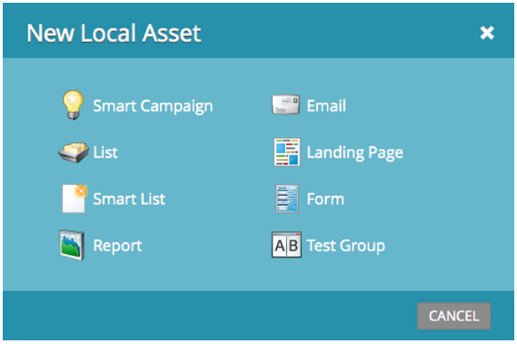

# 發行說明：2013年6月{#release-notes-june}

6月發行包含下列功能。

## 其他使用者語言{#additional-user-languages}

以您偏好的語言檢視Marketo Lead Management介面——現在支援西班牙文和葡萄牙文。

## Cobalt用戶介面{#cobalt-user-interface}

在接下來的幾個月中，您將會注意到應用程式不同部分所推出的新主題；例如影響模型窗口。

## 子資料夾克隆{#subfolder-cloning}

將資產複製至子檔案夾。

## 多個型號{#multiple-models}

此功能是社群中收入週期分析(RCA)的主要概念，可讓您建立多個模型，以更詳細地瞭解您依產品線、業務單位或地區劃分的收入漏斗。 「依收入階段的銷售線索」、「成功路徑分析器」、「計劃分析器」和「收入瀏覽器」報表現在支援選擇特定報表模型的能力。

預設情況下，Select SMB Edition提供兩種機型，Enterprise Edition提供15種機型。 您也可以購買其他機型。

