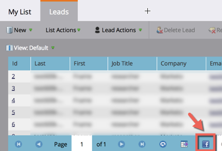

# 發行說明：2014年12月{#release-notes-december}

2014年12月發行包含下列功能。 請檢查您的Marketo Edition是否提供功能。 在發行後，請務必回來尋找每個功能的詳細文章連結！

## 銷售分析報表{#sales-insight-reports}

[Sales Insight Email Performance Report](../../product-docs/marketo-sales-insight/msi-for-salesforce/features/performance-reports/sales-insight-email-performance-report.md)可讓您透過電子郵件和銷售代表查看電子郵件量度。 它支援透過Salesforce、Microsoft Dynamics、Outlook外掛程式和Gmail外掛程式傳送的電子郵件。

## Facebook自訂對象{#facebook-custom-audiences}

一旦您的行銷人員透過「管理員」>「Launchpoint」](../../product-docs/demand-generation/ad-network-integrations/add-facebook-custom-audiences-as-a-launchpoint-service.md)新增[Facebook後，您就可以輕鬆建立、更新或[以來自行銷人員的潛在客戶取代Facebook自訂對象，並設定靜態或智慧清單](../../product-docs/demand-generation/facebook/create-a-custom-audience-in-facebook.md)。 在任何靜態或智慧型清單的銷售線索格線底部尋找新的Facebook圖示。

## 改進跨工作區{#improved-cloning-across-workspaces}的克隆

[將程式](../../product-docs/core-marketo-concepts/programs/working-with-programs/clone-a-program.md) 複製到其他工作區從未如此簡單！按一下克隆時，選擇目標工作區。 不再複製到資料夾中，然後移動資料夾！

>[!NOTE]
>
>此新克隆功能目前僅適用於程式。

## 參考智慧清單{#reference-smart-list}

[建立智慧型清單或流程時，可參](../../product-docs/core-marketo-concepts/smart-lists-and-static-lists/using-smart-lists/reference-a-list-or-smart-list-across-workspaces.md)考與其他工作區共用的智慧型清單。

## 清單匯入改進{#list-import-improvements}

[匯](../../getting-started/quick-wins/import-a-list-of-people.md) 入以UTF-16、Shift-JIS或EUC-JP編碼的檔案。我們繼續支援UTF-8編碼檔案。

## 電子郵件指令碼中的連結追蹤{#link-tracking-in-email-scripting}

現在，「電子郵件連結效能」報表中將會追蹤並提供電子郵件指令碼中的連結。

## Token Encoding Setting {#token-encoding-setting}

我們推出全新的安全性功能，可自動HTML編碼Token，預設將於2015年3月啟用。 在此之前，在「欄位管理」中切換此功能，以提前測試行為。 將所有銷售機會和公司預付碼插入電子郵件或登陸頁面時，都會進行編碼。 個別欄位也可使用選項。

## 新的ReST API呼叫{#new-rest-api-calls}

對Lead &amp; Activity ReST API的三個新呼叫：

·獲取銷售線索分區

·關聯銷售線索

·合併銷售線索

在[developers.marketo.com](https://developers.marketo.com/)發行後，將提供完整的詳細資訊

## Munchkin Javascript相容性增強功能{#munchkin-javascript-compatibility-enhancements}

我們對Munchkin做了幾項小幅增強，以確保它能持續快速載入，並在頁面上的其他JavaScript中，視需要運作。

推出將於12月中旬開始，並持續數月。

## 收入總管升級的外觀和感覺{#revenue-explorer-upgraded-look-and-feel}

## RTP:命名帳戶清單模組{#rtp-named-account-list-module}

在新的「命名帳戶」頁面中管理並監控您的關鍵高收益帳戶。 上傳新的已命名帳戶清單，以識別並鎖定這些組織。 我們自動化了此程式，讓您更能掌控和彈性地實施以帳戶為基礎的行銷計畫，並跨不同通道（網路和廣告）鎖定您的關鍵帳戶。

## RTP:區域內促銷活動的滑動效果{#rtp-sliding-effect-for-in-zone-campaigns}

我們新增了「在區域中滑動」促銷活動的「滑動」效果，讓您的個人化內容在頁面載入時能夠滑入。

