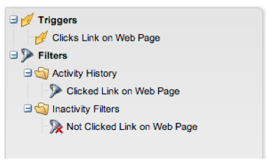

# 發行說明：2014年2月{#release-notes-february}

2014年2月發行包含下列功能。 請查看您的Marketo版以瞭解功能的可用性。 在發行後，請務必回來尋找每個功能的詳細知識庫文章的連結！

## 參與分數作為成功准則{#engagement-score-as-winning-criteria}

[使用參與計](/help/marketo/product-docs/email-marketing/email-programs/email-program-actions/email-test-a-b-test/define-the-a-b-test-winner-criteria.md) 分來判斷A/B分割測試或冠軍／挑戰者測試中的成功變數。測試至少必須執行24小時，才能獲得足夠的參與分數。

## 電子郵件程式結果頁籤{#email-program-results-tab}

[查看為電](/help/marketo/product-docs/email-marketing/email-programs/email-program-data/view-email-program-results.md) 子郵件程式記錄的結果和活動。

## 被阻止寄送{#people-leads-blocked-from-mailing}的人／客源

[按一下封鎖的人員／客](/help/marketo/product-docs/email-marketing/email-programs/managing-people-in-email-programs/define-an-audience-with-a-smart-list.md) 源，查看誰因未訂閱、黑名單、電子郵件地址無效或空白或行銷暫停而無法收到電子郵件。

## 導出電子郵件程式資料{#export-email-program-data}

[將電子郵件量度匯出至Excel](/help/marketo/product-docs/email-marketing/email-programs/email-program-data/export-email-program-dashboard-to-excel.md)，包括AB測試變體資料。

## 參與串流績效報表中的參與分數{#engagement-score-in-engagement-stream-performance-report}

我們將「參與分數」新增至[「參與串流績效報表」](/help/marketo/product-docs/email-marketing/drip-nurturing/reports-and-notifications/engagement-stream-performance-report.md)，協助您瞭解參與計畫中的內容有多有效。

## 電子郵件分析中的程式詳細資訊{#program-details-in-email-analysis}

[現在，您可以依方案名稱、渠道和標籤對電子郵件量度進行分組](/help/marketo/product-docs/reporting/revenue-cycle-analytics/email-analysis/build-an-email-analysis-report-that-shows-program-information.md)。當電子郵件是方案的本機資產時，方案名稱會新增至「電子郵件名稱」欄位。 新的「方案名稱」欄位會顯示傳送電子郵件的智慧型促銷活動的方案名稱。 如果電子郵件是不同程式的本機資產，則可能與「電子郵件名稱」欄位中的程式不同。

## 更新為「點按連結篩選」和「觸發{#update-to-clicks-link-filters-and-trigger}」

下列篩選器和觸發器名稱已更新：

* 點按連結至網頁上的點按連結
* 在網頁上點按連結以點按連結
* 未點按連結至未點按網頁上的連結

## Forms2.0增強功能{#forms-enhancements}

本版本已提供Forms2.0的數個「生活品質」更新。 除了在內嵌表單上啟用漸進式分析外，我們還做了工作流程和UX變更，讓編輯器中使用更進階功能變得更輕鬆，包括可見性規則](/help/marketo/product-docs/demand-generation/forms/form-fields/dynamically-toggle-visibility-of-a-form-field.md)、進階感謝頁面和隱藏欄位。[

