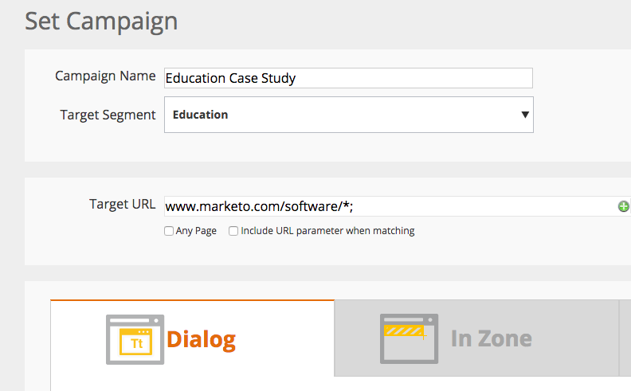

# 發行說明：2015年2月{#release-notes-february}

2015年2月發行包含下列功能。 請查看您的Marketo版以瞭解功能的可用性。 在發行後，請務必回來尋找每個功能的詳細文章連結。 滾筒……

## 行銷自動化增強功能{#marketing-automation-enhancements}

**[移動智慧型促銷活動](/help/marketo/product-docs/core-marketo-concepts/smart-campaigns/using-smart-campaigns/move-a-smart-campaign.md)**

歡慶！ 現在，您可以使用拖放或樹狀結構中的「移動」功能，將智慧型促銷活動移入或移出程式。

**[Dynamics 2015（線上）](https://docs.marketo.com/display/docs/microsoft+dynamics+2013+on-premises)** -支援！

**HTTPS憑證變更**

為保護客戶資料和SaaS服務的機密性和完整性，Marketo遵循SaaS業界最佳實務

並將目前使用的安全性通訊協定（SHA-1和SSL）取代為更安全的版本(SHA-2（亦即SHA-2）。SHA-256)和TLS)，適用於下列網域：

* [marketo.net](https://marketo.net) （加密的Munchkin流量）

* [marketo.com](https://marketo.com) （主要SaaS應用程式）

此版本發佈後不久即會發生。 在2015年12月之前，[mktoapi.com](https://mktoapi.com)網域將暫時支援SHA-1通訊協定，讓舊有系統和應用程式的擁有者更新其具備SHA-2相容性的系統。

**安全蒙奇金**

我們將移除對SSL3的支援。 我們至今仍保有SSL3，以維持對舊版網頁瀏覽器的支援，但在2015年，我們不再看到這些瀏覽器的大量網路流量。 這只會在安全頁面上使用時影響Munchkin，並在2月發行後緩慢推出。

## 即時個人化增強功能{#real-time-personalization-enhancements}

**[促銷活動的目標URL](/help/marketo/product-docs/web-personalization/working-with-web-campaigns/adding-a-target-url-to-a-web-campaign.md)**

使用「新增目標URL」，選取您要讓即時促銷活動顯示的頁面。 此功能適用於所有促銷活動類型（對話、區域內、Widget），但對於「區域內」促銷活動特別有用，其中促銷活動只會針對選取的目標URL在區域ID中呈現。 它支援新增多個URL以定位不同的網頁。

**新增至帳戶型定位的國家／地區和州**

現在可以將國家／地區和州新增至您的「指名帳戶清單」。 從特定位置鎖定主要客戶潛在客戶。
