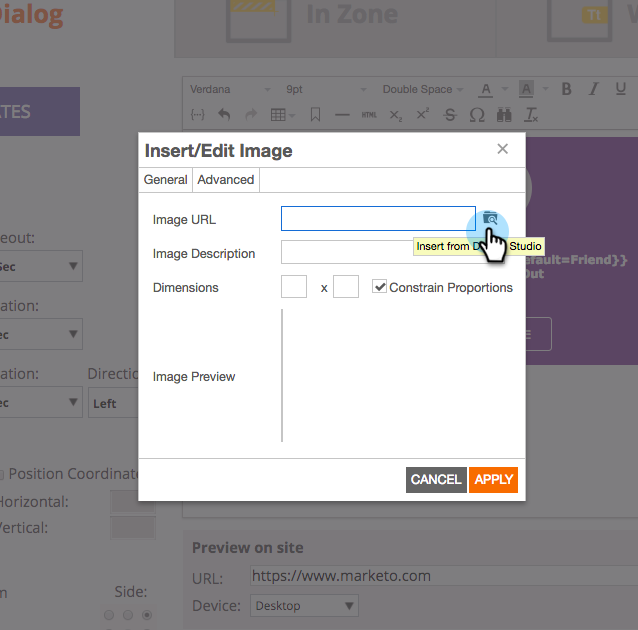

# 發行說明：秋季&#39;17 {#release-notes-fall}

Fall &#39;17發行包含下列功能。 檢查您的Marketo版本，以取得功能。

請按一下標題連結，以檢視每個功能的詳細文章。 注意：此版本包含的部分功能沒有相關文章。 如果主題有多個子標題，則會將連結放在此處。

## 系統可靠性{#system-reliability}

我們進一步改善核心行銷基礎架構，包括更佳的順序、更少的錯配，以及改善Munchkin穩定性。

## SFDC同步效能{#sfdc-sync-performance}

運用Marketo和Salesforce之間更豐富、更快速的同步化。 需要大量更新帳戶或銷售機會的資料變更可分割為平行佇列，以避免積壓。 事件和工作現在的同步速度也提高50%。

## Analytics效能改進{#analytics-performance-improvements}

最近的基礎架構改良可提高行銷人員報告與分析工具的正常運作時間和穩定性，讓您更快速地建立臨機報告。

## [收件者時區](/help/marketo/product-docs/email-marketing/email-programs/email-program-actions/scheduling-with-recipient-time-zone/understanding-recipient-time-zone.md) {#recipient-time-zone}

有了這項新功能，您現在可以根據當地時區儲存並傳送電子郵件。 電子郵件和參與計畫可設定為在收件者的時區傳送，不需要建立多個計畫——只要傳送一次，Marketo就會自動保留電子郵件，直到當地時間正確為止。 提升電子郵件量度、觀察本機做法，並全球使用單一計畫以節省時間。

>[!NOTE]
>
>如果您尚未在電子郵件和參與計畫上啟用「收件者時區」，請勿驚慌！ 我們逐漸將這項功能提供給所有客戶。

## [依區段檢閱範例電子郵件](/help/marketo/product-docs/email-marketing/general/creating-an-email/send-a-sample-email.md) {#review-sample-emails-by-segment}

Marketo在傳送範例電子郵件以供審核時，有新的選項可選擇區段。 您不再需要手動判斷銷售機會屬於哪個區段，因此傳送包含動態內容的電子郵件至不同區段變得更容易。

## [LinkedIn銷售機會開發人員自訂問題](/help/marketo/product-docs/demand-generation/social/social-functions/set-up-linkedin-lead-gen-forms.md) {#linkedin-lead-gen-custom-questions}

自訂您的LinkedIn銷售機會開發表單，以收集自訂銷售機會屬性。 您現在可以針對每個表單詢問最多3個自訂問題、從單行文字輸入或多選題中選擇，並對應回Marketto銷售機會欄位。

## [Slack整合](/help/marketo/product-docs/administration/additional-integrations/add-slack-as-a-launchpoint-service.md) {#slack-integration}

我們發佈了兩項功能，作為新Slack整合的一部分：

* 系統通知：取得有關Marketo例項中重要事件的Slack通知，例如有關目前促銷活動狀態的警報以及任何需要立即注意的問題。
* 有趣的時刻：當銷售帳戶的已知個人觸發Marketo Insight時，銷售線索擁有者可透過Slack收到通知。 通知包括銷售線索資訊和銷售帳戶的詳細資訊。

## ABM增強功能{#abm-enhancements}

**[顯示沒有聯繫人的帳戶](https://docs.marketo.com/x/fKCt)**

Marketo ABM現在可以同步並顯示CRM帳戶，毋需聯絡人。 納入沒有先前銷售或行銷記錄的新帳戶，並透過將後續銷售機會與帳戶配對來追蹤進度。

## ContentAI Analytics {#contentai-analytics}

**[新的ABM帳戶清單篩選](https://docs.marketo.com/x/1BPG)**

檢視並比較ABM帳戶清單的內容效能，以最佳化現有內容。 ContentAI會顯示：

* 檢視的最高內容
* 最高轉換內容
* AI支援的行銷活動建議內容

## Web個人化增強功能{#web-personalization-enhancements}

**[網頁促銷活動的Token](/help/marketo/product-docs/web-personalization/working-with-web-campaigns/using-the-web-personalization-rich-text-editor.md)**

Token現在可用於Web促銷活動。 運用預付碼來傳遞個人化訊息和內容，以提高您網路宣傳的參與度。

**[在Web Campaign編輯器中設計Studio影像](/help/marketo/product-docs/web-personalization/working-with-web-campaigns/using-the-web-personalization-rich-text-editor.md)**

在Marketo內跨多個通道重複使用創意資產和影像，為您節省時間。

## 整合{#integration}

**[電子郵件預覽API](https://developers.marketo.com/rest-api/assets/emails/)**

您現在可以在Marketo之外遠端預覽電子郵件，簡化電子郵件內容本地化流程並減少錯誤。

**[取代HTML API](https://developers.marketo.com/rest-api/assets/emails/)**

開發人員可遠端更新電子郵件資產的HTML內容，讓他們在單一系統中工作以維護資產。
