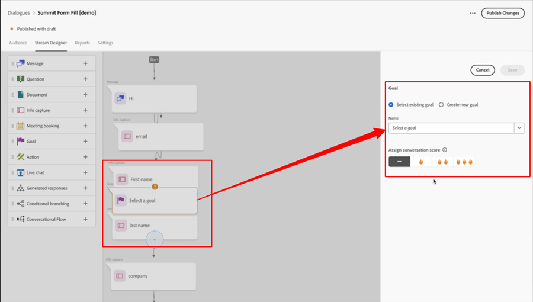
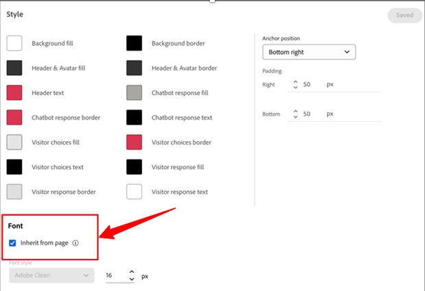

# Dynamic Chat 發行說明 {#dynamic-chat-release}

Adobe Dynamic Chat 的版本發行採用持續傳遞的模式，提供擴充性更好的功能部署方式。有時一個月內會發行多個版本，請您定期查看以獲得最新資訊。

如需 Marketo Engage 的標準發行說明頁面，[請參閱這裡](/help/marketo/release-notes/current.md){target="_blank"}。

## 2025 年 6 月發行版本 {#june-2025-release}

**發行日期：2025 年 6 月 30 日**

### 轉接邏輯翻新 {#routing-logic-revamp}

我們已翻新 Dynamic Chat 中的即時聊天路由邏輯，以確保所有路由類型 (帳戶、自訂、團隊和循環配置) 的參與行為皆能更加智慧化且可預測。新的邏輯將轉接流程簡化，並改善在代理人忙碌無法聊天時的備用處理機制。

#### 路由行為的主要改善

* **每個工作階段最多嘗試聯繫兩次**

   * 系統會嘗試連接至最多兩位代理人，但嚴格遵守主要路由規則。

   * 若代理人有空但沒有回應 (例如拒絕或錯過聊天)，系統會嘗試連接至同一集區的其他代理人。

   * 唯有在初次分配期間未能找到符合條件之代理人時才會啟動備用邏輯 (例如循環配置)，而非在參與失敗後進行重試。

* **路由規則特定行為**

##### —帳戶路由—

若訪客的電子郵件網域對應至已知帳戶，則一定會優先選擇其對應的代理人。

若代理人有空，會直接將聊天路由給他們。

若代理人沒有空，則系統：

* 即使已啟用循環配置做為備用，也不會嘗試指派給其他代理人。

* 相反地，系統會：

   * 顯示所對應代理人的會議行事曆 (若啟用)，
-或-
   * 退回到預設訊息 (最糟情況)。

唯有當帳戶路由不符合條件 (沒有任何相符的網域或代理人) 時，才會考慮卡片層級路由規則 (例如團隊、自訂)。

##### —自訂/團隊路由—

這些規則可能會傳回多位符合條件的代理人。

若第一位有空的代理人沒有接手處理，系統會嘗試從同一清單中再聯繫一位或多位代理人。

不會因為一位代理人沒有回應便觸發循環配置備用機制。

若兩位代理人皆未接手處理：

* 系統會顯示首先嘗試的那位代理人的行事曆 (若啟用)，
-或-
* 顯示預設的備用訊息。

##### —循環配置路由—

做為主要的路由規則時，系統會：

* 嘗試聯繫循環配置集區中第一位有空的代理人。

* 若第一位代理人沒有回應，系統會選擇下一位最合適的代理人並重試。

若使用循環配置做為備用機制，唯有依照主要規則無法找到代理人時才會啟動。

##### 訪客體驗流程

系統會確認帳戶路由是否適用。

* 若適用而且代理人有空，便會立即連接。

* 若代理人不符合條件或沒有空，則會繼續執行卡片層級路由規則。

評估卡片層級路由規則 (自訂、團隊、循環配置)。

* 確認符合條件之代理人是否有空 (權限、狀態)。

* 系統會聯繫一位代理人，如有需要，則會嘗試根據相同規則聯繫第二位代理人。

* 若聯繫皆未成功，則套用備用邏輯：

   * 行事曆備用 (若啟用)，
-或-
   * 預設訊息。

唯有從主要路由規則中找不到符合條件之代理人時，才會考慮循環配置備用機制，而不是在個別代理人無法回應時。

##### 使用案例

_**帳戶路由**_

<table><thead>
  <tr>
    <th>類型</th>
    <th>範例</th>
    <th>結果</th>
  </tr></thead>
<tbody>
  <tr>
    <td>理想狀況</td>
    <td>訪客的網域名稱對應至一個帳戶；其對應的代理人已啟用即時聊天功能而且有空</td>
    <td>聊天會直接連接至對應的代理人</td>
  </tr>
  <tr>
    <td>備用 (循環配置)</td>
    <td>對應的代理人沒有空，循環配置備用機制已啟用</td>
    <td>系統透過循環配置機制選取一位有空的代理人並進行聯繫。 </td>
  </tr>
  <tr>
    <td>無備用代理人</td>
    <td>對應的代理人沒有空，無循環配置備用機制；已啟用會議預約</td>
    <td>系統會顯示對應之代理人的行事曆或顯示預設的備用訊息</td>
  </tr>
</tbody></table>

_**自訂路由**_

<table><thead>
  <tr>
    <th>類型</th>
    <th>範例</th>
    <th>結果</th>
  </tr></thead>
<tbody>
  <tr>
    <td>理想狀況</td>
    <td>自訂邏輯會解析出一組代理人清單；其中第一位代理人有空且接受聊天要求。</td>
    <td>聊天連接至第一位代理人。</td>
  </tr>
  <tr>
    <td>備用 (循環配置)</td>
    <td>自訂規則未找到任何代理人，循環配置備用機制已啟用。</td>
    <td>系統透過循環配置機制選取一位有空的代理人並進行聯繫。</td>
  </tr>
  <tr>
    <td>無備用代理人</td>
    <td>找出兩位代理人；皆不接受聊天，備用設定為會議行事曆。</td>
    <td>顯示所嘗試的第一位代理人的行事曆，或顯示預設的備用訊息。</td>
  </tr>
</tbody></table>

_**團隊路由**_

<table><thead>
  <tr>
    <th>類型</th>
    <th>範例</th>
    <th>結果</th>
  </tr></thead>
<tbody>
  <tr>
    <td>理想狀況</td>
    <td>團隊包含能夠即時聊天的代理人；第一位有空的代理人接受聊天。</td>
    <td>聊天連接至該代理人。</td>
  </tr>
  <tr>
    <td>備用 (循環配置)</td>
    <td>團隊中沒有任何代理人有空，且循環配置備用機制已啟用。</td>
    <td>系統從循環配置集區中選取一位代理人並進行連接。</td>
  </tr>
  <tr>
    <td>無備用代理人</td>
    <td>有兩位代理人有空，但皆未接手處理；行事曆備用已啟用。</td>
    <td>顯示首先嘗試之代理人的行事曆，或觸發備用訊息。</td>
  </tr>
</tbody></table>

_**循環配置路由**_

<table><thead>
  <tr>
    <th>類型</th>
    <th>範例</th>
    <th>結果</th>
  </tr></thead>
<tbody>
  <tr>
    <td>理想狀況</td>
    <td>循環配置集區具有多位代理人；第一位代理人不接受聊天要求後，第二位代理人即會接受聊天。</td>
    <td>聊天連接至第二位代理人。</td>
  </tr>
  <tr>
    <td>備用 (循環配置)</td>
    <td>循環配置集區中沒有任何代理人有空；會議行事曆已啟用。</td>
    <td>顯示清單中第一位代理人的行事曆 (若有設定)，或顯示備用訊息。</td>
  </tr>
  <tr>
    <td>無備用代理人</td>
    <td>沒有任何代理人有空；備用已停用。</td>
    <td>向訪客顯示靜態備用訊息。</td>
  </tr>
</tbody></table>

### 即時簡短通知 {#pulse-notification}

當訪客要求與代理人連接時，我們都會向代理人發送應用程式內瀏覽器通知。但有時候，代理人會錯過這些聊天。

在這次的發行版本中，當新的訪客有興趣進行聊天時，即時代理人可以收到電子郵件、Slack、應用程式內和瀏覽器通知。

1. 在 Adobe Experience Cloud 首頁上，按一下「帳戶」圖示，選取「**偏好設定**」。

   

1. 向下捲動至「_通知_」，選擇您想要的 Dynamic Chat 選項。

   

>[!NOTE]
>
>即時簡短通知的內容可以與我們用於應用程式內瀏覽器通知的內容相同。

## 2025 年 4 月/5 月發行版本 {#apr-may-25-release}

### 訊息通知音效 {#message-notification-sound}

您現在可以選擇每當工作階段觸發聊天機器人時，是否對訪客發出音效。有多種音效可供選擇。

### 在行動裝置上啟用戳一下訊息 {#enable-poke-messages-on-mobile}

「戳一下」功能會在聊天圖示旁顯示開啟對話的問題，訪客不需要點按即可看到，而現在使用行動裝置的訪客可以選擇是否啟用此功能。

### 預設備用更新 {#default-fallback-update}

對於任何用作即時聊天卡片的自訂規則/團隊 - 若沒有任何代理人有空 (或聊天無法連線)，其會退回至循環配置機制尋找有空的代理人 (當下有空的所有代理人，無論流程中採用哪一種路由邏輯/規則)。

### Demandbase 整合 {#demandbase-integration}

Demandbase 使用者可以在 Dynamic Chat 中使用 Demandbase 人員屬性進行對話目標選擇、條件式品牌化以及自訂路由。

## 2024 年 9 月/10 月發行版本 {#sep-oct-release}

### 增強即時聊天分析 {#enhanced-live-chat-analytics}

增強分析儀表板的多項功能，包括：

* 即時聊天請求總數：請求「與代理人聊天」的訪客數量

* 即時聊天連接總數：「與代理人聊天」請求總數與已連接訪客數量的比較

* 即時聊天錯過請求總數：「與代理人聊天」請求總數與無人處理的訪客數量的比較

* 平均聊天長度 (分鐘)：分析訪客和代理人之間的「平均聊天長度」

* 代理人平均回應時間 (秒)：分析代理人回應即時聊天問答的「平均花費時間」

* 每日儀表板：連接成功的即時聊天請求、錯過的即時聊天請求、最近即時聊天活動排序與篩選

### 交談評分 {#conversation-scoring}

根據聊天互動的品質將您的商機量化，並在 Marketo Engage 智慧行銷活動中將該量度用作觸發程序/篩選器。請針對以下活動使用新屬性&#x200B;_交談分數_：

* 參與對話
* 參與交談流程
* 與代理人互動

**注意事項：**

* 分數值為 0、1、2、3 (預設值為空值)

* 當交談完成或捨棄時，評分值便無法編輯

* 設定分數：

   * 在代理人收件匣中 - 在即時聊天期間，代理人可以更新或設定交談的分數，該分數會儲存在對話活動中

   * 在流程設計工具中 - 在目標卡片內，使用者可以更新或設定交談的分數

### 新商機建立邏輯 {#new-lead-creation-logic}

若商機使用電子郵件 `abc@test.com` 填寫表單，且 Cookie 設為 xyz，然後稍後使用電子郵件 `def@test.com` 填寫相同的表單，則會建立新的人員記錄，但 Cookie xyz 會與新的人員相關聯，並從人員 `abc@test.com` 移除。

因此，當使用 Cookie abc 的訪客登陸某個頁面，並使用 `abc@test.com` 做為電子郵件 ID 時：

<table><thead>
  <tr>
    <th>訪客</th>
    <th>Cookie</th>
    <th>提供的電子郵件</th>
    <th>預期行為</th>
  </tr></thead>
<tbody>
  <tr>
    <td>匿名</td>
    <td>abc</td>
    <td>不存在於資料庫中</td>
    <td>建立新人員</td>
  </tr>
  <tr>
    <td>匿名</td>
    <td>abc</td>
    <td>存在於資料庫中</td>
    <td>合併人員</td>
  </tr>
  <tr>
    <td>匿名</td>
    <td>xyz</td>
    <td>存在於資料庫中</td>
    <td>合併人員</td>
  </tr>
  <tr>
    <td>已知人員</td>
    <td>abc</td>
    <td>與現有人員相同</td>
    <td>更新人員</td>
  </tr>
  <tr>
    <td>已知人員</td>
    <td>abc</td>
    <td>與現有人員不同</td>
    <td>若已存在已知人員，則轉移 Cookie 並解析該設定檔。若不存在擁有此電子郵件的人員，則建立新的人員記錄並轉移 Cookie</td>
  </tr>
  <tr>
    <td>已知人員</td>
    <td>xyz</td>
    <td>與現有人員相同</td>
    <td>為同一個人員新增新的 Cookie</td>
  </tr>
  <tr>
    <td>已知人員</td>
    <td>xyz</td>
    <td>與現有人員不同</td>
    <td>此情境不可能發生，因為若是新的 Cookie，系統預設會將其視為新的匿名設定檔</td>
  </tr>
</tbody></table>

### 繼承字型的選項 {#option-to-inherit-font}

您現在可以讓聊天機器人直接繼承其託管網頁的字型，而不必在 Dynamic Chat 中管理品牌字型。當您啟用此選項時，聊天機器人會採用頁面 `<body>` 標記所定義的字型。

### Demandbase 與 Dynamic Chat 整合 {#demandbase-integration-with-dynamic-chat}

Demandbase 使用者可以使用自己的 Demandbase 授權，並啟動整合。使用 Demandbase 人員屬性進行對話目標選擇、條件式品牌化以及自訂路由。

即時地根據這些屬性值對某個人員進行解析，並儲存在相應的人員設定檔中。

### 將交談流程載入時間最佳化 {#optimized-conversation-flow-load-time}

為改善使用者體驗，現在交談流程載入時會顯示微光的載入程式而不是空白區域。

**改善前**

**改善後**

## 2024 年 8 月發行版本 {#august-release}

**發行日期：2024 年 8 月 23 日**

### 自訂交談訊息格式 {#custom-format-conversation-messages}

流程設計工具現在支援透過[插入 HTML](/help/marketo/product-docs/demand-generation/dynamic-chat/automated-chat/stream-designer.md#create-a-stream){target="_blank"} 的方式自訂交談的外觀。

### 聊天機器人捲動至底部 {#chatbot-scroll-to-bottom}

聊天機器人中新增一個圖示，方便網頁訪客直接跳到最後一則訊息。這有助於訪客捲動瀏覽文字並快速返回交談。

### 核心即時簡短通知 {#core-pulse-notifications}

現在，當會議預約或即時聊天失敗時，使用者會收到[電子郵件通知](/help/marketo/product-docs/demand-generation/dynamic-chat/live-chat/live-chat-overview.md#failed-action-notifications){target="_blank"}。

### 支援多重交談 {#support-for-multiple-conversations}

聊天機器人現在支援多重交談。網站訪客可以同時在不同的頁面上進行不同的交談，而且可以在各個交談之間切換。

### 內容的預設排序 {#default-sorting-for-content}

預設情況下，您的交談記錄、未回答的問題，以及問題產生表格會依照建立日期排序 (從最新到最舊)。

### 即時商機解析 {#real-time-lead-resolution}

與匿名商機交談期間，若有提供電子郵件 ID，我們會解析該電子郵件 ID 是否具有已知商機記錄，並使用該記錄即時進行個人化。若找到多筆記錄，我們會即時將記錄合併。對話和交談流程皆會實施此行為。

### 同步商機，無需來自 Marketo Engage 的 Cookie {#syncing-leads-without-cookies}

過去，當啟動 Marketo Engage 同步時，Dynamic Chat 只會同步來自 Marketo Engage 且帶有一個或多個 Cookie ID 的商機。現在，所有已知商機 (無論是否有 Cookie ID) 都會同步至 Dynamic Chat 中，並可以供交談個人化使用。

### 將其他訪客資料傳遞至交談流程 {#pass-additional-visitor-data}

若您是透過表單或登入等其他管道獲取訪客資訊，現在可以將此資訊直接傳遞至 Dynamic Chat。

### 重新整理推斷資料 {#refreshed-inferred-data}

網站上的大多數交談都是與匿名訪客進行的。您仍然可以透過依賴訪客 IP 推斷的資料，將這類訪客設為目標。我們已更新 IP 資料庫和相應的推斷資料，現在支援的 IP 數量是過去的四倍。

### 代理人瀏覽器通知中加入音效 {#sound-added-to-agent-browser-notification}

當即時聊天指派至代理人時，他們會收到瀏覽器通知。但有時他們沒發現這些通知。我們新增[通知音效](/help/marketo/product-docs/demand-generation/dynamic-chat/live-chat/live-chat-overview.md#when-a-live-chat-is-routed-to-an-agent){target="_blank"}，防止以後錯過相關通知。

### 能夠在即時聊天期間更新商機輪廓 {#update-lead-profile-during-live-chat}

在即時聊天期間，代理人想要獲取有關訪客的資訊，並更新相應的輪廓。現在提供更新商機及公司對象屬性值的選項。

## 2024 年 6 月發行版本 {#june-release}

**發行日期：2024 年 6 月 6 日**

### 交談流程卡片 {#conversational-flow-card}

利用交談流程卡片簡化對話流程中的多個步驟。

範例：若您的目標是透過多重對話來推動網路研討會的報名，那麼您必須在所有具有該目標的對話中重新建立相同的流程。而如果您必須更新任何細節，一次只能編輯一個獨立的對話。因為有了交談流程卡片，那樣的情況已有所改變。

除了在多個對話中重複利用同一個流程以外，您還可以使用相同的轉變流程透過其他管道 (例如表單和登陸頁面) 來觸發。

### 使用量限制 {#usage-limits}

使用量限制頁面會顯示重要資訊，例如封裝詳細資料和使用量限制狀態。

## 2024 年 5 月發行版本 {#may-release}

**發行日期：2024 年 5 月 15 日**

### 預先核准的回答資料庫 {#pre-approved-response-library}

[將經過行銷核准的](/help/marketo/product-docs/demand-generation/dynamic-chat/generative-ai/response-library.md){target="_blank"} AI 產生的問題和答案建立成資料庫，有助於在短時間內設定生成式 AI 聊天。

### 未回答的問題 {#unanswered-questions}

[使用包含先前交談中未回答的問題之存放庫](/help/marketo/product-docs/demand-generation/dynamic-chat/generative-ai/unanswered-questions.md){target="_blank"}，產生預先核准的新回答，利用最新資訊維護回答資料庫。

### 交談摘要 {#conversation-summaries}

[為銷售代理人提供交談內容摘要](/help/marketo/product-docs/demand-generation/dynamic-chat/live-chat/agent-inbox.md#conversation-summary){target="_blank"}，包括會議前對於關鍵討論主題的洞察，以減少準備時間並讓銷售代理人掌握最新資訊。

### 生成式 AI 銷售捷徑 {#genai-sales-shortcuts}

[讓即時聊天代理人可以用更快的方式](/help/marketo/product-docs/demand-generation/dynamic-chat/live-chat/agent-inbox.md#shortcuts){target="_blank"}存取 AI 產生的回答、編輯 AI 產生的現有回答，以及搜尋更多內容以便在交談期間傳送給購買者。

### 交談協助 {#conversation-assist}

幫助銷售代理人使用行銷團隊預先核准的回答在即時交談中做出準確的回答。

### 交談引導 {#conversation-nudges}

利用行動號召引導網頁訪客，讓交談可以達成結論。

## 2024 年 4 月發行版本 {#april-release}

**發行日期：2024 年 4 月 23 日**

### 現在所有使用者皆可使用交談流程 {#conversational-flows-available-to-all-users}

利用交談式表單，讓符合條件的商機在提交表單後可以立即預約與銷售人員會面或聊天，使得表單和登陸頁面更有交談互動的效果，並縮短銷售漏斗。現在所有 Dynamic Chat 使用者皆可使用交談式表單&#42;。

_&#42;先前為試用版功能，使用期限為 100 次。現在，交談流程參與會計入 Select 封裝使用者每月 250 次的參與交談次數限制。_

### 回呼函數 {#callback-functions}

[回呼函數](/help/marketo/product-docs/demand-generation/dynamic-chat/setup-and-configuration/callback-functions.md){target="_blank"}讓您能夠在訪客參與 Dynamic Chat 交談時，收集外部系統 (例如 Adobe Analytics 或 Google Analytics) 中的 Dynamic Chat 分析事件。向 API 註冊一個回呼來監聽事件，即可啟用 Dynamic Chat 分析事件。這樣一來，您便可以從更加全面的角度了解 Dynamic Chat 參與情況，以及參與情況與其他關鍵資料 (例如網頁流量) 的關聯。

### 條件式分支中新增即時代理人可用性條件 {#live-agent-availability-conditional-branching}

除了原生和自訂的 Marketo Engage 欄位以外，您現在可以使用條件式分支根據代理人可用性建立分支。若您只想在即時代理人有空的情況下為訪客提供與即時代理人交談的選項，這個方法非常實用。

### 智慧清單條件新增至條件式分支 {#smart-list-condition}

透過在條件式分支中新增新的 Marketo Engage 智慧清單條件，您可以根據已經在 Marketo Engage 中建立之預先存在的客群建立分支，而不是在 Dynamic Chat 中定義客群分支條件。

### 交談流程的條件式分支 {#conditional-branching-for-conversational-flows}

我們在今年稍早的時候發行對話的條件式分支，您現在也可以在交談流程中運用條件式分支！您可以利用條件式分支，在流程中根據不同的條件建立分支。

### 交談流程的即時聊天 {#live-chat-for-conversational-flows}

我們在 2023 年發行對話的即時聊天功能，您現在也可以將即時聊天參與新增至交談流程中。若您在 Marketo Engage 表單中使用交談流程，現在可以讓符合條件的訪客在提交表單後立即與即時代理人聊天！

### 在代理人收件匣中顯示最近的 Marketo Engage 活動 {#recent-marketo-engage-activities-in-agent-inbox}

我們已將最近的 Marketo Engage 活動新增至代理人收件匣的「最近活動」區段中，因此當網站訪客請求與代理人聊天時，代理人可以快速查看訪客最近是否參與以下任何 Marketo Engage 活動 (最近 25 次活動)：

* 開啟電子郵件
* 造訪網頁
* 填寫表單
* 有過關鍵時刻

### 代理人管理中的行事曆連線狀態 {#calendar-connection-status-in-agent-management}

管理員現在可以輕鬆查看哪些具有會議預約權限的代理人已在 Dynamic Chat 中連接其行事曆。這樣您便可以確保整個銷售團隊都相互連接，並準備好接受來自 Dynamic Chat 的會議請求。

### 代理人行事曆中的最短通知設定 {#minimum-notice-setting-in-agent-calendar-configuration}

使用者回報，網頁訪客在其行事曆上預定會議時，其事前通知最短可能僅有 10 分鐘，因此我們在代理人行事曆設定中引入最短通知設定，並將前置時間預設為 24 小時。

### 更新新增/移除的使用者行為 {#add-remove-user-behavior-updated}

部分使用者表示他們在 Dynamic Chat 中新增和移除代理人時遇到問題，因此我們做了一些變更來解決這些問題。

當具有即時聊天或會議預約權限的使用者新增至 Admin Console 時，這類使用者會立即顯示在代理人管理清單中，並可以新增至對話、交談流程、路由規則和團隊中。

當具有會議預約或即時聊天權限的使用者從 Admin Console 中移除時，這類使用者會立即從 Dynamic Chat 中移除，不再可供即時聊天或會議路由使用，而且不再計入授權限制數量內。

### 改進交談級別報告績效 {#improved-conversation-level-report-performance}

個別對話和交談流程級別報告現在的績效和準確性更高。過去，載入對話報告可能需要數秒鐘的時間，而且相關資料有時會與全域績效報告不一致。現在，您的個別對話報告可以立即載入，而且資料會始終與全域報告資料保持一致。

### 權限更新 {#permission-updates}

我們整理 Adobe Admin Console 中的權限結構和命名，讓權限管理更加直覺。

* 「交談管理」類別現在名為「交談」
* 「會議」類別現在名為「活動」
* 「代理人設定」類別現在名為「代理人」
* 「管理員設定」類別現在名為「設定」
* 移除「即時聊天」類別，所有即時聊天權限均已移至「代理人」類別

### 代理人收件匣支援超連結 {#support-for-hyperlinks-in-agent-inbox}

現在，當即時聊天代理人在聊天中與訪客共用 URL 時，這些 URL 會變成超連結，而訪客只需要點按超連結即可導覽至目標頁面，而不需要將 URL 複製貼上到瀏覽器中。

### 代理人收件匣的 Enter 鍵行為更新 {#enter-key-behavior-updated-in-agent-inbox}

我們改變了代理人收件匣的 Return 鍵行為，因此按下 Return 鍵或 Enter 鍵會傳送您的訊息，而按下 Shift+Enter 會建立分行符號。

### 移除循環配置頁面 {#round-robin-page-removed}

別擔心！循環配置路由仍然正常運作，並且按照一直以來的方式運作。我們只是移除了經常顯示不準確的代理人清單及其在循環配置路由佇列中之順序的頁面。

當我們在 2022 年發行 Dynamic Chat 時，並不支援即時聊天而僅支援會議預約，所以循環配置路由頁面的設計僅考慮會議預約。隨著去年推出即時聊天，循環配置頁面便已過時，因為其無法準確反映出同時具有會議預約和即時聊天權限的代理人之間進行循環配置路由的複雜情形。為了解決這個問題我們探索了幾種不同的選項，但最終決定將其完全移除才是盡量減少混亂的最佳選項。

## 2024 年 2 月發行版本 {#february-release}

**發行日期：2024 年 2 月 22 日**

### 交談頁面 {#conversations-page}

新的「交談」頁面為您提供一站式服務，可以檢視您執行個體中發生之所有交談 (自動和即時) 的記錄，對象包括已知和匿名商機，這樣的服務讓您能夠更加了解客戶如何與您的對話、交談流程以及即時代理人互動。

### 全域儀表板中的日期範圍從 90 天增加為 24 個月 {#date-range-in-global-dashboard}

您提出要求，我們便予以滿足。您現在可以在所有分析儀表板中查看最長兩年的 Dynamic Chat 參與資料。

### 對話中的條件式分支 {#conditional-branching-in-dialogues}

條件式分支讓您能夠根據不同的條件在對話流程中建立分支。現在，您可以根據 Marketo Engage 中的商機和公司屬性，在同一個對話中向不同的人員呈現不同的內容。

## 2024 年 1 月發行版本 {#january-release}

**發行日期：2024 年 1 月 24 日**

### 代理人管理中的同時即時聊天限制設定 {#Concurrent-live-chat-limit-setting}

預設情況下，執行個體中的每位即時聊天代理人一次最多可以參與 5 個即時聊天。我們在代理人管理中引入一項新設定，讓您可以調整這項限制為 1 到 10 之間的數目。

