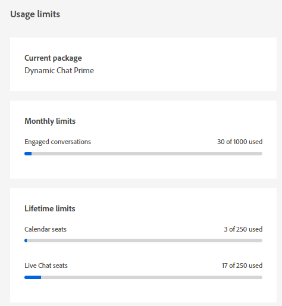

# Dynamic Chat 發行說明 {#dynamic-chat-release}

Adobe Dynamic Chat版本會在持續傳遞模式上運作，允許以更可擴充的方法進行功能部署。 有時候一個月會有多個版本，所以請定期回來檢視最新的資訊。

Marketo Engage[的標準發行說明頁面可在此處](/help/marketo/release-notes/current.md){target="_blank"}找到。

## 2024年9/10月發行版本 {#sep-oct-release}

### 增強型即時聊天分析 {#enhanced-live-chat-analytics}

Analytics Dashboard已進行數個增強功能，包括：

* 請求的即時聊天總數：「與代理商聊天」請求的訪客數

* 連線的即時聊天總數：已連線的訪客數與「與代理商聊天」的請求總數

* 未接的即時聊天請求總數：「與代理聊天」的無人參與訪客數與請求總數

* 以分鐘為單位的平均聊天長度：分析訪客與您的代理之間的「平均聊天長度」

* 平均代理程式回應時間（秒）：分析代理程式回應其即時聊天問答的「平均所用時間」

* 每日儀表板：即時聊天請求已成功連線、即時聊天請求已錯過、排序和篩選最近的即時聊天活動

### 交談評分 {#conversation-scoring}

根據潛在客戶聊天互動的品質來量化潛在客戶，並將該量度用作「Marketo Engage智慧行銷活動」中的觸發器/篩選器。 在下列活動中使用新屬性&#x200B;_交談分數_：

* 與對話方塊互動
* 已參與交談流程
* 與代理程式互動

**注意事項：**

* 分數值將來自0、1、2、3 （預設值為空值）

* 當交談完成或捨棄時，無法編輯評分值

* 設定分數：

   * 在代理程式收件匣中 — 在即時聊天期間，代理程式可以更新或設定對話的分數，該分數會儲存在對話活動中

   * 在資料流設計工具中 — 在目標卡片中，使用者可以更新或設定交談的分數

### 新的潛在客戶建立邏輯 {#new-lead-creation-logic}

如果潛在客戶填入具有電子郵件`abc@test.com`的表單並以xyz編碼，稍後再填入具有電子郵件`def@test.com`的相同表單，則會建立新的人員記錄，但cookie xyz會與新的人員產生關聯並從人員`abc@test.com`中移除。

因此，當具有Cookie abc的訪客登陸頁面並提供電子郵件ID為`abc@test.com`時：

<table><thead>
  <tr>
    <th>Visitor</th>
    <th>Cookie</th>
    <th>已提供電子郵件</th>
    <th>預期行為</th>
  </tr></thead>
<tbody>
  <tr>
    <td>匿名</td>
    <td>abc</td>
    <td>資料庫中不存在</td>
    <td>建立新人員</td>
  </tr>
  <tr>
    <td>匿名</td>
    <td>abc</td>
    <td>存在於資料庫中</td>
    <td>合併人員</td>
  </tr>
  <tr>
    <td>匿名</td>
    <td>xyz</td>
    <td>存在於資料庫中</td>
    <td>合併人員</td>
  </tr>
  <tr>
    <td>已知人員</td>
    <td>abc</td>
    <td>與現有人員相同</td>
    <td>更新人員</td>
  </tr>
  <tr>
    <td>已知人員</td>
    <td>abc</td>
    <td>與現有人員不同</td>
    <td>如果已經有已知人員存在，則轉移Cookie並解析該設定檔。 如果此電子郵件中沒有人員，請建立新的人員記錄並轉移Cookie</td>
  </tr>
  <tr>
    <td>已知人員</td>
    <td>xyz</td>
    <td>與現有人員相同</td>
    <td>將新Cookie新增至同一個人</td>
  </tr>
  <tr>
    <td>已知人員</td>
    <td>xyz</td>
    <td>與現有人員不同</td>
    <td>這種情況不可能發生，就好像它是新的Cookie，來自   預設為新的匿名設定檔</td>
  </tr>
</tbody></table>

### 最佳化的交談流程載入時間 {#optimized-conversation-flow-load-time}

為了改善使用者體驗，現在會在載入對話流程時顯示閃爍的載入器，而非空白區域。

**在**&#x200B;之前

**After**

### 繼承字型的選項 {#option-to-inherit-font}

您現在可以啟用聊天機器人直接從託管它的網頁繼承字型，而不是在Dynamic Chat中管理品牌字型。 啟用此選項時，聊天機器人會採用頁面`<body>`標籤上定義的字型。

### Demandbase與Dynamic Chat整合 {#demandbase-integration-with-dynamic-chat}

Demandbase使用者能夠自攜Demandbase授權並啟用整合。 使用Demandbase人員屬性進行對話方塊目標定位、條件式品牌和自訂路由。

這些屬性值對個人的解決會即時完成，並儲存在各自的人員設定檔中。

## 2024 年 8 月發行版本 {#august-release}

**發行日期： 2024年8月23日**

### 自訂您的交談訊息格式 {#custom-format-conversation-messages}

串流設計工具現在支援[插入HTML](/help/marketo/product-docs/demand-generation/dynamic-chat/automated-chat/stream-designer.md#create-a-stream){target="_blank"}，以自訂您交談的外觀與感覺。

### 聊天機器人捲動至底部 {#chatbot-scroll-to-bottom}

聊天機器人已新增圖示，讓網頁訪客直接跳至最後一則訊息。 這有助於訪客捲動文字以快速回到交談。

### 核心脈衝通知 {#core-pulse-notifications}

使用者現在會在會議預約或即時聊天失敗時收到[電子郵件通知](/help/marketo/product-docs/demand-generation/dynamic-chat/live-chat/live-chat-overview.md#failed-action-notifications){target="_blank"}。

### 支援多個交談 {#support-for-multiple-conversations}

聊天機器人現在支援多個交談。 網站訪客可同時參與不同頁面上的不同交談，且可在這些對話之間切換。

### 內容的預設排序 {#default-sorting-for-content}

依照預設，您的交談記錄、未回答的問題和問題產生表會依建立日期（從最近到最舊）排序。

### 即時銷售機會解析 {#real-time-lead-resolution}

在與匿名潛在客戶進行交談並提供電子郵件ID期間，我們會解決該電子郵件ID是否存在已知潛在客戶記錄，並即時將該記錄用於個人化。 如果我們找到多個記錄，我們會即時合併它們。 此行為會針對對話方塊和對話流程實施。

### 從Marketo Engage同步沒有Cookie的銷售機會 {#syncing-leads-without-cookies}

先前，當啟動Marketo Engage同步時，Dynamic Chat僅會將已知的銷售機會與來自Marketo Engage的一或多個Cookie ID同步。 現在，所有已知的潛在客戶（無論是否有Cookie ID）都會同步至Dynamic Chat，且可用於個人化的交談。

### 將其他訪客資料傳遞至對話流程 {#pass-additional-visitor-data}

如果您透過其他管道（如表單或登入）擷取訪客資訊，現在可以直接將此資訊傳遞給Dynamic Chat。

### 重新整理推斷的資料 {#refreshed-inferred-data}

網站上的大多數交談都是與匿名訪客進行的。 您仍然可以透過推斷的資料來鎖定他們，而這有賴於訪客IP。 我們已更新IP資料庫和個別推斷資料，現在支援的IP是原來的四倍。

### 新增至代理程式瀏覽器通知的聲音 {#sound-added-to-agent-browser-notification}

將即時聊天指派給代理時，他們會收到瀏覽器通知。 但他們偶爾會看不見它們。 我們已新增[通知音效](/help/marketo/product-docs/demand-generation/dynamic-chat/live-chat/live-chat-overview.md#when-a-live-chat-is-routed-to-an-agent){target="_blank"}，以防止日後遺漏通知。

### 可在即時聊天期間更新潛在客戶設定檔 {#update-lead-profile-during-live-chat}

在即時聊天期間，代理程式想要擷取訪客的相關資訊並更新個別設定檔。 現在可以選擇更新潛在客戶與公司物件的屬性值。

## 2024 年 6 月發行版本 {#june-release}

**發行日期： 2024年6月6日**

### 對話式流量卡 {#conversational-flow-card}

運用對話流程卡，簡化對話方塊中流程的多個步驟。

範例：如果您的目標是透過多個對話方塊推動網路研討會註冊，則必須在具有該目標的所有對話方塊中重新建立相同的流程。 如果您必須更新任何詳細資訊，則必須一次編輯一個對話方塊。 由於有對話流量卡，情況已完全不同。

除了跨多個對話方塊重新利用流程之外，您還可以使用相同的轉變流程來觸發其他管道，例如表單和登陸頁面。

### 使用量限制 {#usage-limits}

使用限制頁面會顯示重要資訊，例如封裝詳細資訊和使用限制狀態。

## 2024 年 5 月發行 {#may-release}

**發行日期： 2024年5月15日**

### 預先核准的回應程式庫 {#pre-approved-response-library}

[建立行銷核准的資料庫](/help/marketo/product-docs/demand-generation/dynamic-chat/generative-ai/response-library.md){target="_blank"} AI產生的問題和回答，以協助在幾分鐘內設定產生式AI聊天。

### 未回答的問題 {#unanswered-questions}

[使用先前交談的未回答問題存放庫](/help/marketo/product-docs/demand-generation/dynamic-chat/generative-ai/unanswered-questions.md){target="_blank"}來產生新的預先核准回應，並維護包含最新資訊的回應資料庫。

### 交談摘要 {#conversation-summaries}

[為銷售代理提供總結的交談](/help/marketo/product-docs/demand-generation/dynamic-chat/live-chat/agent-inbox.md#conversation-summary){target="_blank"}，包括會議前的重要討論主題深入分析，以縮短準備時間，並更妥善地為銷售代理提供最新資訊。

### GenAI銷售捷徑 {#genai-sales-shortcuts}

[以更快的方式提供即時聊天代理程式](/help/marketo/product-docs/demand-generation/dynamic-chat/live-chat/agent-inbox.md#shortcuts){target="_blank"}以存取AI產生的回應、編輯現有的已產生回應，並搜尋其他內容以在交談期間傳送給購買者。

### 交談助理 {#conversation-assist}

透過行銷團隊預先核准的回應，協助銷售代理商在即時交談中正確回應。

### 交談輕推 {#conversation-nudges}

透過行動號召來輕推網頁訪客，以促使對話結束。

## 2024 年 4 月發行版本 {#april-release}

**發行日期： 2024年4月23日**

### 交談流程現在可供所有使用者使用 {#conversational-flows-available-to-all-users}

允許合格的潛在客戶在提交表單後立即預約會議或與Sales聊天，讓您的表單和登入頁面更具對話性，並縮短銷售漏斗。Conversational Forms現在已完全可供所有Dynamic Chat使用者使用&#42;。

_&#42;先前提供試用功能，包含100個期限參與專案。 對話流程參與現在計入Select套件上使用者250個參與對話的每月限制。_

### 回呼函式 {#callback-functions}

[回撥函式](/help/marketo/product-docs/demand-generation/dynamic-chat/setup-and-configuration/callback-functions.md){target="_blank"}可讓您在訪客參與Dynamic Chat對話時，收集外部系統(例如Adobe Analytics或Google Analytics)中的Dynamic Chat分析事件。 您可以使用API註冊回呼來監聽事件，藉此啟用Dynamic Chat分析事件。 這可讓您在與其他關鍵資料（例如網站流量）相關時，以更全面的方式檢視Dynamic Chat參與。

### 即時代理程式可用性條件已新增到條件式分支 {#live-agent-availability-conditional-branching}

除了原生和自訂Marketo Engage欄位之外，您現在還可以使用條件式分支，根據代理程式可用性來建立分支。 如果您只想讓訪客在有可用的即時代理程式時選擇與即時代理程式交談，這個功能會很有用。

### 智慧清單條件已新增到條件式分支 {#smart-list-condition}

在條件式分支中新增新的「Marketo Engage智慧列示」條件後，您可以根據已在Dynamic Chat中建立的現有對象建立分支，而非在Marketo Engage中定義對象分支條件。

### 對話流程的條件式分支 {#conditional-branching-for-conversational-flows}

我們今年早些時候發佈了對話的條件分支，現在您也可以利用對話流程中的條件分支！ 條件式分支可讓您根據不同條件在流程中建立分支。

### 對話流程的即時聊天 {#live-chat-for-conversational-flows}

我們在2023年發佈了對話的即時聊天功能，現在您也可以將即時聊天參與新增到對話流程中。 如果您正在使用對話式流程進行Marketo Engage表單，您現在可以允許合格訪客在表單提交後立即與即時代理程式聊天！

### 代理程式收件匣中最近的Marketo Engage活動 {#recent-marketo-engage-activities-in-agent-inbox}

我們已將最近的Marketo Engage活動新增到「代理程式收件匣」的「最近的活動」區段，因此當網站訪客請求與代理程式聊天時，代理程式可以快速檢視訪客最近是否參與了以下任何Marketo Engage活動（最近25個活動）：

* 已開啟的電子郵件
* 造訪的網頁
* 已填寫的表單
* 曾有過關鍵時刻

### 代理程式管理中的行事曆連線狀態 {#calendar-connection-status-in-agent-management}

管理員現在可以輕鬆檢視哪些具有會議預訂許可權的代理已以Dynamic Chat連線其行事曆。 這可讓您確保整個銷售團隊都已連線，且準備好接受Dynamic Chat的會議邀請。

### 代理程式行事曆設定中的最低通知設定 {#minimum-notice-setting-in-agent-calendar-configuration}

使用者回報網站訪客在預約會議時只需要10分鐘的預先通知，因此我們在代理程式行事曆設定中引進了最低通知設定，並將預設前置時間設定為24小時。

### 新增/移除使用者行為已更新 {#add-remove-user-behavior-updated}

有些使用者表示在Dynamic Chat中新增和移除代理程式時發生問題，因此我們進行了一些變更以解決這些問題。

當使用者新增到具有即時聊天或會議預約許可權的Admin Console時，他們將立即出現在「代理管理」清單中，並可用於新增到對話方塊、對話流程、路由規則和團隊。

當具有會議預約或即時聊天許可權的使用者從Admin Console中移除時，他們將會立即從Dynamic Chat中移除，將無法再用於即時聊天或會議路由，並且不再計入授許可權制。

### 改善交談層級報告效能 {#improved-conversation-level-report-performance}

「個別對話方塊」和「對話流量」層級報表現在可提供更有效且更準確的資料。 以前，載入對話方塊報表可能需要幾秒鐘的時間，而且資料偶爾會與全域效能報表不一致。 現在，您的個別對話方塊報表會立即載入，而且資料將一律與全域報表資料對齊。

### 許可權更新 {#permission-updates}

我們已清除Adobe Admin Console中的許可權結構和命名，讓許可權管理更直覺化。

* 「交談管理」類別現在稱為「交談」
* 「會議」類別現在稱為「活動」
* 「代理程式設定」類別現在稱為「代理程式」
* 「管理員設定」類別現在稱為「設定」
* 「即時交談」類別已移除，且所有即時聊天許可權已移至「代理程式」類別

### 支援代理程式收件匣中的超連結 {#support-for-hyperlinks-in-agent-inbox}

現在，當即時聊天代理程式與聊天中的訪客共用URL時，這些URL將會超連結，因此訪客只需按一下這些URL即可導覽至頁面，而不必將URL複製並貼到瀏覽器中。

### 在代理程式收件匣中輸入更新的金鑰行為 {#enter-key-behavior-updated-in-agent-inbox}

我們已切換「代理程式收件匣」中的傳回鍵行為，因此按Return或Enter鍵會傳送您的訊息，按Shift+Enter鍵會建立分行符號。

### 循環配置資源頁面已移除 {#round-robin-page-removed}

別擔心！ 循環配置資源路由仍然完全正常運作，而且運作方式與以往一樣。 我們剛才移除了在循環配置路由佇列中顯示經常不正確代理程式清單及其順序的頁面。

我們在2022年發行Dynamic Chat時，沒有提供即時聊天支援，只支援會議預訂，而且設計了循環配置選項路由頁面，充分考慮到會議預訂。 隨著去年即時聊天功能的推出，循環配置資源頁面已過時，因為它無法正確反映同時具有會議預約和即時聊天許可權之代理程式之間循環配置資源路由的更複雜性質。 我們探索了一些不同的選項來解決此問題，但最終決定完全移除它是最小化混淆的最佳選項。

## 2024 年 2 月發行版本 {#february-release}

**發行日期： 2024年2月22日**

### 對話頁面 {#conversations-page}

新的「交談」頁面提供了一站式服務，讓您檢視執行個體發生的所有交談（自動化和即時）記錄（來自已知和匿名潛在客戶），讓您更清楚瞭解客戶如何與您的對話、交談流程和即時代理進行互動。

### 全域控制面板中的日期範圍從90天增加到24個月 {#date-range-in-global-dashboard}

您詢問，我們已送達。 您現在可以在所有Analytics儀表板中檢視長達兩年的Dynamic Chat參與資料。

### 對話方塊中的條件分支 {#conditional-branching-in-dialogues}

條件式分支可讓您根據不同的條件，在對話方塊流程中建立分支。 現在，您可以根據Marketo Engage中的銷售機會和公司屬性，在相同對話方塊中向不同人員呈現不同的內容。

## 2024 年 1 月發行版本 {#january-release}

**發行日期： 2024年1月24日**

### 代理程式管理中的同時即時聊天限制設定 {#Concurrent-live-chat-limit-setting}

依預設，您執行個體中的每個即時聊天代理程式一次最多可以參與5個即時聊天工作階段。 我們在代理程式管理中引進了新的設定，可讓您將此限制從1調整為10。

