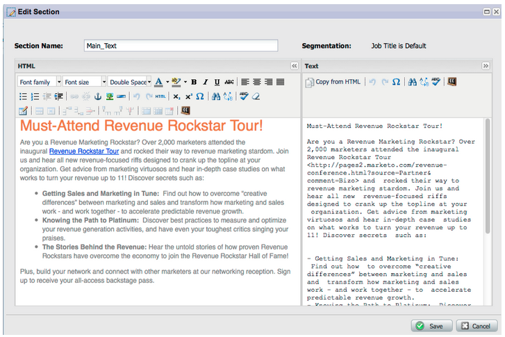

# 發行說明：2012年1月/2月 {#release-notes-jan-feb}

1月/2月發行包含下列功能。 查看您的Marketo版本以了解功能可用性。 發行後回來取得詳細功能檔案的連結。

## 進階動態內容 {#advanced-dynamic-content}

_適用於Pro和Enterprise版本_

透過進階動態內容，您可以建立與對象相關的吸引人的電子郵件通訊和登錄頁面，而無須針對相同訊息建立多個資產。 升級的預覽器可讓您在單一畫面中檢視每個不重複版本。

## 區段  {#segmentation}

_適用於Pro和Enterprise版本_

區段是一組區段，是您行銷的目標個人群組。 區段是由類似智慧清單的篩選條件所驅動的規則定義。 您的區段可以根據人口統計資料，例如職稱或產業，或根據瀏覽或點按連結的網頁等行為。

## 程式碼片段 {#snippets}

_適用於Pro和Enterprise版本_

儲存可一再使用的豐富內容，以建立靜態或動態電子郵件及登錄頁面。

## PURL {#purls}

_適用於Pro和Enterprise版本_

使用個人化URL(PURL)，行銷人員現在可以建立連絡專屬URL，以在多點接觸行銷方案中針對直接郵件和電子郵件行銷促進個人化、可測量性和提升度回應。

## 歐盟隱私權指令支援 {#eu-privacy-directive-support}

針對瀏覽器「不追蹤」設定的新功能包括停用匿名銷售機會追蹤的功能；這讓遵守歐盟更嚴格的隱私權追蹤法規變得更輕鬆。

## 單一登入 {#single-sign-on}

組織現在能夠使用SAML 2.0，支援以單一登入的方式從企業入口網站順暢登入Marketo應用程式。

## 更新電子郵件和登錄頁面編輯器 {#updated-email-and-landing-page-editors}

電子郵件和登錄頁面編輯器經過重新設計，提供更具邀請性的介面、直覺式導覽，以及大幅改善的使用者體驗，包括：

並排的HTML和文字檢視

編輯器中會顯示「寄件者名稱」、「寄件者」、「回覆者」(NEW)和「主旨」。 您可以透過「編輯設定」按鈕存取其他所有設定。

## 瀏覽器支援 {#browser-support}

* Mozilla Firefox 9.0
* Google Chrome 16
* Microsoft Internet Explorer 8和9
* **注意**:不再支援Internet Explorer 7

## 方案管理 {#program-management}

簡化的程式管理可改善令牌刪除的可用性，並更輕鬆地刪除程式。

## 取消訂閱訂閱報表 {#unsubscribe-from-subscription-report}

現在，您可以直接從報表取消訂閱！

## 《蒙奇金更新》 {#munchkin-updates}

新的Munchkin呼叫可縮短網頁載入時間，並為點按連結事件提供更一致的效能。

## 計畫機會分析（僅限RCA） {#program-opportunity-analysis-rca-only}

了解對個別機會收入的行銷貢獻

## 計畫收入階段分析 {#program-revenue-stage-analysis}

通過了解哪些程式獲得了快速移動器，獲得對計畫前置速度的洞察

