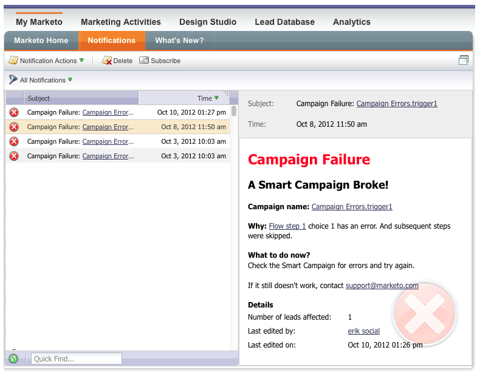

# 發行說明：2012年10月 {#release-notes-october}

10月版包含更令人興奮的新功能！ Social功能可作為附加元件使用，或作為所選套件組合的一部分。

## 導入方案和方案交換 {#import-programs-and-program-exchange}

程式可從一個Marketo訂閱匯入至另一個訂閱。 例如，您可以在沙箱中建立方案，然後將其匯入您的即時訂閱。 此外，您也可以從Marketo方案庫匯入預先建置的方案。

>[!NOTE]
>
>只有Marketo管理員使用者已授與權限的Marketo使用者才能匯入方案。
>
>請聯絡Marketo支援，連線您的即時訂閱的沙箱帳戶。

## 通知 {#notifications}

通知可讓您掌握Marketo訂閱中發生的系統事件最新資訊。 例如，當促銷活動失敗或您的CRM同步需要注意時，系統會自動通知您。 「我的Marketo」標籤上會提供通知。 此外，您可以訂閱通知，以便在電子郵件中即時接收通知。

## 投票 {#polls}

建立投票以吸引您在內容中的領先者！ 他們可以投票選出自己喜愛的網路或電影，然後通過他們的社交網路與朋友分享投票結果。 您可以收集有關您的潛在客戶投票支援內容的豐富分析資料。

## 追蹤社交活動 {#track-social-activities}

根據特定的社交活動建立智慧清單，找出哪些人在投票中分享您的內容和投票。 例如，建立智慧型行銷活動，以提高最常共用您內容之銷售機會的分數！

## 社交設定檔 {#social-profiles}

您現在可以在潛在客戶共用內容或使用其社交設定檔填寫表單時，收集其相關資訊。 這包括Facebook、LinkedIn和Twitter的控點、擁有的朋友人數，以及更多。

## 收入總管報表訂閱 {#revenue-explorer-report-subscriptions}

建立報表訂閱，並定期將「收入總管」報表傳送給您的主要利害關係人，包括非Marketo使用者。 電子郵件包含報表資料表格或圖表的預覽，以及包含所有報表資料的Excel試算表。

>[!NOTE]
>
>僅適用於具有「收入總管」的使用者，透過企業版或選擇版購買收入週期分析。
