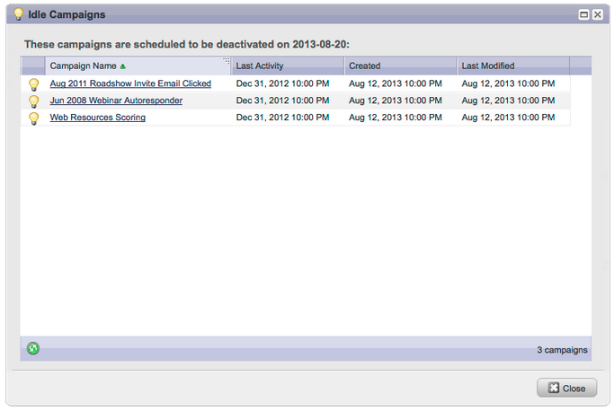

# 發行說明： 2013年8月 {#release-notes-august}

2013年8月發行版本包含下列功能。

**純文字電子郵件**

現在您可以傳送 [只有文字版本](/help/marketo/product-docs/email-marketing/general/creating-an-email/create-a-text-only-email.md) 電子郵件的。 請記住，使用此選項時不會裝飾連結。

## 客戶參與引擎增強功能 {#customer-engagement-engine-enhancements}

### 忽略已耗用的內容 {#ignore-exhausted-content}

將參與計畫設定為 [忽略耗盡](/help/marketo/product-docs/email-marketing/drip-nurturing/using-engagement-programs/disable-and-enable-exhausted-content-notifications.md)，包括隱藏任何通知。

## 參與資料流測試 {#engagement-stream-testing}

使用 [新的測試功能](/help/marketo/product-docs/email-marketing/drip-nurturing/engagement-program-streams/test-an-engagement-stream.md) 以模擬轉型，並測試新新增的內容到即時資料流。

## 個人化的傳送測試 {#personalized-send-test}

當您傳送電子郵件測試時，可以選取銷售機會名稱以個人化測試電子郵件。

## &quot;以網頁檢視電子郵件&quot;和&quot;取消訂閱&quot;系統Token {#view-email-as-web-page-and-unsubscribe-system-tokens}

善用這些 [新Token](/help/marketo/product-docs/email-marketing/general/using-tokens/system-tokens-glossary.md) 以更好地控制這些郵件在電子郵件中的位置。

## 自動觸發行銷活動清理 {#automatic-trigger-campaign-cleanup}

Marketo現在會定期通知您並 [自動停用觸發行銷活動](/help/marketo/product-docs/core-marketo-concepts/smart-campaigns/using-smart-campaigns/automatic-trigger-campaign-cleanup.md) 過去6個月內未執行的專案。

## Marketo財務管理增強功能 {#marketo-financial-management-enhancement}

### 計畫成本更新  {#program-cost-update}

程式成本同步功能可追蹤多個平台上的程式成本。

### Cobalt使用者介面 {#cobalt-user-interface}

我們將繼續推出新的Cobalt介面。 此專案將讓Marketo的所有功能都超級快速！ 升級將在今年餘下時間繼續進行。
