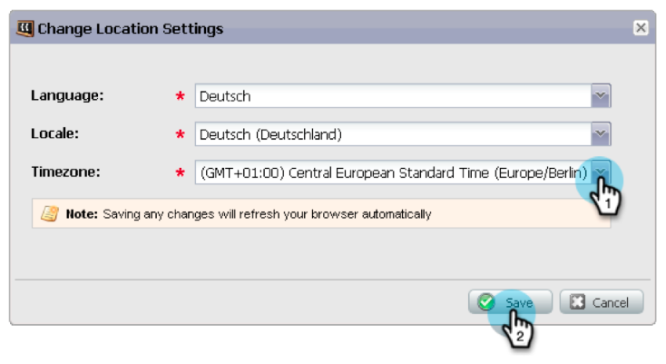
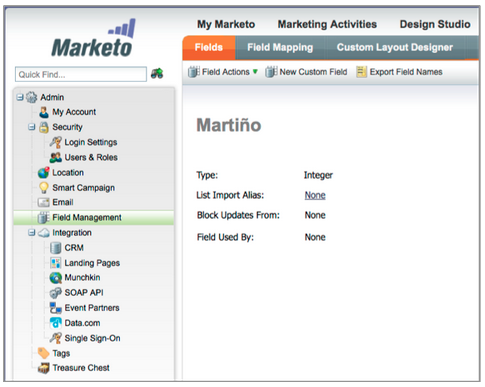

# 發行說明：2013年1月 {#release-notes-january}

1月發行版本擴充了我們的社交服務， **反向連結選件**. 此外，Marketo Lead Management用戶可以設定其時區、語言和地區設定首選項。 請注意，標有 &#42; 只能在「選擇版本」中使用。

## 反向連結選件 {#referral-offers}

A **轉介選件** 會激勵你的主人推薦他們的朋友。 為成功的推薦建立目標和獎勵。 您可以在登錄頁面、您的網站，甚至Facebook上使用它。

## 時區首選項 {#time-zone-preference}

您可以變更個人Marketo帳戶的預設時區。 例如，即使訂閱的預設值為太平洋時間，您也可以針對自己的帳戶將其變更為東方時間。

## 選取您的Marketo銷售機會管理語言 {#select-your-marketo-lead-management-language}

您可以變更Marketo使用者帳戶的預設語言。 即使訂閱的預設值為英文，您也可以將其變更為德文或法文供您使用。

## 多語言表單錯誤訊息 {#multi-lingual-form-error-messages}

當銷售機會填寫Marketo表單時，系統會自動內建一些驗證訊息。 您可能想要為這些錯誤訊息選取不同的顯示語言。 現在支援英文、德文和法文。

法文表單的範例：

## 選擇您的Sales Insight語言（僅限Salesforce） {#select-your-sales-insight-language-salesforce-only}

如果您的Salesforce語言偏好設定為法文或德文，Marketo Sales Insight將遵守此偏好設定。 下載最新的MSI包以獲取此功能（1月14日當周提供）。

## 欄位顯示名稱 {#field-display-name}

「欄位顯示名稱」可以顯示不同語言的文字（例如支援多位元組字元）。

## 更改計畫資料 {#change-program-data}

「變更方案資料流」步驟可讓您透過促銷活動手動變更方案成員的成功狀態和成功日期。 您可以使用此流程步驟來糾正錯誤，或手動更改可能未按預期方式參與計畫的成員。

