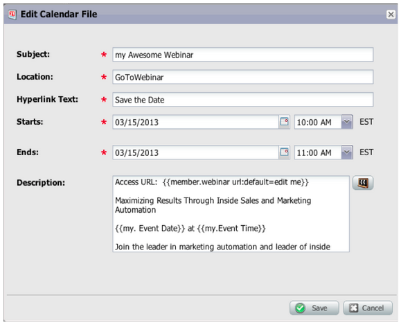
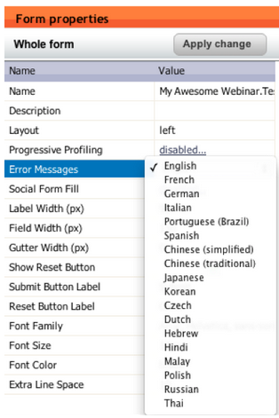

# 發行說明： 2013年3月 {#release-notes-march}

3月發行版本包含下列功能。

## Marketo行事曆檔案 {#marketo-calendar-files}

建立行事曆檔案作為 **我的Token** 用於事件確認和提醒電子郵件中。 此整合行事曆檔案（例如.ics檔案）將轉譯所有權杖，包括「我的權杖」和 `{{member.webinar URL}}` Token。

## 等候直到+/- {#wait-until}

建立可以在日期Token之前或之後執行指定天數的「等待步驟」。 例如，您可以建立等待步驟，在事件日期之前等待3天，然後傳送提醒！

您可以建立等待步驟，在潛在客戶生日之前等候14天。 若選取「使用此日期的下一個週年紀念日」，系統會自動忽略與日期相關的年份，並改用目前或下一個日曆年份。

## 社交抽獎 {#social-sweepstakes}

抽獎活動可讓您的潛在客戶有機會贏得獎項，並將您的情況告訴他們的朋友。 您可從參與者中隨機選取獲勝者，並傳送電子郵件給他們。

## 其他表單錯誤訊息語言 {#additional-form-error-message-languages}

表單錯誤訊息中新增了十多種語言！

## 支援新聞與警示 {#support-news-and-alerts}

訂閱P1警示、已知問題、支援專家的提示和提示，以及Marketo客戶支援的更新消息，即可與Marketo客戶支援保持連線。
