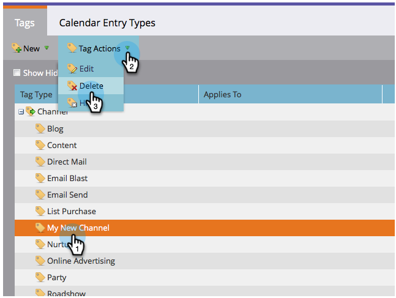
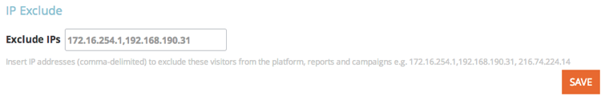

# 發行說明：2014年8月 {#release-notes-august}

2014年8月版本包含下列功能。 查看您的Marketo版本以了解功能可用性。 發行後回來取得詳細功能檔案的連結。

## 行銷行事歷授權 {#marketing-calendar-licenses}

在2014年9月5日之後，只有5位使用者可以免費存取行銷行事歷。 一定要 [發出/撤銷行銷日曆授權](/help/marketo/product-docs/core-marketo-concepts/marketing-calendar/understanding-the-calendar/issue-revoke-a-marketing-calendar-license.md) 之前傳送給您選擇的使用者，以取得無中斷的存取權。

## 新使用者權限 {#new-user-permissions}

已新增下列新使用者權限：

| 權限 | 說明 |
|---|---|
| 存取收入總管 | 如果您已購買RCA，現在可以控制誰可以存取。 |
| 匯入清單 | 限制用戶將清單導入到銷售機會資料庫。 |
| 清單匯入 | 限制使用者透過行銷活動下的方案匯入清單。 |
| 啟動觸發程式促銷活動 | 控制誰可以和誰不能啟用觸發促銷活動。 |
| 排程批次促銷活動 | 控制可排程批次促銷活動執行的人員。 |

## 從管理員匯出使用者和角色 {#export-users-and-roles-from-admin}

您現在可以 [匯出使用者和角色清單](/help/marketo/product-docs/administration/users-and-roles/export-a-list-of-users-and-roles.md) 從Marketo。 您也可以包含「上次登入」時間戳記，以便匯出內容。

## 刪除管道和標籤 {#delete-channels-and-tags}

您現在可以刪除任何未使用的管道和狀態。 一如既往，您只能隱藏目前使用中的一個。

## 自動DKIM {#automated-dkim}

為了改善傳遞能力，所有傳出電子郵件都將經過DKIM(DomainKeys Indified Mail)簽名。 依預設，電子郵件將使用Marketo的共用DKIM簽名。 您將可以選擇自定義此簽名。

>[!NOTE]
>
>DKIM將緩慢推出，幾週後可能就看不到了。

## 即時個人化更新 {#real-time-personalization-updates}

我們已將標籤新增至行銷活動頁面，讓您可以標籤至您的內容。

## 行動定位 {#mobile-targeting}

你問了社區，我們送來了！ 您現在可以包含、排除或設定行動裝置和平板電腦使用者的特定動作呼叫。

## 增強的1:1細分與目標定位 {#enhanced-segmentation-and-targeting}

您現在可以使用進階篩選運算子來鎖定已知訪客。

## 行銷活動共用 {#campaign-sharing}

您現在可以快速輕鬆地共用RTP促銷活動預覽連結。

## 內容建議引擎報表 {#content-recommendation-engine-report}

我們已新增內容建議引擎報表供您查看不錯的摘要。

## 增強的使用者管理 {#enhanced-user-administration}

管理員使用者現在可以因為多次登入嘗試失敗而鎖定使用者。 您也可以視需要解鎖這些使用者。

## 追蹤控制 {#tracking-control}

您現在可以在即時個人化中，從所有追蹤和報表中排除特定IP。

