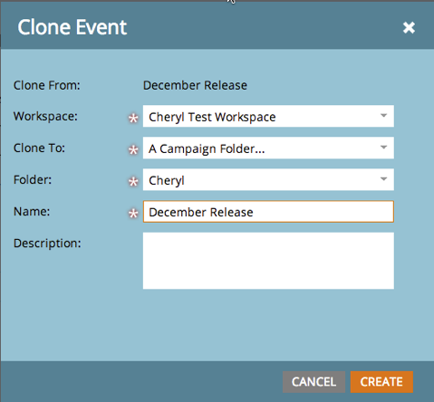
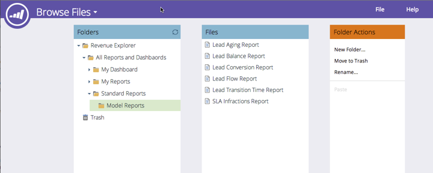

# 發行說明：2014年12月 {#release-notes-december}

2014年12月發行包含下列功能。 請查看您的Marketo版本，了解功能是否可用。 發行後，請務必回來尋找各功能詳細文章的連結！

## 銷售分析報表 {#sales-insight-reports}

[Sales Insight電子郵件績效報表](/help/marketo/product-docs/marketo-sales-insight/msi-for-salesforce/features/performance-reports/sales-insight-email-performance-report.md)可讓您依電子郵件和銷售代表查看電子郵件量度。 它支援透過Salesforce、Microsoft Dynamics、Outlook外掛程式和Gmail外掛程式傳送的電子郵件。

## Facebook自訂對象 {#facebook-custom-audiences}

一旦您的Marketo管理員透過「管理員> Launchpoint](/help/marketo/product-docs/demand-generation/ad-network-integrations/add-facebook-custom-audiences-as-a-launchpoint-service.md)新增[Facebook後，您就可以透過Marketo靜態或智慧清單](/help/marketo/product-docs/demand-generation/facebook/create-a-custom-audience-in-facebook.md)，輕鬆建立、更新或[取代Facebook自訂對象。 在任何靜態或智慧清單的前導格線底部尋找新的Facebook圖示。

## 改善跨工作區的複製功能  {#improved-cloning-across-workspaces}

[將程式](/help/marketo/product-docs/core-marketo-concepts/programs/working-with-programs/clone-a-program.md) 複製到其他工作區從未像現在這樣簡單！按一下原地複製時，您會選取目標工作區。 不再複製到資料夾中，然後移動資料夾！

>[!NOTE]
>
>此新克隆功能目前僅適用於程式。

## 參考智慧清單 {#reference-smart-list}

[建立智慧清單或流程時，可以參](/help/marketo/product-docs/core-marketo-concepts/smart-lists-and-static-lists/using-smart-lists/reference-a-list-or-smart-list-across-workspaces.md) 考與其他工作區共用的智慧清單。

## 清單匯入改善 {#list-import-improvements}

[導](/help/marketo/getting-started/quick-wins/import-a-list-of-people.md) 入以UTF-16、Shift-JIS或EUC-JP編碼的檔案。我們繼續支援UTF-8編碼檔案。

## 電子郵件指令碼中的連結追蹤 {#link-tracking-in-email-scripting}

現在，電子郵件指令碼內的連結將會受到追蹤，並可在「電子郵件連結效能」報表中使用。

## 令牌編碼設定 {#token-encoding-setting}

我們已推出新的安全性功能，可自動對Token進行HTML編碼，預設會在2015年3月啟用。 在此之前，請在「欄位管理」中切換此功能，提前測試行為。 所有銷售機會和公司代號插入電子郵件或登錄頁面時都會經過編碼。 個別欄位也會提供選項。

## 新ReST API呼叫 {#new-rest-api-calls}

銷售機會與活動ReST API的三次新呼叫：

·獲取銷售機會分區

·關聯銷售機會

·合併銷售機會

完整詳細資訊將在[developers.marketo.com](https://developers.marketo.com/)發行後提供

## Munchkin Javascript相容性增強功能 {#munchkin-javascript-compatibility-enhancements}

我們已對Munchkin進行數項微幅增強，以確保在頁面上其他JavaScript的情況下，Munchkin可繼續快速載入並視需要運作。

轉出將於12月中旬開始進行，並持續數月。

## Revenue Explorer升級的外觀和風格 {#revenue-explorer-upgraded-look-and-feel}

## RTP:指定帳戶清單模組 {#rtp-named-account-list-module}

在新的「指定帳戶」頁面中管理並監控您的重要高收益帳戶。 上傳新的指定帳戶清單，以識別和鎖定這些組織。 我們已自動化此程式，讓您能夠更有控制力和彈性地實施以帳戶為基礎的行銷計畫，並在不同管道（網頁和廣告）中鎖定您的關鍵帳戶。

## RTP:區域促銷活動中的滑動效果 {#rtp-sliding-effect-for-in-zone-campaigns}

我們已為「在區域中」促銷活動新增滑動效果，讓您的個人化內容可在頁面載入時滑動至適當位置。

