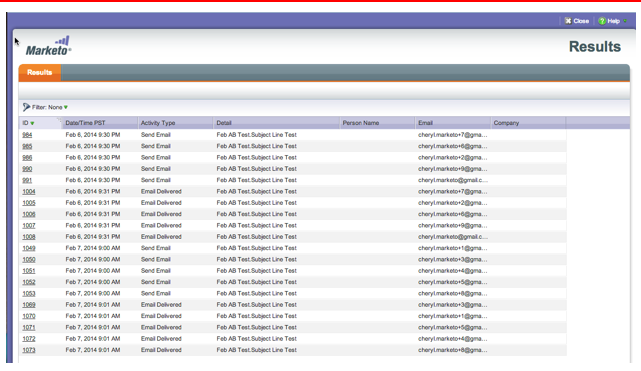

# 發行說明：2014年2月 {#release-notes-february}

2014年2月版本包含下列功能。 請查看您的Marketo版本，了解功能是否可用。 發行後，請務必回來尋找每個功能的詳細知識庫文章連結！

## 以成功標準作為參與分數 {#engagement-score-as-winning-criteria}

[使用參與分數](/help/marketo/product-docs/email-marketing/email-programs/email-program-actions/email-test-a-b-test/define-the-a-b-test-winner-criteria.md) 來判斷A/B分割測試或Champion/Challenger測試中的成功變體。 測試必須至少執行24小時，才能獲得足夠的參與分數。

## 電子郵件計畫結果頁簽 {#email-program-results-tab}

[查看結果](/help/marketo/product-docs/email-marketing/email-programs/email-program-data/view-email-program-results.md) 和為電子郵件程式記錄的活動。

## 被阻止郵寄的人員/線索 {#people-leads-blocked-from-mailing}

[按一下阻止郵寄的人員/線索](/help/marketo/product-docs/email-marketing/email-programs/managing-people-in-email-programs/define-an-audience-with-a-smart-list.md) 號碼可查看因取消訂閱、黑名單、電子郵件地址無效或空白或行銷暫停而未收到電子郵件的使用者。

## 匯出電子郵件方案資料 {#export-email-program-data}

[將電子郵件量度匯出至Excel](/help/marketo/product-docs/email-marketing/email-programs/email-program-data/export-email-program-dashboard-to-excel.md)，包括AB測試變體資料。

## 參與資料流績效報表中的參與分數 {#engagement-score-in-engagement-stream-performance-report}

我們將參與分數新增至 [參與資料流績效報表](/help/marketo/product-docs/email-marketing/drip-nurturing/reports-and-notifications/engagement-stream-performance-report.md) 可協助您了解參與計畫中的內容有何成效。

## 電子郵件分析中的方案詳細資訊 {#program-details-in-email-analysis}

[現在，您可以依方案名稱、管道和標籤來分組電子郵件量度](/help/marketo/product-docs/reporting/revenue-cycle-analytics/email-analysis/build-an-email-analysis-report-that-shows-program-information.md). 當電子郵件是方案的本機資產時，方案名稱會新增至「電子郵件名稱」欄位。 新的「方案名稱」欄位會顯示傳送電子郵件之智慧行銷活動的方案名稱。 如果電子郵件是不同方案的本機資產，則可能與「電子郵件名稱」欄位中的方案不同。

## 更新點按連結篩選器和觸發器 {#update-to-clicks-link-filters-and-trigger}

已更新下列篩選器和觸發器名稱：

* 點按連結以點按網頁上的連結
* 按一下連結以點按網頁上的連結
* 未點按連結至未點按網頁上的連結

## Forms 2.0增強功能 {#forms-enhancements}

此版本已提供Forms 2.0多項「生命品質」更新。 除了對內嵌表單啟用漸進式分析外，我們還進行了工作流程和UX變更，讓您更輕鬆地使用編輯器中更進階的功能。 [包括可見性規則](/help/marketo/product-docs/demand-generation/forms/form-fields/dynamically-toggle-visibility-of-a-form-field.md)、進階感謝頁面和隱藏欄位。

