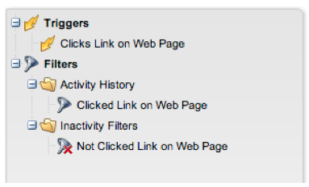

# 發行說明：2014 年 2 月 {#release-notes-february}

2014年2月發行版本包含下列功能。 請檢查您的Marketo版本是否有功能可用。 發行後，請務必返回尋找每個功能的詳細知識庫文章連結！

## [!UICONTROL Engagement Score]為獲勝條件 {#engagement-score-as-winning-criteria}

[使用參與分數](/help/marketo/product-docs/email-marketing/email-programs/email-program-actions/email-test-a-b-test/define-the-a-b-test-winner-criteria.md)來決定A/B分割測試或冠軍/挑戰者測試中的成功變體。 測試必須執行至少24小時，以提供足夠的參與分數。

## 電子郵件程式[!UICONTROL Results]索引標籤 {#email-program-results-tab}

[檢視結果](/help/marketo/product-docs/email-marketing/email-programs/email-program-data/view-email-program-results.md)和為電子郵件程式記錄的活動。

## 人員/[!UICONTROL Leads]已封鎖郵寄 {#people-leads-blocked-from-mailing}

[按一下封鎖郵寄的人員/銷售機會](/help/marketo/product-docs/email-marketing/email-programs/managing-people-in-email-programs/define-an-audience-with-a-smart-list.md)號碼，檢視哪些人不會收到因取消訂閱、列入黑名單、電子郵件地址無效或空白，或行銷活動被暫停而收到的電子郵件。

## 匯出電子郵件程式資料 {#export-email-program-data}

[將電子郵件度量匯出至 [!DNL Excel]](/help/marketo/product-docs/email-marketing/email-programs/email-program-data/export-email-program-dashboard-to-excel.md)，包括AB測試變體資料。

## [!UICONTROL Engagement Score]報告中的[!UICONTROL Engagement Stream Performance] {#engagement-score-in-engagement-stream-performance-report}

我們已將參與分數新增到[[!UICONTROL Engagement Stream Performance]報告](/help/marketo/product-docs/email-marketing/drip-nurturing/reports-and-notifications/engagement-stream-performance-report.md)，以協助您瞭解參與計畫中的內容有多有效。

## 電子郵件分析中的計畫詳細資訊 {#program-details-in-email-analysis}

[您現在可以依方案名稱、頻道和標籤來群組您的電子郵件量度](/help/marketo/product-docs/reporting/revenue-cycle-analytics/email-analysis/build-an-email-analysis-report-that-shows-program-information.md)。 當電子郵件是計畫的本機資產時，計畫名稱會新增到電子郵件名稱欄位。 新的「方案名稱」欄位會顯示傳送電子郵件的智慧型行銷活動的方案名稱。 如果電子郵件是不同計畫的本機資產，則此專案可能不同於「電子郵件名稱」欄位中的計畫。

## 更新點按連結篩選器和觸發器 {#update-to-clicks-link-filters-and-trigger}

已更新下列篩選器和觸發器名稱：

* 按一下連結至[!UICONTROL Clicks Link on Web Page]
* 已點按連結至[!UICONTROL Clicked Link on Web Page]
* 未點按[!UICONTROL Not Clicked Link on Web Page]的連結

## Forms 2.0增強功能 {#forms-enhancements}

我們已在此版本中為Forms 2.0提供數個「生活品質」更新。 除了啟用內嵌表單的漸進式設定外，我們還進行了工作流程和UX變更，這些變更可讓您更輕鬆地在編輯器中使用更進階的功能，[包括可見性規則](/help/marketo/product-docs/demand-generation/forms/form-fields/dynamically-toggle-visibility-of-a-form-field.md)、進階感謝頁面，以及隱藏欄位。

