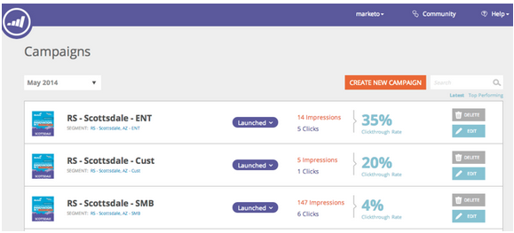

# 發行說明：2014 年 6 月 {#release-notes-june}

2014年6月發行版本包含下列功能。 請檢查您的Marketo版本是否有功能可用。

## 更新UI — 即將推出！ {#updated-ui-coming-soon}

新外觀，包括[!DNL Marketo Lead Management]的導覽功能，即將於稍後版本推出！

## 適用於[!DNL Outlook] 2013的[!DNL Sales Insight]外掛程式 {#sales-insight-plugin-for-outlook}

您必須下載新的外掛程式，才能進行這項作業。 您可以從[這裡](/help/marketo/product-docs/marketo-sales-insight/msi-outlook-plugin/install-the-marketo-email-add-in-for-outlook-with-a-registration-code.md)下載。

## 權杖解析 {#token-resolution}

當您從[!DNL Sales Insight]傳送測試電子郵件時，目前電子郵件中的權杖不會解析，且會傳送預設值。 此增強功能將確保權杖能解析在測試電子郵件中。

## 自訂星星和火焰的百分比 {#customize-percentages-for-stars-and-flames}

[設定獲得1、2或3顆星和火焰的銷售機會百分比](/help/marketo/product-docs/marketo-sales-insight/msi-for-salesforce/features/stars-and-flames/customize-stars-and-flames.md)。

## 潛在客戶REST API {#lead-rest-api}

透過新的ReST API，以程式設計方式建立、讀取和更新銷售機會。 若要開始使用ReST，您必須在Marketo中[建立自訂服務](/help/marketo/product-docs/administration/additional-integrations/create-a-custom-service-for-use-with-rest-api.md)。 然後前往[開發人員網站](https://experienceleague.adobe.com/zh-hant/docs/marketo-developer/marketo/rest/rest-api)取得有關使用此API的詳細資訊。

## Marketo Real-Time Personalization (RTP)行銷活動頁面更新 {#marketo-real-time-personalization-rtp-campaigns-page-update}

RTP行銷活動現在包含新設計，其中包含縮圖檢視和行銷活動績效。 此外，您可以[根據日期或最佳績效，組織行銷活動](/help/marketo/product-docs/web-personalization/working-with-web-campaigns/sort-web-campaigns-by-latest-or-top-performing.md)。

## 網站分析整合 {#web-analytics-integrations}

在網站分析平台中附加所有RTP資料。

現已預設啟用與[Google Analytics](/help/marketo/product-docs/web-personalization/reporting-for-web-personalization/web-analytics-integrations/integrate-rtp-with-google-analytics.md) (GA)的整合，因此在「帳戶設定」底下，開啟您要傳送其資料至GA自訂變數和事件的開關。

我們也已完成與[Adobe SiteCatalyst](/help/marketo/product-docs/web-personalization/reporting-for-web-personalization/web-analytics-integrations/integrate-with-adobe-analytics.md)的整合。
