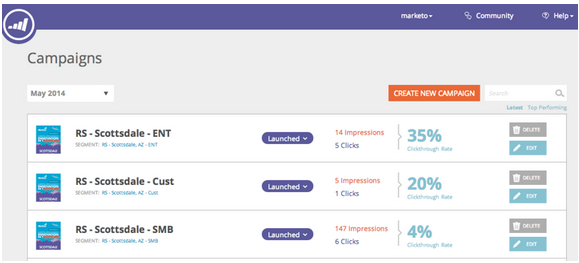

# 發行說明：2014年6月 {#release-notes-june}

2014年6月發行包含下列功能。 請查看您的Marketo版本，了解功能是否可用。

## 更新UI — 即將推出！ {#updated-ui-coming-soon}

新版本即將推出全新外觀，包括Marketo Lead Management的導覽功能！

## Outlook 2013的Sales Insight外掛程式 {#sales-insight-plugin-for-outlook}

這需要下載新外掛程式。 您可以從[這裡](/help/marketo/product-docs/marketo-sales-insight/msi-outlook-plugin/install-the-marketo-email-add-in-for-outlook-with-a-registration-code.md)下載。

## 代號解析度 {#token-resolution}

當您從Sales Insight傳送測試電子郵件時，目前電子郵件中的代號無法解析，且會傳送預設值。 此增強功能可確保測試電子郵件中能解析代號。

## 自訂星圖和火焰的百分比 {#customize-percentages-for-stars-and-flames}

[設定](/help/marketo/product-docs/marketo-sales-insight/msi-for-salesforce/features/stars-and-flames/customize-stars-and-flames.md) 獲得1、2或3顆星和火焰的線索的百分比。

## Lead ReST API {#lead-rest-api}

通過我們新的ReST API，以寫程式方式建立、讀取和更新銷售機會。 若要開始使用ReST，您需要在Marketo中[建立自訂服務](/help/marketo/product-docs/administration/additional-integrations/create-a-custom-service-for-use-with-rest-api.md)。 接著前往[開發人員網站](https://developers.marketo.com/documentation/rest/)以取得使用此API的詳細資訊。

## Marketo即時個人化(RTP)促銷活動頁面更新 {#marketo-real-time-personalization-rtp-campaigns-page-update}

RTP促銷活動現在包含新的設計，內含縮圖檢視和促銷活動績效。 此外，您也可以根據日期或最佳績效，[組織您的促銷活動](/help/marketo/product-docs/web-personalization/working-with-web-campaigns/sort-web-campaigns-by-latest-or-top-performing.md)。

## 網站分析整合 {#web-analytics-integrations}

在您的網頁分析平台中附加您的所有RTP資料。

預設情況下，與[Google Analytics](/help/marketo/product-docs/web-personalization/reporting-for-web-personalization/web-analytics-integrations/integrate-rtp-with-google-analytics.md)(GA)的整合現在已啟用，因此，在「帳戶設定」下，會開啟您要傳送至GA自訂變數和事件的資料的交換機。

我們也已完成與[Adobe SiteCatalyst](/help/marketo/product-docs/web-personalization/reporting-for-web-personalization/web-analytics-integrations/integrate-with-adobe-analytics.md)的整合。
