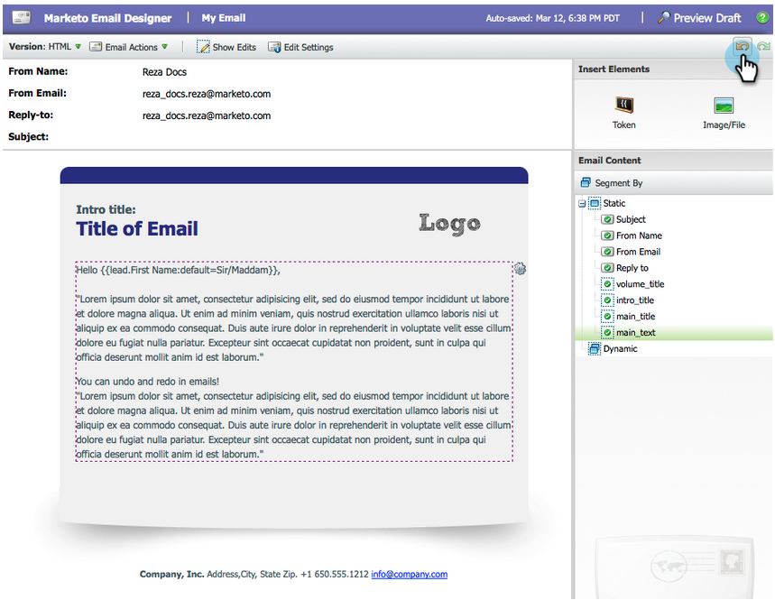
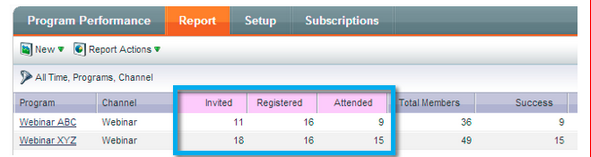

# 發行說明：2014年3月 {#release-notes-march}

2014年3月發行包含下列功能。 請查看您的Marketo版本，了解功能是否可用。 發行後，請務必回來尋找每個功能的知識庫文章連結。

## 電子郵件計畫儀表板刷新按鈕 {#email-program-dashboard-refresh-button}

使用[重新整理按鈕](/help/marketo/product-docs/email-marketing/email-programs/email-program-data/use-the-email-program-dashboard.md)取得有關電子郵件傳送或AB測試的最新電子郵件量度！

## 在電子郵件編輯器和程式碼片段編輯器中還原/重做 {#undo-redo-in-the-email-editor-and-snippet-editor}

[復原或](/help/marketo/product-docs/email-marketing/general/email-editor-2/edit-elements-in-an-email.md) 重複目前工作階段的50個動作。

## 方案執行情況報表中的方案狀態列 {#program-status-columns-in-program-performance-report}

使用[程式效能報表](/help/marketo/product-docs/core-marketo-concepts/programs/program-performance-report/add-program-status-columns-to-a-program-report.md)時，您現在可以看到有多少人處於哪些程式狀態。

## Analytics的包容性與營運計畫 {#inclusive-and-operational-programs-for-analytics}

您現在可以在「收入總管」和「分析器」中，將「分析行為」選項設為「包含」，在編輯「方案管道」時，將[包含不含期間成本的方案](/help/marketo/product-docs/reporting/revenue-cycle-analytics/program-analytics/make-a-program-without-a-period-cost-available-in-revenue-explorer-and-analyzers.md)。 您也可以選擇「操作」，從而將操作程式排除在一起，從而不報告所有內容。

## 潛在客戶轉換的混合與隱含選項 {#hybrid-and-implicit-options-for-lead-conversion}

您可以變更Marketo在Lead Analysis中連結潛在客戶轉換量度的連絡方式和商機。 您可以將歸因設定](/help/marketo/product-docs/administration/settings/change-attribution-settings-for-analytics.md)變更為三個選項之一。 [變更此設定不會修改任何Marketo或CRM資料；它只會變更報表的執行方式，且可隨時還原。

顯式設定將只將業務機會中具有角色的聯繫人視為轉換的銷售線索（預設行為）。 隱式將將業務機會中與帳戶關聯的所有聯繫人（無論角色）視為轉換。 混合式會將具有角色的聯絡人視為已轉換（如果可用）;如果沒有，我們將帳戶中的所有聯繫人視為已轉換。

提醒您，此設定也會變更方案歸因量度。

## 其他使用者語言 {#additional-user-language}

選取您的[Marketo應用程式語言](/help/marketo/product-docs/administration/settings/select-your-language-locale-and-time-zone.md)。 以您慣用的語言檢視Marketo Lead Management介面，現在支援日文。

## Marketo開發人員部落格 {#marketo-developer-blog}

[Marketo開發人員部落格](https://developers.marketo.com/blog/)專屬於支援現代行銷人員快速變遷需求的網頁開發人員和軟體工程師。 您可以訂閱新整合選項、API版本更新和一系列新作法文章的公告，其中包含程式碼範例和與Marketo平台整合的最佳實務。

此系列中的[第一篇文章](https://developers.marketo.com/blog/retrieving-customer-and-prospect-information-from-marketo-using-the-api/)將引導您了解如何使用API有效擷取儲存在Marketo中之人員（客戶/連絡人/銷售機會）的相關資訊。
