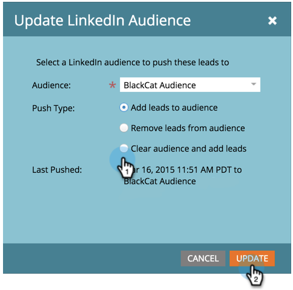

# 發行說明：2015年4月 {#release-notes-april}

2015年4月發行包含下列功能。 請查看您的Marketo版本，了解功能是否可用。 發行後，請務必回來尋找各功能詳細文章的連結！

## Analytics首頁重新設計

[Analytics首頁重新設計](/help/marketo/product-docs/reporting/basic-reporting/creating-reports/navigating-the-analytics-home-page.md)

>[!NOTE]
>
>此功能將於4月28日星期二發行。

新的[Analytics首頁](/help/marketo/product-docs/reporting/basic-reporting/creating-reports/navigating-the-analytics-home-page.md)可讓您快速存取所有可用報表類型的臨機報表。

此外，現在提供私人與共用報表組織。 建立或拖曳報表至您的「我的報表」資料夾，以鎖定其他使用者檢視、編輯或刪除報表。 群組報表會在所有使用者間共用。

## Marketo行動參與 {#marketo-mobile-engagement}

**Marketo行動參與**

透過Marketo行動參與度，提供引人入勝的行動體驗相當輕鬆。 建立高度個人化的行銷活動，提供引人入勝的內容，而無需依賴應用程式開發團隊。 新的篩選器和觸發器可讓您透過推播通知在行動通道上接聽和回應。

## linkedIn Lead Accelerator整合

[linkedIn Lead Accelerator整合](/help/marketo/product-docs/demand-generation/social/social-functions/use-a-marketo-list-or-smart-list-as-a-linkedin-audience-segment.md)

將您的領先培養策略擴展到付費展示和社交廣告。 [具有LinkedIn銷售機會加速器的廣告網路整合](/help/marketo/product-docs/demand-generation/ad-network-integrations/add-linkedin-matched-audiences-as-a-launchpoint-service.md)可讓您根據任何智慧或靜態清單的成員，安全地在LinkedIn中建立受眾區段。 接著，即可以一系列相關廣告來培育LinkedIn受眾區段內的成員。

## Marketo Sales Insight for Salesforce1 {#marketo-sales-insight-for-salesforce}

您最喜愛的Sales Insight功能 — 銷售機會摘要、最佳下注、有趣時刻，以及新增至Marketo Campaign — 所有這些功能都可在Salesforce1應用程式中取得。

 

## RTP — 帳戶型行銷分析 {#rtp-account-based-marketing-analytics}

**RTP — 帳戶型行銷分析**

根據購買週期中的每個階段，使用指定帳戶清單的新效能圖表，即時顯示關鍵指定帳戶清單的效能。 圖形會根據瀏覽次數和訪客狀態，顯示關鍵組織從從認知到動作的瀏覽階段。
