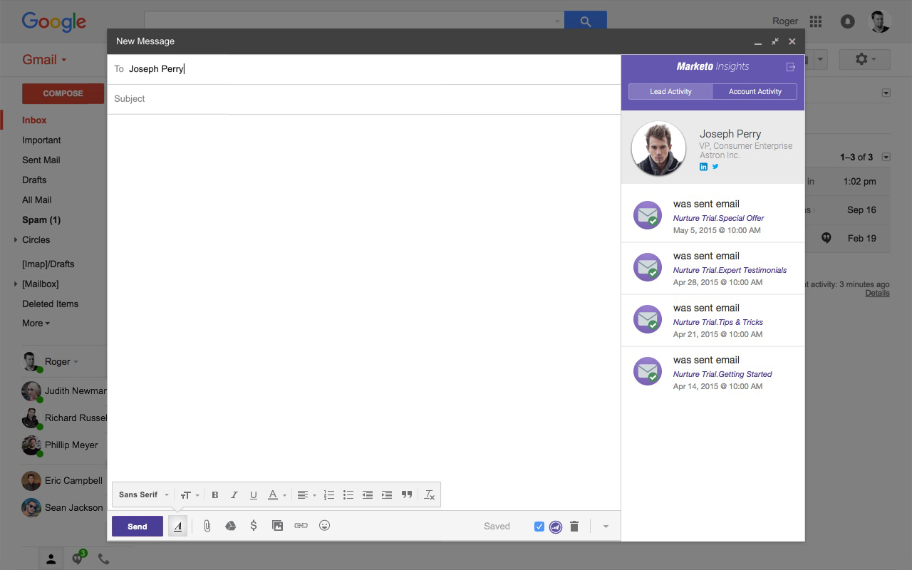
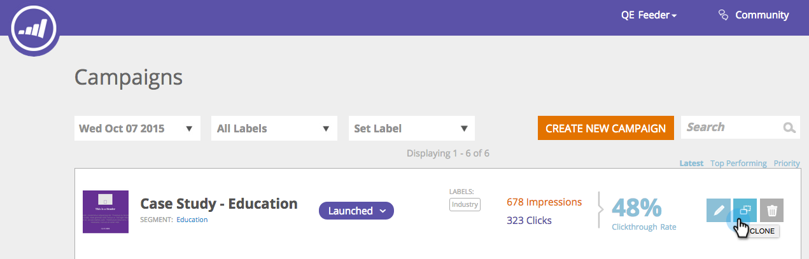

# 發行說明：2015年秋季 {#release-notes-fall}

』15年秋季版包含下列功能。 請查看您的Marketo版本，了解功能是否可用。

## 訂閱智慧清單 {#subscribe-to-a-smart-list}

[訂閱智慧清單](/help/marketo/product-docs/reporting/basic-reporting/report-subscriptions/subscribe-to-a-smart-list.md)

訂閱智慧清單可讓行銷人員匯出智慧清單，並透過電子郵件傳送給未使用Marketo的利害關係人，例如銷售或電話行銷團隊。

匯出可以排程為每日、每週或每月，可以有結束傳送日期，並可自訂以共用有限的欄數。


可在智慧清單上建立多個訂閱。 每個訂閱、跨工作區、每個Marketo例項10萬個銷售機會，有100個訂閱的限制。


## Marketo自訂物件 {#marketo-custom-objects}

[Marketo自訂物件](/help/marketo/product-docs/administration/marketo-custom-objects/understanding-marketo-custom-objects.md)

從管理員UI輕鬆建立自訂物件。 我們目前支援在Marketo中建立1:N自訂物件，並將其連線至銷售機會或公司的能力。

>[!NOTE]
>
>Marketo自訂物件無法用於Spark。


## Marketo Insights for Google Chrome {#marketo-insights-for-google-chrome}

[Marketo Insights for Google Chrome](/help/marketo/product-docs/marketo-sales-insight/msi-chrome-plugin/using-marketo-insights-for-google-chrome.md)

很高興在此宣佈，我們的Google Mail Sales Insight擴充功能更新已正式發佈！ 在  [Chrome商店](https://chrome.google.com/webstore/detail/marketo-insights-for-goog/jjkfbhajlmoeegbjgjipliamplidmbjb).

此更新包含許多新功能：

* 在開展接洽之前，銷售人員可以直接在Google Mail中查看有關其潛在客戶的相關資訊，包括職務、twitter配置檔案、公司資訊、照片等。
* 銷售人員可即時查看潛在客戶在各個管道中參與的內容，例如開啟或點按的電子郵件、線上或親自參加的活動、瀏覽的網頁、下載的電子書等。
* 透過Google Mail傳送的電子郵件會記錄在Marketo中，並且會即時追蹤。 這可讓銷售人員了解潛在客戶何時查看其電子郵件，以便在正確的時間追蹤。 Marketo Sales Insight for Google Mail也讓銷售人員能輕鬆運用行銷所建立的範本，以傳送精美的邀請、優惠方案和其他類型的內容。



## Marketo行動參與 — 代號、傳送範例和預覽 {#marketo-mobile-engagement-tokens-send-sample-preview}

* [代號](/help/marketo/product-docs/mobile-marketing/push-notifications/configure-mobile-push-notification.md)
* [傳送範例](/help/marketo/product-docs/mobile-marketing/push-notifications/send-a-push-notification-sample.md)
* [預覽](/help/marketo/product-docs/mobile-marketing/push-notifications/preview-a-push-notification.md)

使用 [token](/help/marketo/product-docs/mobile-marketing/push-notifications/configure-mobile-push-notification.md).


您也可以 [預覽](/help/marketo/product-docs/mobile-marketing/push-notifications/preview-a-push-notification.md) 或發送 [範例](/help/marketo/product-docs/mobile-marketing/push-notifications/send-a-push-notification-sample.md) 推播通知，再部署給客戶。


## 瞬間的智慧型行銷活動 {#smart-campaigns-in-moments}

[瞬間的智慧型行銷活動](/help/marketo/product-docs/core-marketo-concepts/mobile-apps/marketo-moments/understanding-moments/understanding-smart-campaign-cards.md)

透過智慧型行銷活動傳送之電子郵件的統計資料現在可在「時刻」中取得。 此升級的其他功能包括：

* 輕掃完成。 你的資料流中有太多的卡？ 你現在可以把它們擦開！
* 直接從預覽畫面傳送範例
* 已添加到電子郵件程式卡的智慧清單詳細資訊
* 新增對電子郵件程式已中止狀態的支援


## RTP - Content Analytics和Recommendations {#rtp-content-analytics-and-recommendations}

[內容分析](/help/marketo/product-docs/web-personalization/understanding-web-personalization/understanding-content-analytics.md) 和Recommendations

RTP內容分析會顯示一般網站造訪的網站內容資產效能，以及從RTP的內容建議引擎產生的造訪。

* 了解哪些內容成效最佳，並帶來最多銷售機會
* 啟用RTP的預測內容引擎中的內容，自動向正確的訪客建議最佳內容，借此提高您的內容消耗
* 深入鑽研每個內容資產，以查看更深入的量度、圖形和效能

RTP的「資產」頁面現在分割為「內容分析」和「內容Recommendations」。

* **內容分析：** 顯示所有探索到和定義的Web內容的檢視和直接線索，幫助您分析表現最佳的內容
* **內容Recommendations**:顯示來自RTP建議內容的曝光次數和點按次數以及相關的銷售機會歸因。 您也可以編輯並啟用此頁面中的內容建議，以 [條](/help/marketo/product-docs/predictive-content/enabling-predictive-content/enable-the-content-recommendation-bar.md) 和 [多媒體](/help/marketo/product-docs/predictive-content/enabling-predictive-content/enable-predictive-content-for-web-rich-media.md) 建議。

* 自年初（2015年1月1日）起，這兩頁中的所有直接銷售機會資料已追溯更新。

## RTP — 複製RTP促銷活動 {#rtp-clone-an-rtp-campaign}

[RTP — 複製RTP促銷活動](/help/marketo/product-docs/web-personalization/working-with-web-campaigns/clone-a-web-campaign.md)

複製RTP促銷活動可讓建立更個人化的Web促銷活動更快速、更有效率。 在RTP的促銷活動頁面中使用原地複製功能，以複製促銷活動設定並變更用於分割測試最佳化的內容，或原地複製具有相同內容的促銷活動，並將其定位至不同的群體。 在數秒內建立行銷活動！



## RTF編輯器改良 {#rich-text-editor-improvements}

我們對RTF編輯器進行了幾項改善。 7月發佈更新版編輯器後，我們收到大量回饋，並能將這些變更納入此升級中。 接下來的幾個月還有很多。 以下是第4季新增功能的清單：

* 您的HTML程式碼現在支援VML:

```
<v:background xmlns:v="urn:schemas-microsoft-com:vml" fill="t">
<v:fill type="tile" src="<a href="https://i.imgur.com/YJOX1PC.png" rel="nofollow">https://i.imgur.com/YJOX1PC.png</a>" color="#7bceeb"/>
</v:background>
```

* 現在，任何項目都可插入有效的HTML註解中（先前已移除下列某些語法）:

`<!--[if gte mso 9]> <![endif]-->`

* 請勿將空的表格儲存格填入 `&nbsp;`

* 將新增至HTML來源編輯器的按鈕最大化/最小化
* 現在可在「表屬性」對話框中標識並顯示預先存在的表屬性
* 現在預設會顯示兩列按鈕。
* 編輯器現在會接受任何元素（甚至過時或非標準元素）:

`<myCustomElement>Hello World!</myCustomElement>`

* 編輯器現在會接受任何屬性（即使是過時或非標準屬性）:

```
<myCustomElement myCustomAttribute="foo">Hello World!</myCustomElement>
<td background="someImage.png"> 
```

## Microsoft Dynamics — 驗證同步 {#microsoft-dynamics-validate-sync}

[Microsoft Dynamics — 驗證同步](/help/marketo/product-docs/crm-sync/microsoft-dynamics-sync/sync-setup/validate-microsoft-dynamics-sync.md)

這個新的管理工具會執行一系列檢查，查看您的同步設定是否已正確設定。


## 將欄位添加到CRM自定義對象同步 {#add-fields-to-crm-custom-object-sync}

輕鬆將新欄位新增至從Salesforce和Dynamics同步的自訂物件。 您現在可以將新欄位新增至自訂物件同步，而不需停用和啟用整個自訂物件。

## 安全性功能變更 {#changes-to-security-features}

* 密碼嘗試次數限制為5次。 第五次嘗試後，將鎖定該用戶。
* 現在可為訂閱設定非作用中工作階段逾時。


## IE 11支援（並淘汰IE 9支援） {#ie-support-and-deprecating-support-for-ie}

我們現在正式支援Microsoft Internet Explorer 11瀏覽器，並正在取消對Microsoft Internet Explorer 9瀏覽器的支援。

## MSI的Lightning UI支援 {#lightning-ui-support-for-msi}

應用程式交換上的最新MSI包可與Salesforce UI的Lightning和舊版一起使用。

## 新Dynamics外掛程式 {#new-dynamics-plug-in}

這個新外掛程式會以非同步模式執行各種動作，以協助提高效能。

## 依Design Studio中登錄頁面的URL搜尋 {#search-by-url-of-landing-page-in-design-studio}

在Design Studio登陸頁面格線中，您現在可以依頁面URL搜尋，以尋找您的登陸頁面。 這也可匯出。
