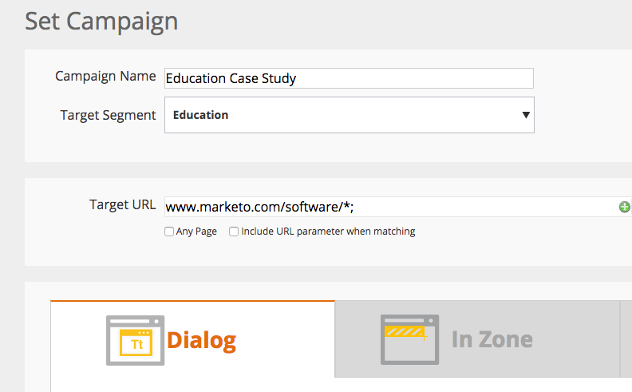

# 發行說明：2015年2月 {#release-notes-february}

2015年2月版本包含下列功能。 請查看您的Marketo版本，了解功能是否可用。 發行後，請務必回來尋找各功能詳細文章的連結。 滾鼓……

## 行銷自動化增強功能 {#marketing-automation-enhancements}

**[移動智慧型行銷活動](/help/marketo/product-docs/core-marketo-concepts/smart-campaigns/using-smart-campaigns/move-a-smart-campaign.md)**

歡慶！ 現在，您可以使用拖放或樹狀結構中的「移動」功能，將智慧型行銷活動移入及移出方案。

**[Dynamics 2015（線上）](https://docs.marketo.com/display/docs/microsoft+dynamics+2013+on-premises)**  — 支援！

**HTTPS憑證變更**

為保護客戶資料和SaaS服務的機密性和完整性，Marketo遵循SaaS行業最佳做法

並會針對下列網域，以更安全的版本(SHA-2（亦即SHA-256）和TLS)取代目前使用的安全性通訊協定（SHA-1和SSL）:

* [marketo.net](https://marketo.net) （加密的Munchkin流量）

* [marketo.com](https://marketo.com) （主要SaaS應用程式）

此發行後不久即會發生。 在2015年12月之前，將暫時支援[mktoapi.com](https://mktoapi.com)網域的SHA-1通訊協定，讓舊版系統和應用程式的擁有者能以SHA-2相容性更新其系統。

**安全蒙奇金**

我們將取消對SSL3的支援。 我們至今仍保有SSL3，以持續支援舊版網頁瀏覽器，但在2015年，我們不會再看到這些瀏覽器帶來顯著的網頁流量。 這只會在安全頁面上使用時影響Munchkin，並在2月發行版本後緩慢推出。

## 即時個人化增強功能 {#real-time-personalization-enhancements}

**[促銷活動的目標URL](/help/marketo/product-docs/web-personalization/working-with-web-campaigns/adding-a-target-url-to-a-web-campaign.md)**

使用「新增目標URL」，選取您要在上顯示即時促銷活動的頁面。 此功能適用於所有促銷活動類型（對話方塊、區域內、介面工具集），但對於區域內促銷活動特別有用，其中促銷活動只會針對選取的目標URL在區域ID中呈現。 它支援新增多個URL以鎖定不同的網頁。

**已新增至帳戶型定位的國家/地區和州**

現在可以將國家/地區和州新增至您的指定帳戶清單。 從特定位置鎖定關鍵帳戶潛在客戶。
