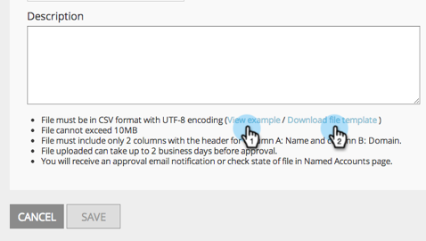

# 發行說明：2015年1月 {#release-notes-january}

2015年1月發行包含下列功能。 請查看您的Marketo版本，了解功能是否可用。 發行後，請務必回來尋找各功能詳細文章的連結！

## 行銷自動化更新 {#marketing-automation-updates}

**行動裝置友好式登陸頁面**

您現在可以從登錄頁面編輯器內[建立登錄頁面的行動檢視](/help/marketo/product-docs/demand-generation/landing-pages/free-form-landing-pages/add-a-mobile-view-for-your-free-form-landing-page.md)。 無論使用何種裝置，都能有效傳送訊息，並透過量身打造內容以方便在行動中使用，進而提高參與度。 此功能將在發行後的整周內逐步推出。

[ — 登陸頁面逐步說明影片 — ](https://youtu.be/aPQHlG2X6c0)

**新的Rest API呼叫**

銷售機會與活動ReST API的三次新呼叫：

* 刪除銷售機會
* 按計畫ID獲取銷售機會
* 獲取已刪除的銷售機會

此外，還有「同步銷售機會」的新選項，可以非同步地寫入銷售機會變更，以加快API呼叫的速度。 完整詳細資訊將在[developers.marketo.com](https://developers.marketo.com)發行後提供

**電子郵件指令碼自訂物件支援**

現在，從電子郵件指令碼記憶體取與帳戶物件相關聯的自訂物件！

## 即時個人化 {#real-time-personalization}

**Google和Facebook的個人化再行銷**

再行銷會向造訪過您網站的使用者顯示廣告。 您現在可以使用來自即時個人化的資料，在[Google](/help/marketo/product-docs/web-personalization/website-retargeting/personalized-remarketing-in-google.md)和[Facebook](/help/marketo/product-docs/web-personalization/website-retargeting/personalized-remarketing-in-facebook.md)上個人化您的再行銷活動。 對來自不同行業的受眾、具名帳戶清單、公司規模或來自已知銷售機會的任何資料進行再行銷。

[指定帳戶清單模組](/help/marketo/product-docs/web-personalization/account-based-web-marketing/create-a-new-account-list.md)

已命名帳戶模組的增強功能將改善使用者的匹配率和驗證。 新增項目包括：

* 使用銷售機會的電子郵件地址（也適用於僅限RTP的客戶）從您的指定帳戶清單中比對組織
* 支援每個帳戶高達10萬條記錄
* 要檢視和下載的CSV檔案範本

**更新的RTP標籤選項**

已更新「帳戶設定」下的RTP標籤選項，以包含：

1. CDN與非同步（建議的標籤）
1. CDN與同步（高速）
1. 不使用CDN的非同步標籤
1. 不使用CDN的同步標籤

為獲得最佳效能，建議將標籤放置在網頁中`<head>`後面標題的頂端。 所有標籤皆允許使用[RTP API](https://developers.marketo.com/documentation/websites/rtp-js-api/)。 有關如何部署RTP標籤的資訊，請參見[here](/help/marketo/product-docs/web-personalization/rtp-tag-implementation/deploy-the-rtp-javascript.md)。

