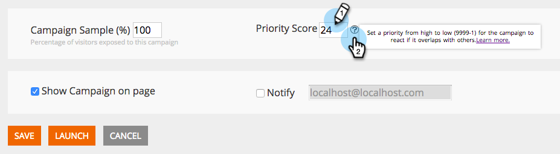

# 發行說明：2015年7月 {#release-notes-july}

## Marketo時刻 {#marketo-moments}

午餐時外出，但需要重新安排一封電子郵件嗎？ App Store或Google Play提供的Marketo Moments應用程式可讓您即時查看電子郵件和活動行銷活動的成效，以及未來iPhone、iPad或Android手機的成效。

## RTF編輯器更新 {#rich-text-editor-update}

以現代化外觀更新文字編輯器，包括簡化的文字格式、影像編輯、連結插入和HTML編輯。 HTML編輯器現在提供最低驗證，讓程式碼編輯限制較少。
`<iframe width="420" height="315" src="https://www.youtube.com/embed/LmmBN6IQrII" frameborder="0" allowfullscreen></iframe>` 此更新將在7月版本發行後的數天內自動推出。之後，您就可以從&#x200B;**管理員>電子郵件>編輯編輯器設定**&#x200B;在新版和舊版編輯器之間切換。

更新連結和影像對話方塊。

切換文字編輯器版本。

## 電子郵件傳遞單一登入 {#email-deliverability-single-sign-on}

按一下電子郵件傳遞方塊時，您不再需要提供登入憑證。

## 促銷活動優先順序 {#campaign-prioritization}

您是否已設定數個個人化RTP促銷活動，並注意到其中有些活動可能與其他活動重疊？ 請繼續設定優先順序，讓促銷活動的RTP應顯示於其他促銷活動。

## 公司API {#company-api}

**透過REST API存取公司物件**:REST API現在提供Marketo公司（亦即帳戶）物件的存取權。這表示您可以讀取、更新和刪除在Marketo中建立的公司對象，並使用更新的銷售機會API將銷售機會與這些公司關聯。

在公司API的參考指南中了解[更多](https://developers.marketo.com/documentation/company-api/)。

## 存取電子郵件傳遞 {#access-email-deliverability}

**存取電子郵件傳遞工具**:此新權限可讓管理員授予使用者存取電子郵件傳遞工具的權限。
