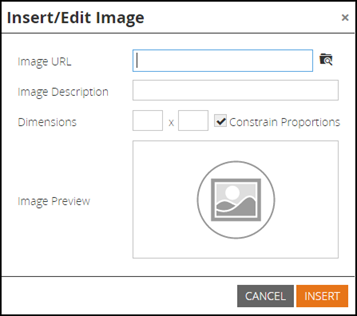

# 發行說明： 2015年7月 {#release-notes-july}

## Marketo時刻 {#marketo-moments}

午餐時間外出，但需要重新排程電子郵件嗎？ App Store或Google Play提供的Marketo Ments應用程式，可讓您透過iPhone、iPad或Android手機，即時瞭解您的電子郵件和事件行銷活動的執行狀況，以及未來趨勢。

## RTF編輯器更新 {#rich-text-editor-update}

以現代外觀更新文字編輯器，包括簡化的文字格式、影像編輯、連結插入和HTML編輯。 HTML編輯器的驗證功能現在已降至最低，因此可編輯限制較少的程式碼。
`<iframe width="420" height="315" src="https://www.youtube.com/embed/LmmBN6IQrII" frameborder="0" allowfullscreen></iframe>` 此更新將在7月發行後的幾天內自動推出。 之後，您將能夠從切換編輯器的新舊版本 **管理員>電子郵件>編輯編輯器設定**.

更新連結和影像對話方塊。

切換文字編輯器版本。

## 電子郵件傳遞能力單一登入 {#email-deliverability-single-sign-on}

按一下電子郵件傳遞能力圖磚時，您不再需要提供登入認證。

## 行銷活動優先順序 {#campaign-prioritization}

您是否已設定數個個人化RTP行銷活動，並發現其中一些行銷活動可能與其他行銷活動重疊？ 繼續進行並設定行銷活動的RTP應比其他行銷活動顯示的優先順序。

## 公司API {#company-api}

**透過REST API存取公司物件**：REST API現在可讓您存取Marketo公司（亦即帳戶）物件。 這表示您可以讀取、更新及刪除您在Marketo中建立的公司物件，並使用更新的銷售機會API將銷售機會與這類公司建立關聯。

瞭解 [更多](https://developers.marketo.com/documentation/company-api/) （位於公司API參考指南中）。

## 存取電子郵件傳遞能力 {#access-email-deliverability}

**存取電子郵件傳遞工具**：此新許可權可讓管理員授予使用者對電子郵件傳遞工具的存取權。
