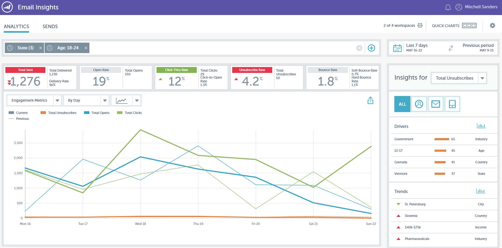

# 發行說明：』16年春 {#release-notes-spring}

』16年春季版包含下列功能。 請按一下標題連結，以檢視每項功能的詳細文章。

## [電子郵件分析](/help/marketo/product-docs/reporting/email-insights/email-insights-overview.md) {#email-insights}

「電子郵件前瞻分析」是全新的歷史匯總資料電子郵件分析體驗，在Project Orion中，經過重新設計，提供超快的效能。 它提供全新的使用者介面設計，經過最佳化以符合電子郵件行銷人員的需求和工作流程。

>[!NOTE]
>
>我們將從6月3日起，分批向客戶發佈「電子郵件前瞻分析」。 我們的目標是在未來幾個月內完成這項工作。 啟用後，我們會通過電子郵件通知您。

## [電子郵件範本選擇器](/help/marketo/product-docs/email-marketing/general/email-editor-2/email-template-picker-overview.md) {#email-template-picker}

使用全新的入門範本，製作精美的電子郵件！ 此外，還可從即時縮圖快速找到範本。

>[!NOTE]
>
>電子郵件編輯器2.0（含範本選擇器）將於6月3日起逐步推出。 我們將在6月30日前完成推出。 與「電子郵件分析」不同，當您有存取權時，將不會收到通知。 若要查看是否確實如此，請依照[本文](/help/marketo/product-docs/email-marketing/general/email-editor-2/transitioning-to-email-editor-2-0.md)中的步驟操作。

## [電子郵件編輯 — 重新想像](/help/marketo/product-docs/email-marketing/general/email-editor-2/email-editor-v2-0-overview.md) {#email-editing-re-imagined}

沒錯，一個全新的電子郵件編輯！ 使用輕量型拖放功能來新增和重新排序內容。 新元素（包括影像、影片、變數和模組）必定能增強您的編輯體驗。 另請查看更新的程式碼編輯器、預覽器和預先標題支援。

## [行動應用程式內訊息](/help/marketo/product-docs/mobile-marketing/in-app-messages/understanding-in-app-messages.md) {#mobile-in-app-messages}

直接在Marketo中為您的應用程式建立令人驚艷的應用程式內訊息。 使用應用程式內訊息程式，明確定義應查看該訊息的對象，以及查看時機。 使用程式儀表板輕鬆監視其效能。

## [無草稿片段](/help/marketo/product-docs/administration/users-and-roles/managing-user-roles-and-permissions/enable-no-draft-for-snippets.md) {#no-draft-snippets}

每次更新程式碼片段時，您必須重新核准所有內容的日子已過去！ 若使用非草稿，所有使用程式碼片段的電子郵件和登錄頁面都會取得程式碼片段更新並維持其先前的狀態。 每次核准程式碼片段時，您都可以選擇執行「非草稿」並更新所有內容，或建立草稿。 由你決定！ 「無草稿」將可供所有客戶使用，並由管理員的新權限控制。

## [登錄頁面、登錄頁面範本和表單API](https://developers.marketo.com/blog/spring-2016-updates/) {#landing-page-landing-page-template-and-form-apis}

Marketo REST API現在支援控制Marketo登陸頁面、登陸頁面範本和表單。 使用者現在可以直接透過Marketo REST API建立、更新內容、核准及刪除這些資產。

## [API存取權限清單](/help/marketo/product-docs/administration/additional-integrations/create-an-allowlist-for-ip-based-api-access.md) {#ip-allowlisting-for-api-access}

與Marketo使用者登入的IP允許清單功能類似，Marketo管理員現在可以設定可存取Marketo SOAP和REST API的IP位址允許清單，借此封鎖非授權IP位址的存取。 這可為您的Marketo執行個體提供新增的安全層級，並確保API存取只能從組織的網路進行。 有關如何設定的詳細資訊，請參閱[Marketo檔案網站](/help/marketo/product-docs/administration/additional-integrations/create-an-allowlist-for-ip-based-api-access.md)。

## [全新高速Microsoft Dynamics同步連接器](/help/marketo/product-docs/crm-sync/microsoft-dynamics-sync/microsoft-dynamics-sync-details/sync-status.md) {#new-high-speed-microsoft-dynamics-sync-connector}

新的高速動態介面構建在Orion體系結構之上，在初始同步時速度快20倍，在增量同步時速度快5倍。 所有新客戶將於發行日期上線至此連接器，我們將在夏季發行時間範圍內逐步推出此連接器給現有客戶。

**重新整理新欄位的資料**:現在，您可以在任何時間點啟用新的同步欄位，該欄位的所有資料值將從Dynamics CRM重新整理至Marketo。不再擔心在初始設定期間必須選取所有欄位。 如果您停用現有的同步欄位，並稍後重新啟用，該欄位的所有資料值將會從Dynamics CRM重新整理至Marketo。

**以聯繫人身份同步銷售機會**:「將銷售線索同步到Microsoft流」操作有一個新選項可以作為銷售線索或聯繫人同步。

**同步錯誤管理頁簽**:瀏覽、搜索或導出無法與操作、方向、錯誤代碼和錯誤消息等詳細資訊同步的線索（和其他對象）。

**Microsoft Dynamics 2016**:Connector已完全通過Dynamics 2016線上版和內部部署版本的認證。

**外掛程式更新現在已記錄：** 請參閱外 [掛程式更新檔案文章](/help/marketo/product-docs/crm-sync/microsoft-dynamics-sync/marketo-plugin-releases-for-microsoft-dynamics.md)。

## [易記執行個體名稱](/help/marketo/product-docs/administration/settings/edit-subscription-settings.md) {#friendly-instance-name}

目前很難區分Marketo例項，例如沙箱和生產例項。 此功能可讓您知道目前正在使用的執行個體。

## [訂閱的有限時間存取](/help/marketo/product-docs/administration/users-and-roles/managing-marketo-users.md) {#limited-time-access-for-subscriptions}

今天，使用者會無限期受邀加入Marketo訂閱。 此功能可讓管理員在限定的時間內邀請使用者加入訂閱，例如2週或1個月。

## [自定義對象網格](/help/marketo/product-docs/administration/marketo-custom-objects/understanding-marketo-custom-objects.md) {#custom-objects-grid}

現在，您可以檢視所有已發佈自訂物件的記錄和欄位數。

## 自訂活動 {#custom-activities}

Marketo管理員現在可以透過「Marketo自訂活動定義」建立器來定義及管理其自訂活動類型。 與Marketo自訂物件建模器類似（並結合），管理員現在可以擴充資料模型，以符合其確切的業務需求。 有關如何使用此功能的詳細資訊，請參閱[Marketo檔案網站](/help/marketo/product-docs/administration/marketo-custom-activities/understanding-custom-activities.md)。
