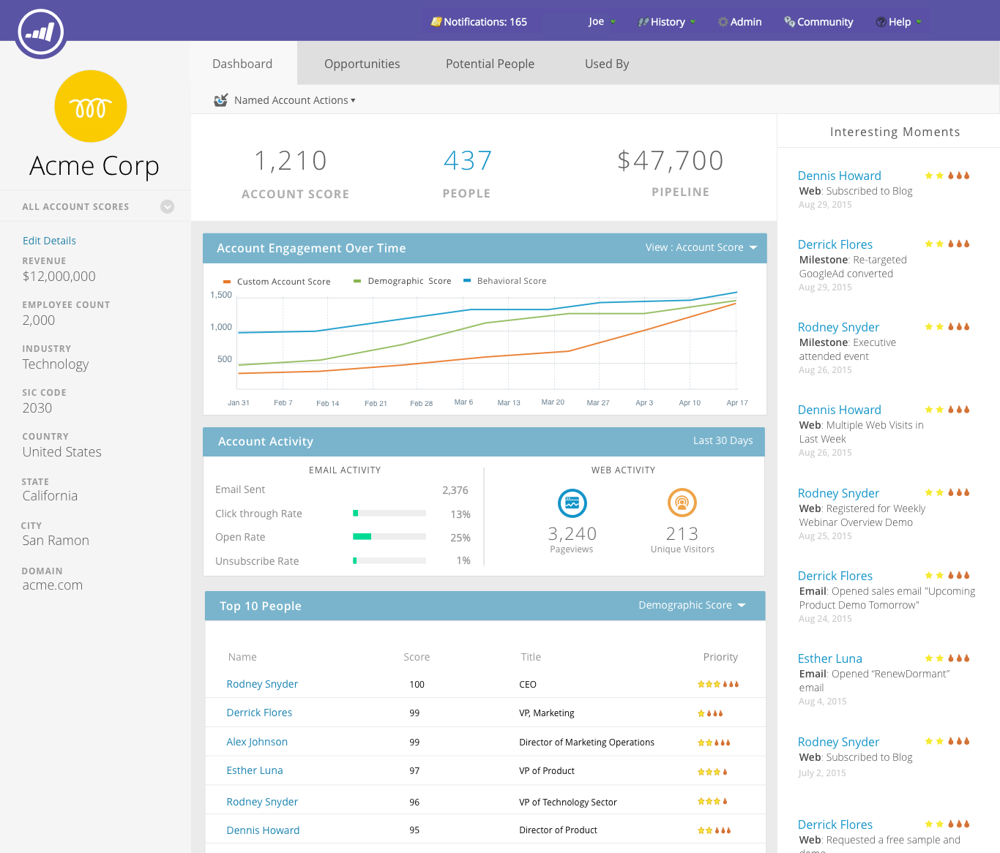

# 發行說明： 2016年夏天 {#release-notes-summer}

下列功能包含在2016年夏季版本中。 檢查您的Marketo版本是否有功能可用。 請按一下標題連結以檢視每個功能的詳細文章。

## [帳戶型行銷](https://docs.marketo.com/display/docs/account+based+marketing) {#account-based-marketing}

Marketo帳戶式行銷在一個統一的平台上提供所有基本功能：

* **Target**  — 帳戶探索、銷售線索與帳戶的比對，以及具名帳戶清單
* **參與**  — 帳戶型個人化、跨頻道參與和帳戶專屬工作流程
* **測量**  — 帳戶和清單層級深入分析、帳戶參與分數，以及管道和收入影響

>[!NOTE]
>
>ABM可作為您的Marketo訂閱的附加元件，因此請聯絡您的銷售代表以實作它。

## [稽核軌跡](/help/marketo/product-docs/administration/audit-trail/audit-trail-overview.md) {#audit-trail}

稽核軌跡提供在Marketo訂閱中所做變更的完整記錄。 如此一來，使用者和管理員將可共同承擔責任，協助找出非預期行為的成因，並確保安全掌握相關資訊。 此資訊將在任何時間點提供，並可用於回答以下問題：

* 此資產或設定有什麼改變，上次更新的是誰？
* 使用者X最近做了哪些工作？
* 誰正在登入我們的帳戶？

## [Marketo-Vibes SMS LaunchPoint整合](/help/marketo/product-docs/mobile-marketing/vibes-sms-messages/create-a-vibes-sms-message.md) {#marketo-vibes-sms-launchpoint-integration}

直接在Marketo中輕鬆建立簡訊。 使用豐富的Marketo資料個人化和鎖定您的訊息，並使用SMS訊息儀表板輕鬆監控其效能。

>[!NOTE]
>
>若要使用此功能，您必須具備現有的Vibes SMS帳戶。

## [Email 2.0增強功能](/help/marketo/product-docs/email-marketing/general/email-editor-2/email-editor-v2-0-overview.md) {#email-enhancements}

**模組層級變數**

以往，電子郵件2.0範本中指定的所有變數在範圍中都是「全域」。 在模組中使用變數時，如果您打算使用模組的多個例項，並非總是希望如此。 在此版本中，變數現在可指定為「模組層級」，這可讓您指示使用者應能夠針對其使用的每個模組設定唯一值。

**語法更新**

* 您現在可以在電子郵件2.0範本中指定的模組上使用「mktoAddByDefault」，以指示預設應在新電子郵件中顯示的模組。 如果您要建置包含大量模組的電子郵件範本，這會更方便。
* 在影像元素上，您現在可以指定基礎元素是否為 `` 一般使用者應鎖定HTML元素的「高度」和「寬度」屬性或可編輯屬性。 mktoLockImgSize=&quot;true&quot;會導致系統鎖定高度/寬度（即使影像已變更）。 同樣地，mktoLockImgStyle=&quot;true&quot;會導致&quot;style&quot;屬性被鎖定。

**程式碼搜尋**

使用新的搜尋功能，有效率地尋找及取代電子郵件程式碼中的內容。 電子郵件範本編輯器也提供此功能。

**影像元素中的Token支援**

代號現在可用於插入影像體驗的「外部URL」區域！ 如果您已指定影像 `{{my.tokens}}`，您現在可以在電子郵件編輯器2.0中參考這些權杖。請注意，在電子郵件編輯器2.0畫布中，影像仍會顯示為損毀。 但是，在傳送電子郵件之前，您會在預覽和傳送範例中看到這些篩選。

## 多個品牌化網域 {#multiple-branding-domains}

電子郵件追蹤連結只能使用單一品牌網域來建立品牌的日子已經一去不復返了。 您現在可以新增多個品牌領域來激發消費者的信心、建立更精簡的外觀來著重於品牌、改善電子郵件傳遞能力，以及根據電子郵件選擇用於每個電子郵件追蹤連結的品牌領域。

## [計畫權杖](/help/marketo/product-docs/demand-generation/landing-pages/personalizing-landing-pages/tokens-overview.md) {#program-tokens}

我們已建立程式的新Token型別。 您現在可以在資產和智慧行銷活動流程步驟中呈現方案名稱、說明和ID。

## [企業金鑰](/help/marketo/product-docs/marketo-sales-insight/msi-outlook-plugin/authorize-the-marketo-outlook-plugin.md) {#enterprise-key}

要求您的銷售團隊中的每個人安裝適用於Outlook的Sales Insight外掛程式，可能會相當繁瑣。 我們已推出新的方式，使用企業金鑰從遠端安裝Outlook外掛程式。 傳送您在「管理員」的「Marketo銷售分析專案」區段中找到的唯一金鑰給您的IT團隊，讓他們完成其餘工作。

## [Web Personalization行銷活動](/help/marketo/product-docs/web-personalization/working-with-web-campaigns/create-a-new-dialog-web-campaign.md) {#web-personalization-campaigns}

指定網站行銷活動在網站上反應的時間延遲。

## [內容分析和Recommendations匯出](/help/marketo/product-docs/web-personalization/understanding-web-personalization/understanding-content-analytics.md) {#content-analytics-and-recommendations-export}

離線檢視內容分析和建議資料。

## [電子郵件編輯器2.0的API支援](https://developers.marketo.com/documentation/asset-api/) {#api-support-for-email-editor}

先前僅與v1.0電子郵件和範本相容的既有資產API，現在可供v2.0電子郵件資產使用。

## [Marketo開發人員網站](https://developers.marketo.com/) {#marketo-developers-site}

全新及改良！

## [隱私權設定](/help/marketo/product-docs/administration/settings/understanding-privacy-settings.md) {#privacy-settings}

行銷人員可使用隱私權設定，決定是否使用Munchkin和Web個人化功能追蹤訪客。 追蹤層級可透過使用瀏覽器的Do Not Track設定、選擇退出Cookie或非特定IP來控制。 這些方法可能會影響Marketo在特定區域中的價值和功能，但若行銷人員未變更任何專案，Marketo功能將會維持不變。

此功能將在六週後逐步發行給客戶。 如果您需要立即取得此資訊，請聯絡Marketo支援。
