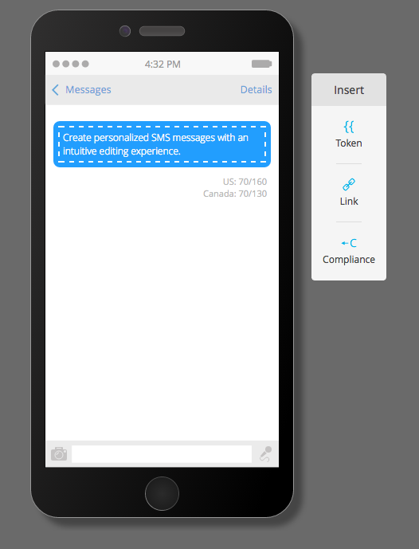

# 發行說明：』16年夏季 {#release-notes-summer}

』16年夏季發行包含下列功能。 查看您的Marketo版本以了解功能可用性。 請按一下標題連結，以檢視每項功能的詳細文章。

## [帳戶型行銷](https://docs.marketo.com/display/docs/account+based+marketing) {#account-based-marketing}

Marketo帳戶型行銷在單一統一平台中提供所有基本功能：

* **Target**  — 帳戶探索、銷售機會對帳戶比對，以及命名的帳戶清單
* **參與**  — 以帳戶為基礎的個人化、跨管道參與和帳戶專屬工作流程
* **測量**  — 帳戶和清單層級的深入分析、帳戶參與分數，以及管道和收入影響

>[!NOTE]
>
>ABM是Marketo訂閱的附加元件，因此請連絡您的銷售代表以進行實作。

## [稽核軌跡](/help/marketo/product-docs/administration/audit-trail/audit-trail-overview.md) {#audit-trail}

稽核軌跡提供您在Marketo訂閱中所做變更的完整記錄。 它可在使用者和管理員之間建立問責機制，協助識別非預期行為的原因，並提供安全性，讓您知道誰在做什麼以及何時做什麼。 此資訊可隨時提供，且可用於回答下列問題：

* 此資產或設定有什麼改變，上次更新的是誰？
* X用戶做了什麼？
* 誰在登入我們的帳戶？

## [Marketo-Vibes SMS LaunchPoint整合](/help/marketo/product-docs/mobile-marketing/vibes-sms-messages/create-a-vibes-sms-message.md) {#marketo-vibes-sms-launchpoint-integration}

直接在Marketo中輕鬆建立SMS訊息。 使用您豐富的Marketo資料個人化和鎖定訊息，並使用SMS訊息控制面板輕鬆監控其效能。

>[!NOTE]
>
>此功能需要您有現有的Vibes SMS帳戶。

## [Email 2.0增強功能](/help/marketo/product-docs/email-marketing/general/email-editor-2/email-editor-v2-0-overview.md) {#email-enhancements}

**模組層級變數**

以前，電子郵件2.0範本中指定的所有變數在範圍中都是「全域」的。 在模組內使用變數時，如果您打算使用模組的多個例項，則不一定是理想的作法。 在此版本中，變數現在可指定為「模組層級」，這可讓您指出使用者應該能夠為其中使用的每個模組設定唯一值。

**語法更新**

* 您現在可以對電子郵件2.0範本中指定的模組使用「mktoAddByDefault」，以指出依預設應在新電子郵件中顯示哪些模組。 如果您要建立包含大量模組的電子郵件範本，則此功能會方便得多。
* 在影像元素上，您現在可以指定是否應將底層`` HTML元素的「height」和「width」屬性鎖定或可編輯給一般使用者。 mktoLockImgSize=&quot;true&quot;會導致高度/寬度被鎖定（即使影像已更改）。 同樣地， mktoLockImgStyle=&quot;true&quot;也會導致&quot;style&quot;屬性被鎖定。

**程式碼搜尋**

使用新的搜尋功能，以有效率地尋找和取代電子郵件程式碼中的內容。 電子郵件範本編輯器中也提供此功能。

**影像元素中的代號支援**

Token現在可用於插入影像體驗的「外部URL」區域中！ 如果您已使用`{{my.tokens}}`指定影像，現在可以在電子郵件編輯器2.0中參考這些代號。請注意，電子郵件編輯器2.0畫布中的影像仍會顯示損毀。 但是，您會在傳送電子郵件之前，看到它們在「預覽」和「傳送範例」中呈現。

## 多品牌域 {#multiple-branding-domains}

電子郵件追蹤連結只能以單一品牌網域加上品牌標籤的日子已經過去。 您現在可以新增多個品牌網域，以激發消費者信心，建立更精簡的外觀以專注於品牌，改善電子郵件傳遞能力，並根據每封電子郵件選擇要用於每個電子郵件追蹤連結的品牌網域。

## [程式代號](/help/marketo/product-docs/demand-generation/landing-pages/personalizing-landing-pages/tokens-overview.md) {#program-tokens}

我們已為程式建立了新的代號類型。 您現在可以在資產和智慧型行銷活動流程步驟中呈現方案名稱、說明和ID。

## [企業密鑰](/help/marketo/product-docs/marketo-sales-insight/msi-outlook-plugin/authorize-the-marketo-outlook-plugin.md) {#enterprise-key}

要求您銷售團隊中的每個人安裝我們的Sales Insight Plugin for Outlook，可能很麻煩。 我們推出了使用企業密鑰遠程安裝Outlook插件的新方法。 將您在「管理員」的「Marketo Sales Insight」區段找到的唯一金鑰傳送給IT團隊，讓他們執行其餘操作。

## [Web個人化行銷活動](/help/marketo/product-docs/web-personalization/working-with-web-campaigns/create-a-new-dialog-web-campaign.md) {#web-personalization-campaigns}

指定網路行銷活動在您網站上反應的延遲時間。

## [Content Analytics和Recommendations匯出](/help/marketo/product-docs/web-personalization/understanding-web-personalization/understanding-content-analytics.md) {#content-analytics-and-recommendations-export}

離線檢視內容分析和建議資料。

## [電子郵件編輯器2.0的API支援](https://developers.marketo.com/documentation/asset-api/) {#api-support-for-email-editor}

先前僅與v1.0電子郵件和範本相容的資產API，現在已針對v2.0電子郵件資產啟用。

## [Marketo開發人員網站](https://developers.marketo.com/) {#marketo-developers-site}

全新改良！

## [隱私權設定](/help/marketo/product-docs/administration/settings/understanding-privacy-settings.md) {#privacy-settings}

行銷人員可使用隱私權設定來決定是否使用Munchkin和Web個人化功能來追蹤訪客。 使用瀏覽器的「不追蹤」設定、選擇退出Cookie或非特定IP來控制追蹤層級。 這些方法可能會影響Marketo在特定領域的價值和功能，但若行銷人員未變更任何項目，Marketo功能將維持不變。

此功能將在六週內逐步發佈給客戶。 如果您需要，請立即聯絡Marketo支援。
