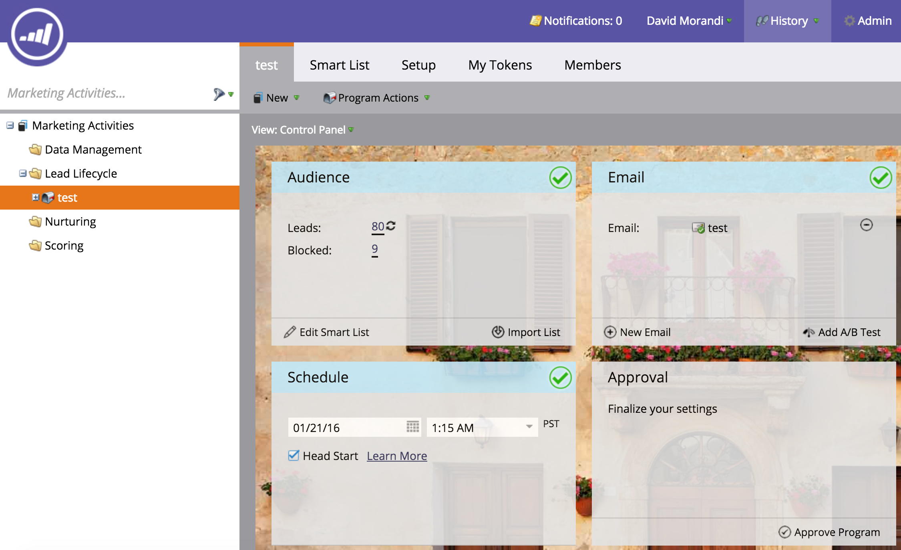

# 發行說明：』16年冬季 {#release-notes-winter}

』16年冬季發行包含下列功能。 請按一下標題連結，以檢視每項功能的詳細文章。

## [是匿名篩選器](/help/marketo/product-docs/administration/additional-integrations/add-munchkin-tracking-code-to-your-website/next-generation-munchkin-tracking-faq.md) {#is-anonymous-filter}

已為智慧清單移除「匿名」篩選器。 如需詳細資訊，請參閱[新一代Munchkin追蹤常見問題集](/help/marketo/product-docs/administration/additional-integrations/add-munchkin-tracking-code-to-your-website/next-generation-munchkin-tracking-faq.md)檔案。 此變更不會影響Web個人化(RTP),RTP會繼續識別匿名和已知的Web訪客，並對這些訪客即時個人化內容。

## [資料庫儀表板](/help/marketo/product-docs/core-marketo-concepts/smart-lists-and-static-lists/managing-people-in-smart-lists/database-dashboard.md) {#database-dashboard}

銷售機會資料庫具有更新的「摘要控制面板」，其中包括人員資料庫總大小、可銷售銷售銷售機會的數量以及按前五個來源細分銷售機會。

## [Microsoft Edge瀏覽器](/help/marketo/product-docs/administration/setup-administration/supported-browsers.md) {#microsoft-edge-browser}

已將Microsoft Edge新增至Marketo支援的[瀏覽器清單](https://docs.marketo.com/display/public/DOCS/Supported+Browsers)。

## [Microsoft Outlook 2016](/help/marketo/product-docs/marketo-sales-insight/msi-outlook-plugin/install-the-marketo-email-add-in-for-outlook-with-a-registration-code.md) {#microsoft-outlook}

[現已支援Microsoft Outlook 2016](/help/marketo/product-docs/marketo-sales-insight/msi-outlook-plugin/install-the-marketo-email-add-in-for-outlook-with-a-registration-code.md) 。

## [電子郵件計劃開始](/help/marketo/product-docs/email-marketing/email-programs/email-program-actions/head-start-for-email-programs.md) {#email-program-head-start}

使用「頭開始」指出應提前處理您的傳送。 Head Start不會在計畫安排的時間確認銷售機會並準備電子郵件，而是確保這些任務在預先完成。 如此一來，您的對象就會開始在排程時間收到電子郵件。

若要使用此功能，電子郵件程式必須提前至少12小時排程，且智慧清單會在傳送前12小時被鎖定。

>[!NOTE]
>
>此功能在』16年冬季發行後一週內逐步推出。 無法與智慧型行銷活動或API搭配使用。

## [行動行銷增強功能](/help/marketo/product-docs/mobile-marketing/admin/add-a-mobile-app.md) {#mobile-marketing-enhancements}

**PhoneGap支援：** 我們現在為您的行動應用程式提供PhoneGap支援。[更多詳情](https://developers.marketo.com/documentation/mobile/phonegap-plugin/)。

**支援沙箱應用程式**:

## [方案API](https://developers.marketo.com/documentation/programs/) {#program-api}

透過REST API建立、更新和復製程式。 這不包括在方案中建立或更新智慧清單和智慧行銷活動。

## [Microsoft Dynamics增強功能](/help/marketo/product-docs/crm-sync/microsoft-dynamics-sync/microsoft-dynamics-sync-details/sync-status.md) {#microsoft-dynamics-enhancements}

**[同步狀態](/help/marketo/product-docs/crm-sync/microsoft-dynamics-sync/microsoft-dynamics-sync-details/sync-status.md)**:制定同步過程的當前吞吐量和積壓。按對象的插入和更新次數劃分。

**[通知](/help/marketo/product-docs/core-marketo-concepts/miscellaneous/understanding-notifications/notification-types.md)**:收到常見同步錯誤的通知，以及有該錯誤的銷售機會清單。

## [自訂物件增強功能](/help/marketo/product-docs/administration/marketo-custom-objects/create-marketo-custom-objects.md) {#custom-objects-enhancements}

您現在可以使用具有多個連結欄位的中介物件，在銷售機會/帳戶和自訂物件之間建立多對多關係。

## [Facebook Lead Ads](/help/marketo/product-docs/demand-generation/facebook/set-up-facebook-lead-ads.md) {#facebook-lead-ads}

[Facebook銷](https://www.facebook.com/business/a/lead-ads) 售機會廣告是企業在Facebook上執行銷售機會開發行銷活動的更直接方式。人們會填寫表格來表達對產品或服務的興趣，讓企業可以跟進。 Marketo與Facebook Lead Ads的整合會自動擷取銷售機會在Lead Ads表單中提供的資訊。 之後，您就可以使用新的「填出Facebook銷售機會廣告」觸發器，自動執行後續動作和通知。

## [網頁（即時個人化）促銷活動排程器](/help/marketo/product-docs/web-personalization/working-with-web-campaigns/schedule-a-web-campaign.md) {#web-real-time-personalization-campaign-scheduler}

事先排程您的行銷活動。 設定個人化網頁內容的開始和結束日期，並在特定日期和時間重複促銷活動。 根據網站訪客的時間或所選時區個人化排程以顯示促銷活動。

