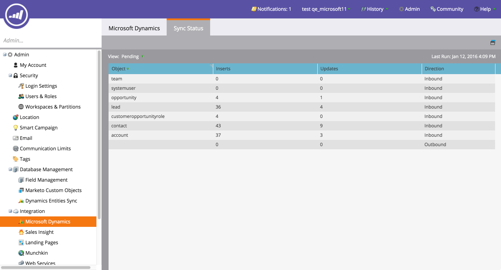
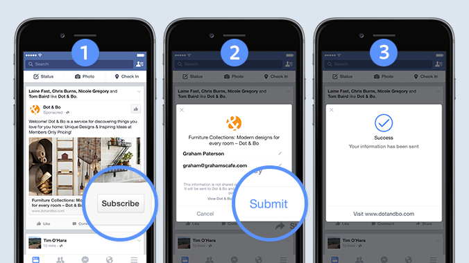

# 發行說明： Winter &#39;16 {#release-notes-winter}

以下功能包含在2016年冬季發行版本中。 請按一下標題連結以檢視每個功能的詳細文章。

## [為匿名篩選器](/help/marketo/product-docs/administration/additional-integrations/add-munchkin-tracking-code-to-your-website/next-generation-munchkin-tracking-faq.md) {#is-anonymous-filter}

已移除智慧列示的「為匿名」篩選器。 請參閱 [新一代Munchkin追蹤常見問題集](/help/marketo/product-docs/administration/additional-integrations/add-munchkin-tracking-code-to-your-website/next-generation-munchkin-tracking-faq.md) 詳細資料檔案。 此變更不會影響Web Personalization (RTP)，其會繼續識別匿名和已知的Web訪客，並即時為這些訪客個人化內容。

## [資料庫控制面板](/help/marketo/product-docs/core-marketo-concepts/smart-lists-and-static-lists/managing-people-in-smart-lists/database-dashboard.md) {#database-dashboard}

Lead資料庫已更新Summary Dashboard，其中包含人員資料庫大小總計、可行銷銷售機會數量，以及依前五個來源的銷售機會劃分。

## [Microsoft Edge瀏覽器](/help/marketo/product-docs/administration/setup-administration/supported-browsers.md) {#microsoft-edge-browser}

我們已將Microsoft Edge新增至 [瀏覽器清單](https://docs.marketo.com/display/public/DOCS/Supported+Browsers) 受Marketo支援。

## [Microsoft Outlook 2016](/help/marketo/product-docs/marketo-sales-insight/msi-outlook-plugin/install-the-marketo-email-add-in-for-outlook-with-a-registration-code.md) {#microsoft-outlook}

[Microsoft Outlook 2016](/help/marketo/product-docs/marketo-sales-insight/msi-outlook-plugin/install-the-marketo-email-add-in-for-outlook-with-a-registration-code.md) 現已支援。

## [電子郵件計劃開始時間](/help/marketo/product-docs/email-marketing/email-programs/email-program-actions/head-start-for-email-programs.md) {#email-program-head-start}

使用Head Start來指示您傳送的處理應提前進行。 「開始式」不會在計畫的排程時間確認潛在客戶並準備電子郵件，而是確保預先完成這些任務。 如此一來，您的對象就會開始在排程時間收到電子郵件。

若要使用此功能，至少必須提前12小時排程電子郵件程式，而且智慧型清單會在傳送前12小時鎖定。

>[!NOTE]
>
>此功能將在2016年冬季版本發行後的一週內逐步推出。 無法將其用於智慧行銷活動或API。

## [行動裝置行銷增強功能](/help/marketo/product-docs/mobile-marketing/admin/add-a-mobile-app.md) {#mobile-marketing-enhancements}

**PhoneGap支援：** 我們現在為您的行動應用程式提供PhoneGap支援。 [深入了解](https://developers.marketo.com/documentation/mobile/phonegap-plugin/).

**支援沙箱應用程式**：

## [程式API](https://developers.marketo.com/documentation/programs/) {#program-api}

透過REST API建立、更新和復製程式。 這不包括方案中智慧列示和智慧行銷活動的建立或更新作業。

## [Microsoft Dynamics增強功能](/help/marketo/product-docs/crm-sync/microsoft-dynamics-sync/microsoft-dynamics-sync-details/sync-status.md) {#microsoft-dynamics-enhancements}

**[同步狀態](/help/marketo/product-docs/crm-sync/microsoft-dynamics-sync/microsoft-dynamics-sync-details/sync-status.md)**：密切關注同步處理程式的目前輸送量和待處理專案。 依插入和更新次數（依物件）來劃分。

**[通知](/help/marketo/product-docs/core-marketo-concepts/miscellaneous/understanding-notifications/notification-types.md)**：取得常見同步錯誤的通知，以及具有該錯誤的潛在客戶清單。

## [自訂物件增強功能](/help/marketo/product-docs/administration/marketo-custom-objects/create-marketo-custom-objects.md) {#custom-objects-enhancements}

您現在可以使用具有多個連結欄位的中介物件，在銷售機會/帳戶與自訂物件之間建立多對多關係。

## [facebook潛在客戶廣告](/help/marketo/product-docs/demand-generation/facebook/set-up-facebook-lead-ads.md) {#facebook-lead-ads}

[facebook潛在客戶廣告](https://www.facebook.com/business/a/lead-ads) 是企業在Facebook上執行潛在客戶產生行銷活動的更直接方式。 人們填寫表格來表達對產品或服務的興趣，以便企業跟進。 Marketo與Facebook銷售機會廣告的整合會自動擷取銷售機會在銷售機會廣告表單中提供的資訊。 接著，您就可以使用新的「填寫Facebook銷售機會廣告」觸發程式，將後續動作和通知自動化。

## [Web （即時個人化）行銷活動排程器](/help/marketo/product-docs/web-personalization/working-with-web-campaigns/schedule-a-web-campaign.md) {#web-real-time-personalization-campaign-scheduler}

預先排程您的行銷活動。 設定個人化網頁內容的開始和結束日期，並在特定日期和時間重複行銷活動。 個人化排程，以根據網站訪客的時間或選取的時區顯示行銷活動。

