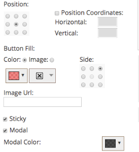

# 發行說明：』17年春 {#release-notes-spring}

』17年春季版包含下列功能。 查看您的Marketo版本以了解功能可用性。

請按一下標題連結，以檢視每項功能的詳細文章。 **注意**:如果主題有多個子標題，則連結會放在該處。

## [linkedIn引領Forms](/help/marketo/product-docs/demand-generation/social/social-functions/set-up-linkedin-lead-gen-forms.md) {#linkedin-lead-gen-forms}

[linkedIn Lead Gen ](https://business.linkedin.com/marketing-solutions/native-advertising/lead-gen-ads) Form是企業在LinkedIn上執行銷售機會開發行銷活動的更直接方式。人們可以填寫表單來表達對產品或服務的興趣，使企業能夠捕獲人員的詳細資訊並將其同步到Marketo，在那裡可以執行自動化的後續流程和銷售線索傳送活動。

Marketo與LinkedIn Lead Gen Forms的整合會自動擷取銷售機會在Lead Gen表單中提供的資訊。 然後，可使用新的&#x200B;**填出LinkedIn銷售機會代表表單**&#x200B;觸發和篩選器，自動執行後續動作和通知。

## [過期的MSI模板](/help/marketo/product-docs/marketo-sales-insight/msi-for-salesforce/features/actions-in-the-msi-panel/send-marketo-email/publish-an-email-to-sales-insight.md) {#expire-msi-template}

在Sales Insight中清除過時範本的日子已一去不復返。 設定您發佈電子郵件的到期日，當到期日轉過來時，我們會為您處理取消發佈。

>[!NOTE]
>
>設定5/31/17的到期日表示該範本將在當天結束時從Sales Insight中移除5/31/17。

## [適用於人員和活動的大量擷取API](https://developers.marketo.com/rest-api/bulk-extract/) {#bulk-extract-apis-for-people-and-activities}

輕鬆將大量人員和活動資料從Marketo傳輸至外部系統。

## ABM增強功能 {#abm-enhancements}

**[ABM命名帳戶上的自定義欄位](https://docs.marketo.com/x/1wnG)**

Marketo ABM現在可讓您在指定帳戶上建立最多10個自訂欄位。 您可以將這些自訂欄位對應至CRM帳戶物件中的欄位，而Marketo ABM將同步資料，讓您可擴充ABM指名帳戶，並協助推動行銷。

**[ABM已命名帳戶的百分位數分數](https://docs.marketo.com/display/docs/assets/abmpercentiles.png)**

具名帳戶的分數可能會大不相同。 Marketo ABM現在會自動計算每個分數的百分位數，以便您一目瞭然地看到每個已命名帳戶在其他已命名帳戶中的排名位置。

**[ABM帳戶清單API](https://developers.marketo.com/rest-api/lead-database/named-account-lists/)**

運用豐富且強大的ABM合作夥伴整合，以及對指定帳戶清單的增強API支援。

## 網頁個人化增強功能 {#web-personalization-enhancements}

**[捲動時的網頁促銷活動](/help/marketo/product-docs/web-personalization/working-with-web-campaigns/set-how-your-web-campaign-displays.md)**

新的Web促銷活動效果可為您的Web訪客提供更個人化的體驗。 將您的個人化網站促銷活動設定為只有當網頁訪客向下捲動時才會顯示。 您可以根據下列項目，將「對話方塊Web促銷活動」設定為在捲動時顯示：

* 已捲動頁面的百分比
* 已達像素
* 捲動到頁面的下半部

**[退出意圖時的Web促銷活動](/help/marketo/product-docs/web-personalization/working-with-web-campaigns/set-how-your-web-campaign-displays.md)**

在訪客關閉您的頁面之前，請先吸引其注意。 將您的個人化網頁促銷活動設定為只有在訪客離開頁面時才會顯示滑鼠手勢。

**[網路宣傳的動畫效果](/help/marketo/product-docs/web-personalization/working-with-web-campaigns/create-a-new-dialog-web-campaign.md)**

為Dialog Web促銷活動設定動畫效果，以自訂促銷活動在進入或退出網頁時的顯示方式。 您可以從6種不同的效果中選擇，並控制對話框的時間和方向。

**[對話框關閉按鈕定制](/help/marketo/product-docs/web-personalization/working-with-web-campaigns/create-a-new-dialog-web-campaign.md)**

自定義對話框的關閉按鈕。 從「透明對話樣式Web促銷活動」中使用的選項範圍中選取。 選擇「關閉」按鈕的表徵圖、顏色和位置。 您也可以新增自己的按鈕影像。

**[封存Web行銷活動](/help/marketo/product-docs/web-personalization/working-with-web-campaigns/archive-a-web-campaign.md)**

封存是新的Web促銷活動狀態，可讓您封存Web促銷活動，並在預設的Web促銷活動檢視中隱藏。 這可讓您專注在最相關、最有效的促銷活動，並依需求擷取舊有的已封存促銷活動。

**[本地化](/help/marketo/product-docs/administration/settings/select-your-language-locale-and-time-zone.md)**

現在，所有Marketo支援的語言（英文、日文、德文、西班牙文、法文和葡萄牙文）都提供網頁個人化。

## 預測性增強功能 {#predictive-enhancements}

**[本地化](/help/marketo/product-docs/administration/settings/select-your-language-locale-and-time-zone.md)**

預測性內容現在提供Marketo支援的所有語言（英文、日文、德文、西班牙文、法文和葡萄牙文）。

## [舊版RTF編輯器和表單編輯器1.0淘汰](https://nation.marketo.com/docs/DOC-4315) {#legacy-rich-text-editor-and-form-editor-deprecation}

自2017年8月1日起，仍使用舊版RTF編輯器和表單編輯器1.0的客戶將自動轉換為新體驗。
