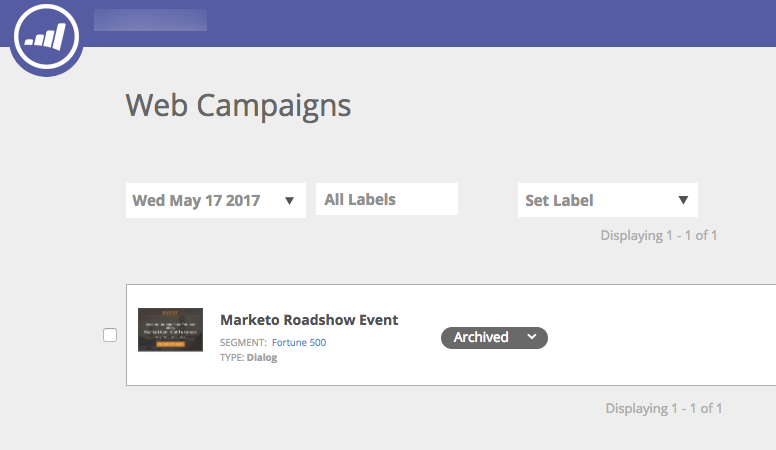

# 發行說明： 2017年春季 {#release-notes-spring}

以下功能包含在2017年春季發行版本中。 檢視您的Marketo版本，瞭解是否有功能可用。

請按一下標題連結以檢視每個功能的詳細文章。 **注意**：如果主題有多個子標題，則會將連結放在那裡。

## [linkedIn Lead Gen Forms](/help/marketo/product-docs/demand-generation/social/social-functions/set-up-linkedin-lead-gen-forms.md) {#linkedin-lead-gen-forms}

[linkedIn Lead Gen Forms](https://business.linkedin.com/marketing-solutions/native-advertising/lead-gen-ads) 是企業在LinkedIn上執行潛在客戶產生行銷活動的更直接方式。 人員可以填寫表格來表達對產品或服務的興趣，讓企業能夠擷取人員的詳細資訊，並將其同步至Marketo，以便進行自動化後續流程和銷售機會活動。

Marketo與LinkedIn Lead Gen Forms的整合會自動擷取Lead在Lead Gen表單中提供的資訊。 後續動作和通知可以使用新的 **填寫LinkedIn銷售機會一般表單** 觸發器和篩選器。

## [使MSI範本過期](/help/marketo/product-docs/marketo-sales-insight/msi-for-salesforce/features/actions-in-the-msi-panel/send-marketo-email/publish-an-email-to-sales-insight.md) {#expire-msi-template}

清除Sales Insight中過時範本的日子已經一去不復返了。 設定您發佈電子郵件的到期日，我們會在到期日臨近時為您取消發佈。

>[!NOTE]
>
>將到期日設為2017年5月31日表示範本將從2017年5月31日當天結束的銷售分析中移除。

## [大量擷取適用於人員和活動的API](https://developers.marketo.com/rest-api/bulk-extract/) {#bulk-extract-apis-for-people-and-activities}

輕鬆將大量個人和活動資料從Marketo傳輸至外部系統。

## ABM增強功能 {#abm-enhancements}

**[ABM具名帳戶上的自訂欄位](https://docs.marketo.com/x/1wnG)**

Marketo ABM現在可讓您在具名帳戶中建立最多10個自訂欄位。 您可以將這些自訂欄位對應到CRM帳戶物件中的欄位，Marketo ABM將同步資料，讓您擴充ABM具名帳戶，並幫助推動行銷。

**[ABM指定帳戶上的百分位數評分](https://docs.marketo.com/display/docs/assets/abmpercentiles.png)**

具名帳戶的分數可能大不相同。 Marketo ABM現在會自動計算每個分數的百分位數，因此您可以一眼看出每個指定帳戶與其他指定帳戶之間的排名。

**[ABM帳戶清單API](https://developers.marketo.com/rest-api/lead-database/named-account-lists/)**

利用豐富且強大的ABM合作夥伴整合，以及針對具名帳戶清單的增強API支援。

## Web個人化增強功能 {#web-personalization-enhancements}

**[捲動時的網頁行銷活動](/help/marketo/product-docs/web-personalization/working-with-web-campaigns/set-how-your-web-campaign-displays.md)**

新的Web Campaign效果為網頁訪客提供更個人化的體驗。 將您的個人化網頁行銷活動設定為僅在網頁訪客向下捲動您的網頁時顯示。 您可以根據以下條件設定在捲動時顯示對話方塊網頁行銷活動：

* 已捲動頁面的百分比
* 已達到畫素
* 捲動至頁面摺疊下方

**[退出意圖時的網路行銷活動](/help/marketo/product-docs/web-personalization/working-with-web-campaigns/set-how-your-web-campaign-displays.md)**

在訪客關閉您的頁面之前吸引訪客的注意。 設定個人化網頁促銷活動，使其僅在滑鼠手勢指出訪客正在離開頁面時顯示。

**[網路行銷活動的動畫效果](/help/marketo/product-docs/web-personalization/working-with-web-campaigns/create-a-new-dialog-web-campaign.md)**

設定對話方塊網頁行銷活動的動畫效果，以自訂行銷活動在進入或退出網頁時的顯示方式。 您可以從6種不同的效果中選取，並控制對話方塊的時機和方向。

**[對話方塊關閉按鈕自訂](/help/marketo/product-docs/web-personalization/working-with-web-campaigns/create-a-new-dialog-web-campaign.md)**

自訂對話方塊的關閉按鈕。 從透明對話方塊樣式網頁行銷活動中使用的選項範圍中選取。 選取「關閉」按鈕的圖示、顏色和位置。 您也可以新增自己的按鈕影像。

**[封存網站行銷活動](/help/marketo/product-docs/web-personalization/working-with-web-campaigns/archive-a-web-campaign.md)**

封存是一種新的網站行銷活動狀態，可讓您封存網站行銷活動，並將其從預設的網站行銷活動檢視中隱藏。 這可讓您專注於最相關、最活躍的行銷活動，並隨選擷取較舊的已封存行銷活動。

**[本地化](/help/marketo/product-docs/administration/settings/select-your-language-locale-and-time-zone.md)**

Web Personalization現在提供所有Marketo支援的語言（英文、日文、德文、西班牙文、法文和葡萄牙文）。

## 預測性增強功能 {#predictive-enhancements}

**[本地化](/help/marketo/product-docs/administration/settings/select-your-language-locale-and-time-zone.md)**

預測內容現在提供所有Marketo支援的語言（英文、日文、德文、西班牙文、法文和葡萄牙文）。

## [舊版RTF編輯器和表單編輯器1.0已淘汰](https://nation.marketo.com/docs/DOC-4315) {#legacy-rich-text-editor-and-form-editor-deprecation}

自2017年8月1日起，仍在使用舊版RTF編輯器和表單編輯器1.0的客戶將自動轉換為新體驗。
