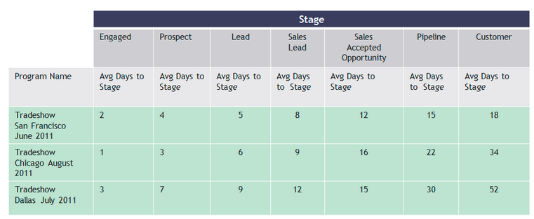
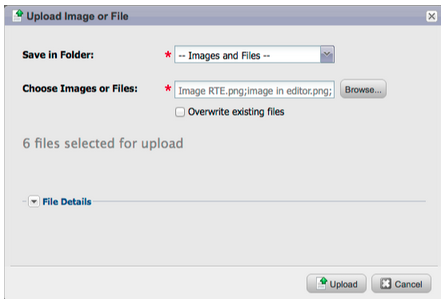
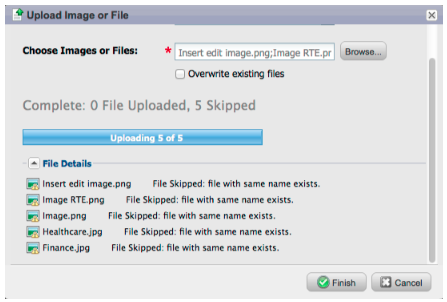
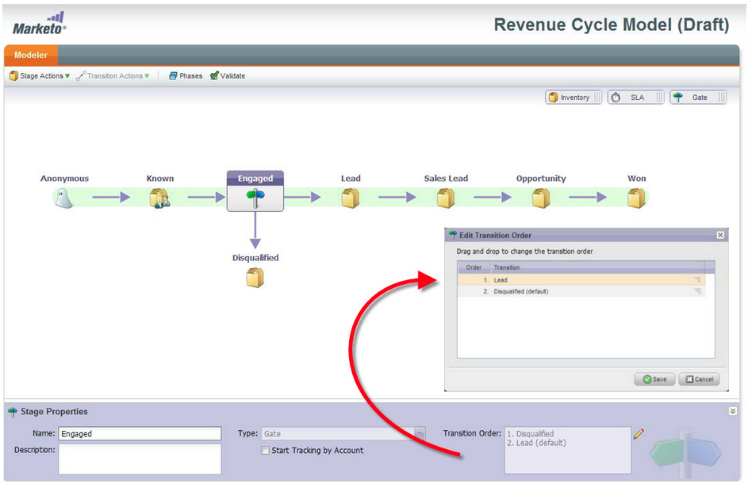
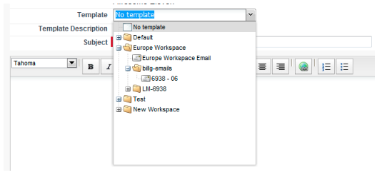
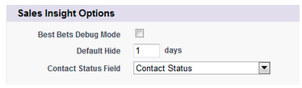
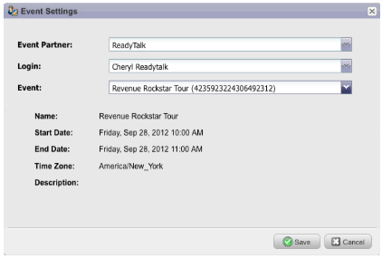
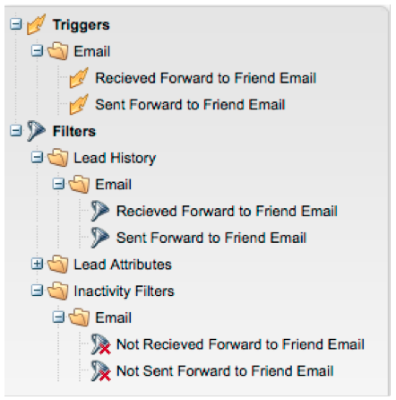

# 2012

## 2012年1/2月 {#january-february}

1月/2月版本包含下列功能。 檢查您的Marketo版本是否有功能可用。 在發行後返回以取得詳細功能檔案的連結。

## 進階動態內容 {#advanced-dynamic-content}

_適用於Pro和Enterprise版本_

透過進階動態內容，您可以建立與對象相關的吸引人電子郵件通訊和登陸頁面，而不必為同一訊息建立多個資產。 升級版預覽器可讓您在單一畫面中檢視每個唯一版本。

## 細分  {#segmentation}

_適用於Pro和Enterprise版本_

細分是一組區段，是您行銷對象的目標個人群組。 區段是由規則所定義，這些規則是由類似於智慧列示的篩選條件所驅動。 您的區段可以根據人口統計資料，例如職稱或產業，或根據行為，例如瀏覽的網頁或點選的連結。

## 程式碼片段 {#snippets}

_適用於Pro和Enterprise版本_

儲存可重複使用的豐富內容，以建立靜態或動態電子郵件和登入頁面。

## PURL {#purls}

_適用於Pro和Enterprise版本_

使用個人化URL (PURL)行銷人員現在可以建立聯絡人特定的URL，以推動多點觸控行銷方案中直接郵件和電子郵件促銷活動的個人化、可測量性和提升回應。

## 歐盟隱私權指令支援 {#eu-privacy-directive-support}

遵守瀏覽器「不要追蹤」設定的新功能包括停用匿名潛在客戶追蹤的功能；這可讓遵守歐盟更嚴格的隱私權追蹤法規變得更容易。

## 單一登入 {#single-sign-on}

現在，組織可支援使用SAML 2.0從企業入口網站進行單一登入，順暢地登入Marketo應用程式。

## 更新電子郵件和登陸頁面編輯器 {#updated-email-and-landing-page-editors}

電子郵件和登陸頁面編輯器經過重新設計，提供更吸引人的介面、直覺式導覽，以及大幅改善的使用者體驗，其中包括：

並排的HTML和文字檢視

「寄件者名稱」、「寄件者電子郵件」、「回覆（新）」和「主旨」會顯示在編輯器中。 所有其他設定可透過「編輯設定」按鈕存取。

## 瀏覽器支援 {#browser-support}

* [!DNL Mozilla Firefox] 9.0
* [!DNL Google Chrome] 16
* [!DNL Microsoft Internet Explorer] 8 &amp; 9
* **附註**：我們不再支援[!DNL Internet Explorer] 7

## 方案管理 {#program-management}

簡化的程式管理改善了權杖刪除的可用性，並更容易刪除程式。

## 取消訂閱訂閱報告 {#unsubscribe-from-subscription-report}

現在您可以直接從報表取消訂閱訂閱了！

## Munchkin更新 {#munchkin-updates}

新的Munchkin呼叫可減少網頁載入時間，並為點選連結事件提供更一致的效能。

## 方案機會分析（僅限RCA） {#program-opportunity-analysis-rca-only}

瞭解行銷對個別機會收入的貢獻

## 方案收入階段分析 {#program-revenue-stage-analysis}

瞭解哪些程式擁有快速行動者，以提升insight的程式領先速度

## 2012年3月 {#march}

## 解析我的Token {#resolve-my-tokens}

我的Token （程式權杖）將在預覽電子郵件、傳送測試電子郵件及透過單一流程動作傳送本機電子郵件時解析。 您不再需要在程式中建立智慧型行銷活動來測試您的My Token！

## 在電子郵件和登入頁面中的預覽器和編輯器之間切換 {#toggle-between-previewer-and-editor-in-emails-and-landing-pages}

只要按一下滑鼠，即可輕鬆在編輯器和預覽器之間來回切換。

編輯者至預覽者：

編輯器的預覽器：

## 程式碼片段預覽器 {#snippet-previewer}

從選單中選取「預覽程式碼片段」，可讓您檢視程式碼片段，而不會將其設為草稿。 此外，如果您對共用程式碼片段具有唯讀存取權（透過工作區），則可使用此動作檢視程式碼片段。

## 傳送多封測試電子郵件 {#send-multiple-test-emails}

隨著動態內容的增加，預覽和測試可能傳送給潛在客戶的所有電子郵件變體變得越來越重要。 當您使用「依潛在客戶詳細資料檢視」進行預覽時，您可以選擇從潛在客戶清單傳送變異測試（最多100封測試電子郵件）。

## 根據URL引數的動態登陸頁面 {#dynamic-landing-pages-based-on-url-parameter}

匿名潛在客戶佔您的登陸頁面瀏覽次數相當大。 新增動態內容，並可以將區段作為引數放入URL中，這樣就能在匿名或已知潛在客戶點按連結時，動態顯示您的登入頁面內容。

## 2012 4月 {#april}

## 分段篩選器和觸發器 {#segmentation-filters-and-triggers}

您是否一致地鎖定相同的潛在客戶群組？ 如果是這樣的話，請在智慧清單中使用分段來鎖定潛在客戶。 有了細分，您的整個潛在客戶資料庫都會細分，並可在您的程式中重複使用，以維持一致性。 分段結果會快速提取，因為它們不需要智慧清單在請求時執行。

## 透過擴充的API功能，將外部值插入電子郵件內容和其他流程步驟中 {#insert-external-values-into-email-content-and-other-flow-steps-through-expanded-api-capabilities}

* Request Campaign API現在可讓您針對該特定行銷活動執行，傳送「我的Token」的值，這對透過API填入電子郵件內容特別有用
* 新的上傳至清單和排程Campaign API對以上銷售機會清單和批次行銷活動的支援。

## [!DNL GoToWebinar]和[!DNL WebEx]的更簡單確認電子郵件（Adobe Connect和[!DNL ON24]即將推出！） {#easier-confirmation-emails-for-gotowebinar-and-webex-adobe-connect-and-on-coming-soon}

我們已建立會顯示每個潛在客戶之唯一註冊確認URL的成員權杖，以簡化確認URL。 您將不再需要使用不同的權杖來建立此URL。 這目前可供[!DNL GoToWebinar]和[!DNL WebEx]客戶使用，並將在我們下一個版本中供Adobe Connect和[!DNL ON24]使用。

## 按一下即可上傳多個影像和檔案！ {#upload-multiple-images-and-files-with-a-single-click}

將影像和檔案匯入Marketo時，可以節省時間並提高效率！ 如果您使用[!DNL Firefox]或[!DNL Google Chrome]，您可以多選檔案並一次上傳所有檔案。 雖然您可以上傳的檔案數量沒有限制，但每個檔案的個別大小限製為50MB。

注意：由於瀏覽器的限制，[!DNL Internet Explorer]目前不支援此功能。

## 在電子郵件中移動文字 {#move-text-in-an-email}

您可以重新排序電子郵件中的文字區塊。 在文字編輯器中選取文字區塊；按一下編輯圖示時，您會看到向上或向下移動區塊的選項。

## 已移除非[!DNL Salesforce]使用者的[!DNL Salesforce]個參考 {#salesforce-references-removed-for-non-salesforce-users}

如果您未與[!DNL Salesforce]同步處理您的訂閱，您將會注意到所有參考[!DNL Salesforce]的資料夾和流程動作都已移除。

## Marketo收入週期Analytics {#marketo-revenue-cycle-analytics}

收入週期Modeler中的&#x200B;**增強閘道階段**

可讓使用者定義轉變規則的順序。

## 2012年5月 {#may}

## 電子郵件效能報表重新設計 {#email-performance-report-redesign}

注意：這將是一次分階段推出，從5月發行版本開始

我們讓電子郵件效能和行銷活動電子郵件效能報表的執行速度更快。 我們也改善了一些量度的定義，並將「已傳送的訊息」和「已傳送的潛在客戶」量度整合為單一量度「已傳送」。 我們已將「已傳送的訊息」和「已傳送的潛在客戶」合併為「已傳送」。

## 等待步驟增強功能 {#wait-step-enhancements}

您可以使用新的「進階等待」屬性，在「智慧型促銷活動流量」動作中將等待步驟設定為「等待」一週中的特定日期、下一個營業日、特定日期或時間。 這些增強功能可確保您的Nurture電子郵件在工作時間送達收件匣！

圖 1。 指定要在營業日結束的等待步驟

## 已封存的Assets已隱藏 {#archived-assets-hidden}

封存的資產會自動從自動建議、下拉清單和報告中進行篩選，以便更輕鬆地找到您要尋找的內容！

圖 2。 已封存電子郵件篩選的範例

## 適用於iPad的新事件簽入應用程式 {#new-event-check-in-app-for-ipad}

使用我們新的iPad應用程式，簡化您的事件簽到程式！ 事件簽入應用程式會與您的Marketo程式同步，並讓您輕鬆將註冊者簽入事件，以及即時新增潛在客戶。

需要iOS 5.1或更新版本；僅限iPad。

圖 3。 事件簽入首頁

圖 4。 活動簽入：選取您的活動！

圖 5。 存回

## 增強型網路研討會確認URL {#enhanced-webinar-confirmation-url}

現在可供[!DNL ON24]和Adobe Connect使用！ 使用新`{{member.webinar URL}}`權杖的每位註冊出席者，在確認電子郵件中包含唯一連結。 Adobe Connect增強功能也包含開啟/關閉Adobe帳戶資訊電子郵件的功能，其中包含使用者的登入ID和密碼。

圖 6。 讓人員參加您的網路研討會

## 範本預覽 {#template-preview}

在建立您的電子郵件或登入頁面時正在尋找特定範本，但不確定它是什麼模樣？ 透過新的範本預覽功能，您可以在儲存新資產之前驗證選取的範本！

圖 7。 預覽您選擇的範本

## 可設定的表單預填 {#configurable-form-prefill}

在訂閱層級控制表單資料的預先填入，並在登入頁面層級覆寫。 若沒有預先母體，您可以確保潛在客戶提供最新資訊。

圖 8。 在Admin中的表單預填設定

圖 9。 編輯登陸頁面上的表單預填設定

## Marketo國寶箱 {#marketo-treasure-chest}

存取由Marketo工程師開發的實驗功能，以增強您的使用者體驗。 此版本包含電子郵件還原，以及輸入評論和在您的登入頁面上與其他使用者共同作業的功能。

\

圖 10。 Admin中的Manager Treasure Chest功能

## [!DNL Microsoft Dynamics]® CRM整合 {#microsoft-dynamics-crm-integration}

使用我們預先建立的新整合功能，在Marketo和[!DNL Microsoft Dynamics] CRM Online之間同步帳戶、連絡人和銷售機會！

圖 11。 [!DNL Microsoft Dynamics]設定

## Marketo [!DNL Sales Insight]增強功能 {#marketo-sales-insight-enhancements}

**取消訂閱頁尾選項**

設定透過[!DNL Sales Insight]傳送的電子郵件何時及是否顯示取消訂閱頁尾。

圖12。[!DNL Sales Insight] 管理員中的設定

## 銷售電子郵件範本的資料夾 {#folders-for-sales-email-templates}

您現在可以將與Marketo [!DNL Sales Insight]共用的電子郵件範本整理到指定的資料夾中，讓銷售代表更容易找到正確的電子郵件。

圖 13。 選擇電子郵件的資料夾

## 從[!DNL Sales Insight]存取機會分析器 {#access-opportunity-analyzer-from-sales-insight}

使用從Marketo [!DNL Sales Insight]直接存取Opportunity Analyzer的方式，將行銷活動帶動參與的insight提供給您的銷售代表。 注意。 需要Revenue Cycle Analytics授權。

## 連絡人狀態的自訂欄位 {#custom-field-for-contact-status}

您現在可以在[!DNL Salesforce]中對應自訂欄位，以在「我的首選」、「我的團隊的首選」和自訂檢視中填入連絡人的狀態列位。

圖 14。 將自訂欄位對應至聯絡人

檢視匿名潛在客戶造訪的頁面

從[!UICONTROL Anonymous Web Activity]檢視向下展開至匿名潛在客戶檢視的頁面。

圖 15。 請參閱匿名網路活動

## 增強型銷售機會與聯絡人訂閱 {#enhanced-lead-and-contact-subscribe}

使用記錄詳細資訊頁面上的新「訂閱」按鈕，隨時追蹤潛在客戶或連絡人。

## 2012年6月 {#june}

## Marketo銷售機會管理增強功能 {#marketo-lead-management-enhancements}

### 重新命名 {#rename}

您可以重新命名智慧清單、靜態清單和行銷活動。 如果您在篩選器、觸發器或流程中使用這些資產，名稱也會自動更新。 您一律可以重新命名電子郵件、表單和資料夾。

另外，我們也改善資產的說明文字輸入和檢視方式。

## 匯入欄位對應 {#import-field-mapping}

我們簡化將清單匯入Marketo的程式！ 在匯入過程中，您可以將Marketo欄位的名稱對應到匯入檔案中的欄標題名稱。 此外，您可以在[!UICONTROL Admin]中設定對應至Marketo中欄位名稱的別名，確保您的使用者每次都選取正確的欄位。

當您繼續匯入及對應欄位時，Marketo會在匯入期間記住並顯示對應，以方便使用。 若要讓生活更輕鬆，您可以按一下「範例值」標題，檢視將填入欄位中的不同值。 這有助於確保您每次都對應正確的欄位！

## 智慧列示和靜態清單的[!UICONTROL Summary]頁面 {#summary-page-for-smart-lists-and-static-lists}

您是否曾想過清單的使用位置？ 或清單的建立者或上次修改者？ 智慧列示和靜態清單中可用的新摘要頁面，將為您提供這些重要詳細資訊。

我們在現有的方案和行銷活動摘要頁面上新增了建立日期/使用者和上次修改日期/使用者資訊！

## 適用於Assets的[!UICONTROL Used By] {#used-by-for-assets}

我們在資產[!UICONTROL Summary]頁面中新增了一個索引標籤，稱為[!UICONTROL Used By]！

範例： [!UICONTROL Used By]靜態清單

## 登陸頁面格線 {#landing-page-gridlines}

新增登陸頁面格線可讓您更輕鬆對齊登陸頁面上的文字、圖形和表單。 開啟或關閉任何指定登陸頁面的設定值，同時調整線條之間的寬度！

## 已封鎖郵寄的潛在客戶 {#leads-blocked-from-mailings}

排程行銷活動時，您可以按一下連結，以檢視已封鎖您郵件的潛在客戶清單。

## [!UICONTROL Wait]步驟 — 潛在客戶權杖和我的權杖 {#wait-step-lead-token-and-my-token}

在5月版本中，我們已將進階選項新增至「[!UICONTROL Wait]」流程步驟。 透過這些變更，您可以指定營業日、日期和時間。 在此版本中，我們新增了在等待步驟中使用權杖的功能。 例如，您可能會想要使用`{{lead.Birthday}}`在他們的生日傳送電子郵件，或使用`{{my.Event Date}}`傳送最終的網路研討會提醒。

## 在Design Studio中以[!UICONTROL Thumbnails]身分[!UICONTROL View] {#view-as-thumbnails-in-design-studio}

將檢視從影像清單切換為縮圖檢視！

注意：截至此版本，智慧清單格線的先前排序將不會套用至您檢視的下一個智慧清單。 例如，如果您依公司名稱排序智慧列示，我們不會自動排序此相同欄位檢視的下一個智慧列示。

提醒：電子郵件效能報告升級進行中！

## Marketo Revenue Cycle Analytics增強功能 {#marketo-revenue-cycle-analytics-enhancements}

### 方案機會分析中的新量度  {#new-metrics-in-program-opportunity-analysis}

您現在可以深入瞭解建立或關閉商機前的平均行銷接觸次數，以及行銷接觸的平均值。

## 顯示多張圖表 {#displaying-multi-charts}

多圖表功能可讓您在單一收入週期總管報表中顯示多個圖表。 例如，當您想要顯示不同月份中的相同資料時，可以使用此功能。 此功能也可讓您無須建立個別的篩選器和報表。

## 熱格線圖表型別  {#heat-grid-chart-type}

熱格可讓您視覺化資料，以便識別行銷績效模式。 此視覺效果型別將為您的結果設定色彩代碼，好讓您以易於理解的視覺效果來檢視複雜的業務分析。

## 散佈圖型別  {#scatter-chart-type}

散佈圖可協助您在一個圖表中以視覺效果呈現多個維度的資料。 此視覺效果型別會根據使用的屬性，在圖表上繪製泡泡圖。 然後，您可以使用量值對泡泡進行色彩編碼和/或使用量值指定泡泡的大小。

## 2012年9月 {#september}

此版本包含備受期待的整合式社交功能和銷售機會管理小工具！ 注意：社交功能可作為附加元件或所選套裝的一部分使用。

## 透過社交分享發佈YouTube影片 {#publish-a-youtube-video-with-social-sharing}

鼓勵訪客使用登陸頁面上新的視訊共用功能，進行社交分享，藉此擴大視訊的受眾。

## 新增共用按鈕 {#add-a-share-button}

完全自訂分享訊息和一組新社交分享按鈕的外觀。 此外，當潛在客戶分享您的內容時，請擷取社交設定檔資料。

## 社交登入 {#social-sign-on}

允許潛在客戶使用來自其社交網路的資訊預先填寫表單，以取得insight並減少摩擦。

## 將登入頁面發佈至[!DNL Facebook] {#publish-landing-pages-to-facebook}

將登入頁面直接發佈至[!DNL Facebook]、完成社交應用程式、表單，以及Marketo登入頁面的完整功能，以擴充登入頁面的觸及範圍。

## [!DNL ReadyTalk]事件配接器 {#readytalk-event-adapter}

將Marketo事件順暢地連線至[!DNL ReadyTalk]會議。 使用Marketo表單來擷取註冊者，並自動在[!DNL ReadyTalk]中註冊他們。 雙向同步可讓出勤資訊填入Marketo中。

## Microsoft [!DNL Dynamics]內部部署 {#microsoft-dynamics-on-premise}

我們現在支援內部部署的Microsoft [!DNL Dynamics] 2011，具有網際網路對向部署。

## Webhooks （寶箱） {#webhooks-treasure-chest}

Webhook是使用者定義的HTTP回呼。 這是將資料從Marketo推播至任何其他服務的絕佳方式。 此功能目前可在Treasure Chest中使用，目前僅支援觸發行銷活動。

您如何使用Webhook的範例包括：將使用者名稱和密碼資訊張貼到另一個系統以建立試用帳戶；當您取得新潛在客戶時傳送SMS文字訊息。

## getMultipleLeads API的更新 {#update-to-getmultipleleads-api}

我們已將新的篩選條件新增至getMultipleLeads API呼叫。 除了依日期篩選外，我們現在還支援其他條件：

* 日期範圍
* 靜態清單名稱
* 潛在客戶索引鍵陣列

## 2012年10 {#october}

10月發行版本包含更令人興奮的新功能！ 社交功能可作為附加元件或所選套裝的一部分使用。

## 匯入方案和方案交換 {#import-programs-and-program-exchange}

程式可從一個Marketo訂閱匯入到另一個訂閱。 例如，您可以在沙箱中建立計畫，然後將其匯入您的即時訂閱中。 此外，您也可以從Marketo方案庫匯入預先建立的方案。

>[!NOTE]
>
>只有Marketo管理員使用者授予許可權的Marketo使用者才能匯入計畫。
>
>請聯絡Marketo支援，以連絡您即時訂閱的沙箱帳戶。

## 通知 {#notifications}

通知可讓您隨時掌握Marketo訂閱中發生之系統事件的最新資訊。 例如，當行銷活動失敗或您的CRM同步需要注意時，系統會自動通知您。 我的Marketo標籤上提供通知。 此外，您可以訂閱通知，以便在電子郵件中即時收到通知。

## 投票 {#polls}

建立投票，讓您的潛在客戶參與您的內容！ 他們可以投票給自己最愛的網路或電影，然後透過社交網路與朋友分享投票。 您可以收集有關您的潛在客戶投票贊成什麼的豐富分析。

## 追蹤社交活動 {#track-social-activities}

根據特定社交活動建立智慧清單，瞭解哪些人一直在分享您的內容並在您的投票中投票。 例如，建立智慧型行銷活動，為最常分享您內容的潛在客戶提高分數！

## 社交設定檔 {#social-profiles}

您現在可以在潛在客戶共用內容或使用其社交設定檔填寫表單時，收集有關他們的資訊。 這包括[!DNL Facebook]、[!DNL LinkedIn]和[!DNL Twitter]控制代碼、他們擁有的朋友數量等等。

## [!UICONTROL Revenue Explorer]個報告訂閱 {#revenue-explorer-report-subscriptions}

建立報告訂閱並定期傳送[!UICONTROL Revenue Explorer]報告給您的關鍵利害關係人，包括非Marketo使用者。 電子郵件包含報表資料表或圖表的預覽，以及包含所有報表資料的[!DNL Excel]試算表。

>[!NOTE]
>
>僅適用於擁有[!UICONTROL Revenue Explorer]的使用者，方法是向Enterprise或Select Edition購買Revenue Cycle Analytics。

## 2012年12 {#december}

12月發行版本包含備受期待的&#x200B;**轉寄給Friend**&#x200B;功能，以及其他幾個小工具！ 請注意，以星號(&#42;)標示的功能僅適用於Select Edition和RCA (Revenue Cycle Analytics)。

## 轉寄給朋友 {#forward-to-friend}

在您的電子郵件中加入&#x200B;**轉寄給Friend**&#x200B;連結，以啟用與他人共用內容。 新增篩選器和觸發器，可識別轉寄電子郵件及收到轉寄電子郵件之使用者的身分，進而協助您識別影響者。

若要在電子郵件中加入&#x200B;**轉寄給朋友**&#x200B;邀請，請在編輯器中開啟該邀請並插入`{{system.forwardToFriendLink}}`權杖。

使用對應的觸發器和篩選器來識別使用&#x200B;**轉寄給Friend**&#x200B;連結的使用者，以及收到電子郵件的使用者。

## 精細管理許可權 {#granular-admin-permissions}

我們的最新版本藉由控制每個角色在Marketo [!UICONTROL Admin]區域中不同功能的存取權，讓您對[!UICONTROL Admin]角色有更佳的存取權和控制權。 當您建立新角色時，可以指派該角色可存取的特定[!UICONTROL Admin]功能。

>[!NOTE]
>
>依預設，在修改之前，具有&#39;[!UICONTROL Access Admin]&#39;許可權的現有角色都可以存取所有[!UICONTROL Admin]函式。

## [!UICONTROL BrightTALK]介面卡 {#brighttalk-adapter}

Marketo [!UICONTROL BrightTALK]配接卡可讓您從即時或隨選網路廣播擷取出席資訊，直接放入Marketo活動中！

## [!DNL Microsoft Dynamics]的Marketo [!DNL Sales Insight] {#marketo-sales-insight-for-microsoft-dynamics}

[!DNL Sales Insight]現在可供[!DNL Microsoft Dynamics]個客戶使用！

## [!DNL Dynamics]個機會同步 {#dynamics-opportunity-sync}

在Marketo和[!DNL Microsoft Dynamics]之間同步機會資料。

## 行銷影響的機會報告&#42; {#marketing-influenced-opportunities-report}

檢視您的行銷方案影響了公司管道和收入的百分比。 在&#x200B;**[!UICONTROL Revenue Explorer]**&#x200B;中，您現在可以在機會分析中使用新的「行銷受影響機會」黃點來建立自訂報表。 您也可以在「標準」資料夾中使用下列兩個報表：

* 行銷對所建立機會的影響
* 對已結束成功的機會的行銷影響

## 方案機會分析中的自訂機會欄位&#42; {#custom-opportunity-fields-in-program-opportunity-analysis}

新增自訂機會欄位，讓您的[!UICONTROL Revenue Explorer]方案機會分析報表更為豐富。

## 行銷活動檢查器 {#campaign-inspector}

您是否曾想過哪些行銷活動正在使用特定流量動作，例如[!UICONTROL Change Score]或[!UICONTROL Request Campaign]？ 或是使用特定篩選器的位置？ 新的[!UICONTROL Campaign Inspector] （可從Treasure Check取得）可讓您識別這些行銷活動，以及發生錯誤的作用中行銷活動和行銷活動。

移至&#x200B;**[!UICONTROL Admin]** > **[!UICONTROL Treasure Chest]**&#x200B;以啟用&#x200B;**[!UICONTROL Campaign Inspector]**。

