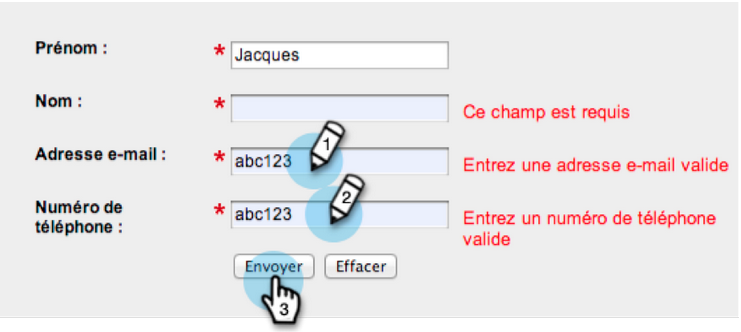
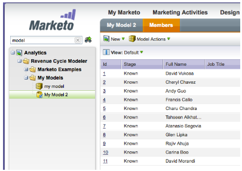
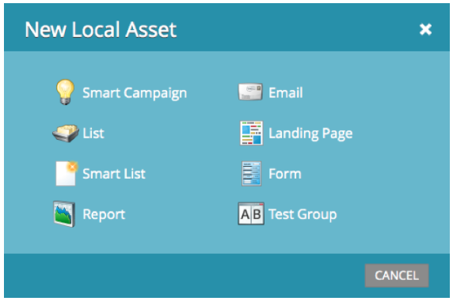

# 2013

## 2013年1月 {#january}

1月發行版本透過&#x200B;**轉介優惠方案**&#x200B;擴充我們的社交優惠方案。 此外，[!DNL Marketo Lead Management]使用者可以設定其時區、語言和區域設定喜好設定。 請注意，標示&#42;的功能僅適用於Select版本。

## 反向連結選件 {#referral-offers}

**轉介優惠方案**&#x200B;可鼓勵您的潛在客戶轉介他們的朋友。 建立成功轉介的目標和回報。 您可以在登入頁面、您的網站，甚至Facebook上使用它。

## 時區喜好設定 {#time-zone-preference}

您可以變更個人Marketo帳戶的預設時區。 例如，即使訂閱的預設為太平洋時間，您仍可以將自己的帳戶變更為東部時間。

## 選取您的[!DNL Marketo Lead Management]語言 {#select-your-marketo-lead-management-language}

您可以變更Marketo使用者帳戶的預設語言。 即使訂閱的預設為英文，您也可以將其變更為德文或法文以供您自用。

## 多語言表單錯誤訊息 {#multi-lingual-form-error-messages}

當銷售機會填寫Marketo表單時，會自動內建一些驗證訊息。 您可能會想要為這些錯誤訊息選取不同的顯示語言。 我們現在支援英文、德文和法文。

法文表單的範例：

## 選取您的[!DNL Sales Insight]語言（僅限[!DNL Salesforce]） {#select-your-sales-insight-language-salesforce-only}

如果您的[!DNL Salesforce]語言偏好設定設為法文或德文，Marketo [!DNL Sales Insight]將遵循此偏好設定。 下載最新的MSI套件以取得此功能（1月14日當週提供）。

## 欄位顯示名稱 {#field-display-name}

欄位顯示名稱可以顯示不同語言的文字（例如，支援多位元組字元）。

## 變更方案資料 {#change-program-data}

[!UICONTROL Change Program Data]流程步驟可讓您透過行銷活動手動變更方案成員的[!UICONTROL Success]狀態和[!UICONTROL Success Date]。 您可以使用此流程步驟來更正錯誤，或手動變更可能未如預期參與計畫的成員。

## 2013年2月 {#february}

2月版本包含強烈要求的功能、[!DNL Apple Safari]支援和其他小型增強功能。

## [!DNL Apple Safari]的官方支援 {#official-support-for-apple-safari}

Mac和[!DNL Windows]的最新版本[!DNL Apple Safari]完全支援搭配Marketo銷售機會管理使用。 注意： iOS上的[!DNL Safari]不完全相容。

## Webhooks增強功能 {#webhooks-enhancements}

Webhook已增強，以逸出URL/承載中的權杖，也可剖析來自協力廠商系統的XML/JSON回應（無法在[!DNL Spark SMB Edition]中使用）來更新Marketo潛在客戶欄位。

## 已更新SOAP API端點 {#updated-soap-api-endpoint}

更新偏好的SOAP API端點，顯示在[!UICONTROL Admin] -> SOAP API中。 請更新您的呼叫以使用此新端點。 對舊端點的API呼叫已過時，但將繼續運作。 （[!DNL Spark SMB Edition]中不提供SOAP API）

## [!DNL Facebook]索引標籤的行動支援 {#mobile-support-for-facebook-tabs}

從Marketo發佈的[!DNL Facebook]個索引標籤會偵測行動裝置，並將其路由至登陸頁面。 這將確保使用者在不支援[!DNL Facebook]索引標籤的行動裝置上取得正確內容（可在[!DNL Spark]、[!DNL Standard]、[!DNL Select SMB Editions]和[!DNL Marketo Social Marketing]中使用）。

## 即將推出：支援多種模型 {#coming-soon-support-for-multiple-models}

我們正在做基礎工作，以支援多個收入週期模型，並在未來版本中#1社群中投票贊成以RCA的構想。 在此版本中，您會注意到一些變更，包括智慧清單篩選條件和在流程步驟中新增選擇，以支援選取模型和階段。 我們也會將「銷售機會收入階段」和「銷售機會收入週期模型」欄位移出「智慧清單銷售機會網格」標籤。

## 2013年3月 {#march}

3月發行版本包含下列功能。

## Marketo行事曆檔案 {#marketo-calendar-files}

將行事曆檔案建立為&#x200B;**我的Token**，以用於事件確認和提醒電子郵件中。 此整合行事曆檔案（例如.ics檔案）將轉譯所有權杖，包括「我的權杖」和`{{member.webinar URL}}`權杖。

## 等候直到+/- {#wait-until}

建立可以在日期Token之前或之後執行指定天數的「等待步驟」。 例如，您可以建立等待步驟，在事件日期之前等待3天，然後傳送提醒！

您可以建立等待步驟，在潛在客戶生日之前等候14天。 若選取「使用此日期的下一個週年紀念日」，系統會自動忽略與日期相關的年份，並改用目前或下一個日曆年份。

## 社交抽獎 {#social-sweepstakes}

抽獎活動可讓您的潛在客戶有機會贏得獎項，並將您的情況告訴他們的朋友。 您可從參與者中隨機選取獲勝者，並傳送電子郵件給他們。

## 其他表單[!UICONTROL Error Message]語言 {#additional-form-error-message-languages}

表單錯誤訊息中新增了十多種語言！

## 支援新聞與警示 {#support-news-and-alerts}

訂閱P1警示、已知問題、支援專家的提示和提示，以及Marketo客戶支援的更新消息，即可與Marketo客戶支援保持連線。

## 2013年4月 {#april}

4月發行版本包含下列功能。

## [!DNL Box]整合 {#box-integration}

將Marketo與您的[!DNL Box]帳戶連線，以輕鬆地將檔案複製到設計工作室。

## [!DNL Gmail]外掛程式 {#gmail-plugin}

如果您使用Marketo [!DNL Sales Insight]以及[!DNL Gmail]，可以透過[!DNL Chrome]商店安裝我們的新[!DNL Gmail]外掛程式。 外掛程式可讓您使用Marketo記錄訊息、載入Marketo電子郵件範本，以及使用Marketo追蹤功能傳送訊息。

## 電子郵件分析 {#email-analysis}

在[!UICONTROL Revenue Explorer]中建立進階電子郵件報表，例如Click Activity Heat Grid報表。 此報告可提供insight使用者在電子郵件中點按連結的日期和時間。

我們將在4月和5月期間移轉您的2012和2013年電子郵件資料，並分階段開啟整個電子郵件分析功能。 換言之，某些客戶會比其他客戶更早存取此功能。

## 程式API {#program-apis}

支援SOAP API呼叫中的方案，包括方案資料的唯讀存取權，例如：方案會籍數、取得者、成功、設定、管道、標籤、代號和成本。 如需詳細資訊，請參閱SOAP API檔案。

## [!DNL ON24]增強功能 {#on-enhancement}

職稱和公司名稱會從您的Marketo登錄檔單同步至[!DNL ON24]。

## 2013年5月 {#may}

5月發行版本包含下列功能。

## 登陸頁面的日曆檔案 {#calendar-files-for-landing-pages}

將日曆檔案建立為「我的Token」，可新增至您的登陸頁面。 此整合式行事曆檔案（例如.ics檔案）將轉譯所有權杖，包括本機資產登陸頁面上的「我的權杖」。

## 模型成員資格標籤 {#model-membership-tab}

在一個位置檢視模型成員的所有資料，以便輕鬆進行監控和疑難排解。 當您選取已核准的收入週期模型時，新的[!UICONTROL Members]索引標籤是唯讀的檢視，可供使用。

## 重新組織的流量動作樹狀結構 {#reorganized-flow-action-tree}

使用新重新組織的流量動作樹狀結構，更快找到流量動作。

## 已重新命名流量動作 {#renamed-flow-actions}

變更進度狀態現在是[!UICONTROL Change Program Status]。 變更方案資料現在是[!UICONTROL Change Program Success]。

## 2013年6月 {#june}

6月發行版本包含下列功能。

## 其他使用者語言 {#additional-user-languages}

以您的慣用語言檢視Marketo銷售機會管理介面 — 現在支援西班牙文和葡萄牙文。

## Cobalt使用者介面 {#cobalt-user-interface}

在接下來的幾個月中，您會注意到應用程式的不同部分陸續推出新的主題；例如，會影響強制回應視窗。

## 子資料夾複製 {#subfolder-cloning}

將資產複製至子資料夾。

## 多個模型 {#multiple-models}

這是社群收入週期分析(RCA)的首要構想，此功能可讓您建立多個模型，以按產品線、業務單位或區域更詳細地瞭解您的收入funnel。 「依收入階段的銷售機會」、「成功路徑分析器」、「Program Analyzer」和「收入總管」報告現在支援選取特定模型以進行報告的功能。

依預設，Select SMB Edition提供兩種機型，Enterprise Edition提供十五種機型。 您也可以購買其他機型。

## 2013年7月 {#july}

下列功能包含在7月發行版本中，該版本預計於7月26日星期五推出。

## 儀表板上已用完的內容Widget {#exhausted-content-widget-on-the-dashboard}

提供有關潛在客戶何時將耗盡資料流內內容的資訊。 系統會為您提供即將達到已耗盡內容的潛在客戶數量，或潛在客戶已耗盡時間的資訊。

## 通訊限制 {#communication-limits}

要停止過度傳送電子郵件給潛在客戶嗎？ 現在可以輕鬆地將頻率自動限製為每個人。 只要設定每日和每週的通訊限制，系統就會完成其他工作。 適用於Select、Enterprise及Standard客戶的附加元件套件。

## Cobalt使用者介面 {#cobalt-user-interface-july}

在接下來的幾個月中，您會發現我們在應用程式的不同部分推出更多的新主題。 不會移動或移除任何功能。

## 方案成員日期欄 {#program-member-date-column}

依新增潛在客戶的日期檢視及排序成員網格。

## WYSIWYG編輯器拼字檢查的變更 {#changes-to-spell-check-in-wysiwyg-editor}

WYSIWYG編輯器用於拼字檢查的服務已終止。 我們已從編輯器中移除「拼字檢查」按鈕，直到找到取代專案為止。

## 2013年8月 {#august}

2013年8月發行版本包含下列功能。

**純文字電子郵件**

現在您可以只傳送[文字版的電子郵件](/help/marketo/product-docs/email-marketing/general/creating-an-email/create-a-text-only-email.md)。 請記住，使用此選項時不會裝飾連結。

## 客戶參與引擎增強功能 {#customer-engagement-engine-enhancements}

### 忽略已耗用的內容 {#ignore-exhausted-content}

將參與計畫設定為[忽略耗盡](/help/marketo/product-docs/email-marketing/drip-nurturing/using-engagement-programs/disable-and-enable-exhausted-content-notifications.md)，包括隱藏任何通知。

## 參與資料流測試 {#engagement-stream-testing}

使用[新測試功能](/help/marketo/product-docs/email-marketing/drip-nurturing/engagement-program-streams/test-an-engagement-stream.md)來模擬轉換，並測試新加入的內容到即時資料流。

## 個人化傳送測試 {#personalized-send-test}

當您傳送電子郵件測試時，可以選取銷售機會名稱以個人化測試電子郵件。

## &quot;以網頁檢視電子郵件&quot;和&quot;Unsubscribe&quot;系統權杖 {#view-email-as-web-page-and-unsubscribe-system-tokens}

利用這[個新權杖](/help/marketo/product-docs/email-marketing/general/using-tokens/system-tokens-glossary.md)，進一步掌控它們在電子郵件中的位置。

## 自動觸發程序行銷活動清理 {#automatic-trigger-campaign-cleanup}

Marketo現在會定期通知您，並[自動停用過去六個月未執行的觸發促銷活動](/help/marketo/product-docs/core-marketo-concepts/smart-campaigns/using-smart-campaigns/automatic-trigger-campaign-cleanup.md)。

## Marketo財務管理增強功能 {#marketo-financial-management-enhancement}

### 計畫成本更新  {#program-cost-update}

程式成本同步功能可追蹤多個平台上的程式成本。

### Cobalt使用者介面 {#cobalt-user-interface-august}

我們將繼續推出新的Cobalt介面。 此專案將讓Marketo的所有功能變得超級快速！ 此升級作業將持續到今年餘下時間。

## 2013年9月 {#september}

9月版本中包括下列功能。

## 較短的URL {#shorter-urls}

電子郵件URL已獲得修剪，讓收件者易於按一下，同時保留所有追蹤功能

>[!CAUTION]
>
>當我們切換至簡短URL時，在9月版之前傳送的電子郵件中的連結將在本版90天後過期。

使用Marketo自訂物件的資料，或使用Velocity範本語言將條件式邏輯新增至您的電子郵件內容。

## 變更傳送測試以傳送範例 {#change-send-test-to-send-sample}

我們已將「傳送測試」動作重新命名為「傳送範例」

## 個人化[!UICONTROL Send Sample Email] {#personalized-send-sample-email}

當您傳送電子郵件範例時，可以選取銷售機會的名稱，以個人化範例電子郵件。

## [!DNL GoToWebinar]的其他欄位同步 {#additional-field-sync-for-gotowebinar}

您可以將Marketo表單中的公司名稱和職稱同步至[!DNL GoToWebinar]。 若要啟用這些額外欄位，請前往「事件合作夥伴」並勾選「啟用額外欄位」。

## 將使用者登入限製為僅限SSO {#restrict-user-login-to-sso-only}

將訂閱設定為僅允許Marketo使用者透過SSO登入，不允許透過一般登入畫面登入

## 已上傳檔案的病毒掃描 {#virus-scan-of-uploaded-files}

如果檔案包含病毒，現在會自動掃描並封鎖上傳至Design Studio的檔案

## 匯出機會影響分析器 {#export-opportunity-influence-analyzer}

您現在可以將Opportunity Influence Analyzer中的資料匯出至[!DNL Excel]。 每個匯出的[!DNL Excel]檔案都包含所有潛在客戶（包括商機中沒有角色的潛在客戶）的所有行銷互動，以及分析器中所選帳戶下的所有商機。 機會列會以綠色反白顯示。 如果您需要專注於特定潛在客戶或行銷活動，可以使用[!DNL Excel]的原生資料篩選功能。

## 計劃歸因設定 {#program-attribution-settings}

您可以變更Marketo第一次接觸與多次接觸歸因量度連結聯絡人和機會的方式，包括執行以帳戶為基礎的歸因功能。 這些設定將會影響在Program Opportunity Analysis區域和Opportunity Analysis區域下的[!UICONTROL Revenue Explorer]個報告中的歸因量度。 這也會影響Program Analyzer中的歸因量度。

您可以將方案歸因設定變更為三個選項之一。 變更此設定不會修改任何Marketo或CRM資料；只會變更報表的執行方式，而且隨時都可以還原。

Explicit設定只會檢查具有角色（目前行為）的連絡人。 隱含將會檢查與帳戶相關聯的所有連絡人，無論角色為何。 我們強烈建議儘可能使用明確模式。 使用隱含可能會產生誤判，即表示雖然對機會沒有實際影響，但相信機會的人們。

## [!UICONTROL Sales Insight]提供法文和德文版（僅限[!DNL Salesforce]） {#sales-insight-available-in-french-and-german-salesforce-only}

從[!DNL AppExchange]下載最新版的Marketo銷售機會管理和Marketo [!UICONTROL Sales Insight]，讓您的法文和德文銷售人員可以他們的慣用語言看到[!UICONTROL Sales Insight]內容。

## Cobalt使用者介面 {#cobalt-user-interface-september}

在接下來的幾個月中，新的主題將在應用程式的不同部分推出。 本月，您可能會發現更多新的藍色強制回應視窗。

## 2013年10 {#october}

2013年10月發行版本包含下列功能。

## templates.marketo.com {#templates-marketo-com}

[Templates.marketo.com](/help/marketo/product-docs/demand-generation/landing-pages/landing-page-templates/guided-landing-page-template-list.md)會展示您可從[!DNL Marketo Program Library]下載的電子郵件和登入頁面範本（包括回應式行動電子郵件範本）。 我們每月都會新增範本，請經常回來檢視！

## developers.marketo.com {#developers-marketo-com}

[Developer.adobe.com](https://experienceleague.adobe.com/zh-hant/docs/marketo-developer/marketo/home)適用於想建置整合至Marketo的開發人員。 您可以參考不同的整合選項，包括Munchkin JavaScript API、SOAP API程式碼範例、Webhook和電子郵件指令碼。 [GitHub](https://github.com/Marketo/SOAP-API-Java-Client)上也提供Java SDK。

## 已更新[!DNL BrightTALK]事件配接器 {#updated-brighttalk-event-adapter}

將其他欄位從[!DNL BrightTALK]同步至Marketo，包括公司名稱、職稱、產業和公司規模。

## Android Tablet事件簽入應用程式 {#android-tablet-event-check-in-app}

使用Google Play提供的新型Android簽到應用程式，將註冊者簽到您的活動中。

## 2013年12 {#december}

12月版本中包括下列功能。

發行後，請務必檢視Community中的新發行版本索引標籤，以取得每個功能的詳細知識庫文章！

## 電子郵件方案 {#email-program}

傳送電子郵件從未如此容易。 使用新的[電子郵件程式](/help/marketo/product-docs/email-marketing/email-programs/creating-an-email-program/understanding-email-programs.md)來傳送批次電子郵件，而非預設程式。 定義智慧清單、電子郵件、排程，然後您就會關閉！

另請參閱新的[電子郵件度量儀表板](/help/marketo/product-docs/email-marketing/email-programs/email-program-data/view-the-email-program-dashboard.md)，瞭解您的電子郵件執行情形。

## 電子郵件A/B測試 {#email-a-b-testing}

在新的電子郵件程式中，針對整體電子郵件傳送母體的百分比執行[A/B測試](/help/marketo/product-docs/email-marketing/email-programs/email-program-actions/email-test-a-b-test/add-an-a-b-test.md)。 從4種不同型別的測試中選擇：主旨列、寄件者地址、日期/時間和整個電子郵件。 您甚至可以選擇手動提升獲勝者，或讓系統根據預先定義的獲勝標準提升獲勝者。 新的電子郵件程式（包括A/B測試）可巢狀內嵌於Events和預設程式中，讓該電子郵件傳送如此簡單！

## 電子郵件Champion/挑戰者測試 {#email-champion-challenger-testing}

[冠軍/挑戰者測試](/help/marketo/product-docs/email-marketing/general/functions-in-the-editor/email-tests-champion-challenger/add-an-email-champion-challenger.md)類似於A/B測試，但不同之處在於它會用於觸發的電子郵件，而且您不會自動傳送獲勝者。 此測試可讓您挑戰既定的做事方式，稱為冠軍，並且透過引入挑戰者來測試其是否仍然是最棒的。 此外，冠軍/挑戰者電子郵件測試可用於參與計畫串流中。

## [!UICONTROL Email Analysis]中的潛在客戶詳細資料 {#lead-details-in-email-analysis}

我們在[!UICONTROL Email Analysis]中引進了其他銷售機會和公司屬性。 您現在可以檢視依新屬性（例如[!UICONTROL Industry]和[!UICONTROL Lead Source]）分組的電子郵件統計資料。

## 增強的[!DNL BrightTALK]事件配接器 {#enhanced-brighttalk-event-adapter}

現在您可以從您的[!DNL BrightTALK]頻道和活動將註冊者拉入Marketo。 您可以利用此資訊來通知其他行銷活動！

