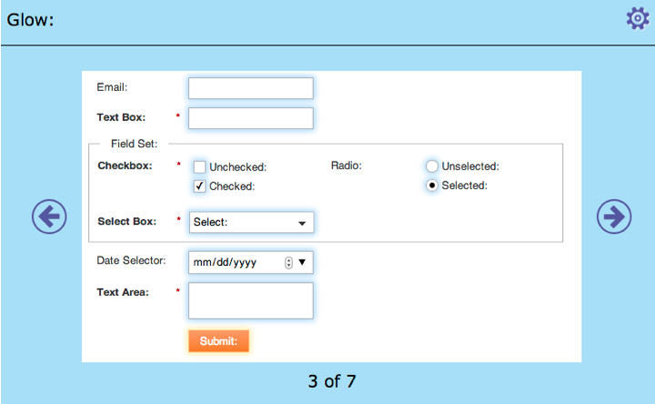
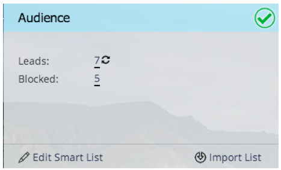
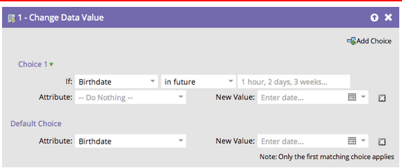
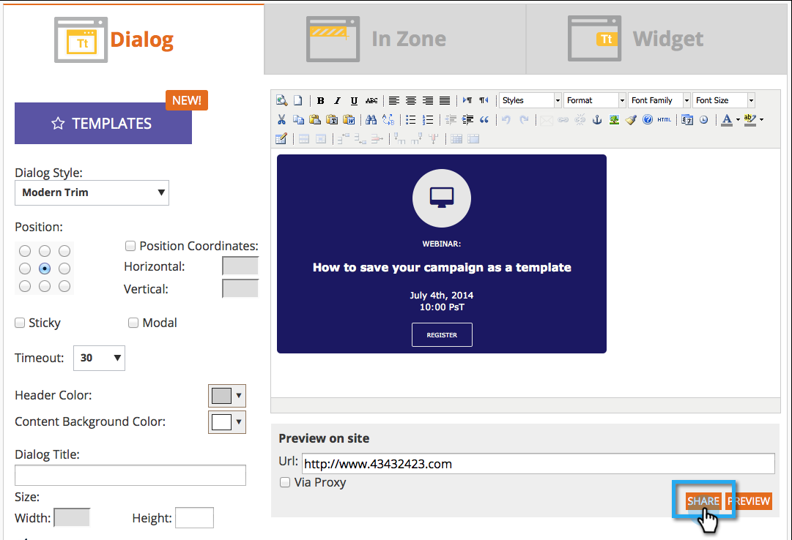

# 2014

## 2014年1月 {#january}

2014年1月發行版本包含下列功能。 請檢查您的[Marketo Edition](https://www.marketo.com/pricing/)是否有功能可用。

## Forms 2.0 {#forms}

注意： Forms 2.0的檔案即將推出！

掌控表單建立流程，讓您的網頁開發人員輕鬆體驗。 Forms 2.0的設計目的，是要讓行銷人員能夠建立視覺上及功能上強大的表單，而不需要程式設計知識。

**給您的Forms應有的視覺化改造：**

主題設計、按鈕自訂和彈性版面配置可讓您設計符合網站外觀和感覺的現代外觀表單。

**條件式可見性和後續追蹤頁面邏輯：**

想要僅在使用者選取美國作為其「國家/地區」時顯示「州」嗎？ 如何根據客戶回答您表單上的問題，向客戶展示不同的白皮書？ 直接從編輯器將條件式邏輯建置到您的表單中。 不需要[!DNL javascript]！

**輕鬆將Forms內嵌在您自己的登陸頁面上：**

從放置在Marketo登陸頁面上的表單中提取html程式碼並將它們拖放到[!DNL iFrame]中的日子已經過去。 只要抓住內嵌程式碼，並將其放置在您要轉譯表單的登陸頁面上。 兩種模式（一般和燈箱）可讓您在網站上使用Marketo表單獲得更大的彈性。

## 電子郵件程式的通訊限制 {#communication-limits-for-email-program}

[設定電子郵件程式的通訊限制](/help/marketo/product-docs/email-marketing/email-programs/email-program-actions/enable-disable-communication-limits-in-an-email-program.md)以確保您不會過度通訊資料庫。 如果人員超過定義的限制，她將不會收到電子郵件。

## 計畫會員資格分析中的其他欄位 {#additional-fields-in-program-membership-analysis}

現在，您可以依銷售線索和公司屬性，新增計畫會員資格分析量度並加以分組。 例如，您可以新增產業欄位，以檢視方案成員與成功的分割。

## 2014年2月 {#february}

2014年2月發行版本包含下列功能。 請檢查您的Marketo版本是否有功能可用。 發行後，請務必返回尋找每個功能的詳細知識庫文章連結！

## [!UICONTROL Engagement Score]為獲勝條件 {#engagement-score-as-winning-criteria}

[使用參與分數](/help/marketo/product-docs/email-marketing/email-programs/email-program-actions/email-test-a-b-test/define-the-a-b-test-winner-criteria.md)來決定A/B分割測試或冠軍/挑戰者測試中的成功變體。 測試必須執行至少24小時，以提供足夠的參與分數。

## 電子郵件程式[!UICONTROL Results]索引標籤 {#email-program-results-tab}

[檢視結果](/help/marketo/product-docs/email-marketing/email-programs/email-program-data/view-email-program-results.md)和為電子郵件程式記錄的活動。

## 人員/[!UICONTROL Leads]已封鎖郵寄 {#people-leads-blocked-from-mailing}

[按一下封鎖郵寄的人員/銷售機會](/help/marketo/product-docs/email-marketing/email-programs/managing-people-in-email-programs/define-an-audience-with-a-smart-list.md)號碼，檢視哪些人不會收到因取消訂閱、列入黑名單、電子郵件地址無效或空白，或行銷活動被暫停而收到的電子郵件。

## 匯出電子郵件程式資料 {#export-email-program-data}

[將電子郵件度量匯出至 [!DNL Excel]](/help/marketo/product-docs/email-marketing/email-programs/email-program-data/export-email-program-dashboard-to-excel.md)，包括AB測試變體資料。

## [!UICONTROL Engagement Stream Performance]報告中的[!UICONTROL Engagement Score] {#engagement-score-in-engagement-stream-performance-report}

我們已將參與分數新增到[[!UICONTROL Engagement Stream Performance]報告](/help/marketo/product-docs/email-marketing/drip-nurturing/reports-and-notifications/engagement-stream-performance-report.md)，以協助您瞭解參與計畫中的內容有多有效。

## 電子郵件分析中的計畫詳細資訊 {#program-details-in-email-analysis}

現在您可以依方案名稱、頻道和標籤，將您的電子郵件量度分組。 當電子郵件是計畫的本機資產時，計畫名稱會新增到電子郵件名稱欄位。 新的「方案名稱」欄位會顯示傳送電子郵件的智慧型行銷活動的方案名稱。 如果電子郵件是不同計畫的本機資產，則此專案可能不同於「電子郵件名稱」欄位中的計畫。

## 更新點按連結篩選器和觸發器 {#update-to-clicks-link-filters-and-trigger}

已更新下列篩選器和觸發器名稱：

* 按一下連結至[!UICONTROL Clicks Link on Web Page]
* 已點按連結至[!UICONTROL Clicked Link on Web Page]
* 未點按[!UICONTROL Not Clicked Link on Web Page]的連結

## Forms 2.0增強功能 {#forms-enhancements}

我們已在此版本中為Forms 2.0提供數個「生活品質」更新。 除了啟用內嵌表單的漸進式設定外，我們還進行了工作流程和UX變更，這些變更可讓您更輕鬆地在編輯器中使用更進階的功能，[包括可見性規則](/help/marketo/product-docs/demand-generation/forms/form-fields/dynamically-toggle-visibility-of-a-form-field.md)、進階感謝頁面，以及隱藏欄位。

## 2014年3月 {#march}

2014年3月發行版本包含下列功能。 請檢查您的Marketo版本是否有功能可用。 發行後，請務必返回各個功能的知識庫文章連結。

## 電子郵件程式儀表板重新整理按鈕 {#email-program-dashboard-refresh-button}

使用[重新整理按鈕](/help/marketo/product-docs/email-marketing/email-programs/email-program-data/use-the-email-program-dashboard.md)取得有關您的電子郵件傳送或AB測試的最新電子郵件量度！

## 在電子郵件編輯器和代碼片段編輯器中還原/重做 {#undo-redo-in-the-email-editor-and-snippet-editor}

針對目前工作階段[復原或重做](/help/marketo/product-docs/email-marketing/general/email-editor-2/edit-elements-in-an-email.md)最多50個動作。

## 方案績效報表中的方案狀態列位 {#program-status-columns-in-program-performance-report}

使用[方案效能報表](/help/marketo/product-docs/core-marketo-concepts/programs/program-performance-report/add-program-status-columns-to-a-program-report.md)時，您現在可以看到有多少人處於方案狀態。

## Analytics的包含與作業程式 {#inclusive-and-operational-programs-for-analytics}

您現在可以在編輯「方案頻道」時，將「分析行為」選項設定為「包含」，在[!UICONTROL Revenue Explorer]和分析器中納入沒有期間成本的方案。 您也可以選擇「作業」，將作業程式排除在報表之外。

## 潛在客戶轉換的混合與隱含選項 {#hybrid-and-implicit-options-for-lead-conversion}

您可以針對「銷售機會分析」中的銷售機會轉換量度，變更Marketo連結聯絡人和商機的方式。 您可以[將歸因設定](/help/marketo/product-docs/administration/settings/change-attribution-settings-for-analytics.md)變更為三個選項之一。 變更此設定不會修改任何Marketo或CRM資料；只會變更報表的執行方式，而且隨時都可以還原。

「明確」設定只會將具有商機中角色的聯絡人視為轉換的潛在客戶（預設行為）。 隱含會將與商機中帳戶關聯的所有連絡人（無論角色為何）視為已轉換。 如果可用，混合會將角色連絡人視為已轉換；如果沒有，我們會將該帳戶中的所有連絡人視為已轉換。

提醒您，此設定也會變更方案歸因量度。

## 其他使用者語言 {#additional-user-language}

選取您的[Marketo應用程式語言](/help/marketo/product-docs/administration/settings/change-time-zone.md)。 以您偏好的語言檢視Marketo銷售機會管理介面 — 現在支援日文。

## Marketo開發人員部落格 {#marketo-developer-blog}

[Marketo Developer部落格](https://developers.marketo.com/blog/)專供那些支援現代行銷人員快速發展需求的網頁開發人員和軟體工程師使用。 您可以訂閱有關新整合選項、API版本更新的公告，以及一系列新的作法文章（包括程式碼範例和與Marketo平台整合的最佳作法）。

此系列中的[第一篇文章](https://developers.marketo.com/blog/retrieving-customer-and-prospect-information-from-marketo-using-the-api/)將逐步引導您瞭解如何使用API有效擷取儲存在Marketo中的人員（客戶/聯絡人/潛在客戶）的相關資訊。

## 2014年5月 {#may}

2014年5月發行版本包含下列功能。 請檢查您的Marketo版本是否有功能可用。 發行後，請務必返回尋找每個功能的詳細知識庫文章連結！

## 刪除Workspace {#delete-workspace}

現在您可以[刪除未使用的工作區](/help/marketo/product-docs/administration/workspaces-and-person-partitions/delete-a-workspace.md)。 在嘗試刪除工作區之前，請務必將所有資產移至另一個工作區。

## 排程首次點播 {#schedule-first-cast}

在參與程式中，您可以排定[第一次轉換的日期](/help/marketo/product-docs/email-marketing/drip-nurturing/engagement-program-streams/set-stream-cadence.md)。 例如，指定每2週播放一次，並選取第一次播放的日期。

## 增強參與計畫 {#enhanced-engagement-programs}

現在每個人都擁有多個程式、串流和通訊限制。

## 文字電子郵件中的連結追蹤 {#link-tracking-in-text-emails}

[在電子郵件文字版的URL兩側加上雙方括弧](/help/marketo/product-docs/email-marketing/general/functions-in-the-editor/add-tracked-links-to-a-text-email.md)，以指出何時應將連結轉換為重新導向的Marketo追蹤連結

>[!NOTE]
>
>**範例**
>
>`[[https://www.marketo.com]]`

預設情況下，不會在電子郵件的文字版本中追蹤任何連結。 新增此新語法以指出何時應將連結轉換為追蹤連結。 HTML連結的行為未變更。  若要將追蹤連結新增至您的電子郵件：

* **HTML版本：**&#x200B;只要插入連結即可。 預設會加以追蹤。
* **文字版本：**&#x200B;請輸入由雙方括弧括住的URL。

若要將未追蹤的連結新增至您的電子郵件：

* **HTML版本：**&#x200B;插入您的連結，並將「mktNoTrack」類別新增至連結。
* **文字版本：**&#x200B;只要輸入URL即可。 預設會取消追蹤。

## 範例電子郵件中的連結標籤 {#link-markup-in-sample-emails}

事先瞭解連結在電子郵件中的行為。 範例電子郵件現在會顯示連結，以及連結在潛在客戶面前的顯示方式。 預覽哪些連結已轉換為追蹤連結，讓您更清楚瞭解訊息實際向收件者顯示的方式。

## [!UICONTROL Abort Campaign] {#abort-campaign}

不要驚慌！ 如果發現錯誤，請使用新的[中止行銷活動](/help/marketo/product-docs/core-marketo-concepts/smart-campaigns/using-smart-campaigns/abort-a-smart-campaign.md)按鈕，立即停止行銷活動中的行銷活動。 您會收到通知，概述行銷活動停止時每個流程步驟中擱置的潛在客戶數。

## [!UICONTROL Sales Insight]日文、葡萄牙文和西班牙文 {#sales-insight-in-japanese-portuguese-and-spanish}

從AppExchange下載最新版的[!UICONTROL Sales Insight]，讓您的日文、葡萄牙文和西班牙文銷售代理商以慣用語言檢視[!UICONTROL Sales Insight]內容。

## 方案會員資格分析中的方案狀態和成功時間範圍 {#program-status-and-success-timeframe-in-program-membership-analysis}

檢視每個方案狀態中的成員數量及其變更為每個狀態的時間，包括取得方案成功的日期。

## [!UICONTROL Email Analysis]中的A/B測試電子郵件 {#a-b-test-emails-in-email-analysis}

在[!UICONTROL Email Analysis]中報告每個A/B測試電子郵件變體。

## Analytics封裝變更 {#analytics-packaging-changes}

MA Standard Edition現已包含Revenue Cycle Modeler和Success Path Analyzer。

## 行動平台資訊 {#mobile-platform-info}

從潛在客戶行動裝置開啟及點按電子郵件時，對其進行[區段並觸發](/help/marketo/product-docs/reporting/basic-reporting/report-activity/build-a-people-performance-report-with-mobile-platform-columns.md)。

## 2014年6月 {#june}

2014年6月發行版本包含下列功能。 請檢查您的Marketo版本是否有功能可用。

## 更新UI — 即將推出！ {#updated-ui-coming-soon}

新外觀，包括[!DNL Marketo Lead Management]的導覽功能，即將於稍後版本推出！

## 適用於[!DNL Outlook] 2013的[!DNL Sales Insight]外掛程式 {#sales-insight-plugin-for-outlook}

您必須下載新的外掛程式，才能進行這項作業。 您可以從[這裡](/help/marketo/product-docs/marketo-sales-insight/msi-outlook-plugin/install-the-marketo-email-add-in-for-outlook-with-a-registration-code.md)下載。

## 權杖解析 {#token-resolution}

當您從[!DNL Sales Insight]傳送測試電子郵件時，目前電子郵件中的權杖不會解析，且會傳送預設值。 此增強功能將確保權杖能解析在測試電子郵件中。

## 自訂星星和火焰的百分比 {#customize-percentages-for-stars-and-flames}

[設定獲得1、2或3顆星和火焰的銷售機會百分比](/help/marketo/product-docs/marketo-sales-insight/msi-for-salesforce/features/stars-and-flames/customize-stars-and-flames.md)。

## 潛在客戶REST API {#lead-rest-api}

透過新的ReST API，以程式設計方式建立、讀取和更新銷售機會。 若要開始使用ReST，您必須在Marketo中[建立自訂服務](/help/marketo/product-docs/administration/additional-integrations/create-a-custom-service-for-use-with-rest-api.md)。 然後前往[開發人員網站](https://experienceleague.adobe.com/zh-hant/docs/marketo-developer/marketo/rest/rest-api)取得有關使用此API的詳細資訊。

## Marketo Real-Time Personalization (RTP)行銷活動頁面更新 {#marketo-real-time-personalization-rtp-campaigns-page-update}

RTP行銷活動現在包含新設計，其中包含縮圖檢視和行銷活動績效。 此外，您可以[根據日期或最佳績效，組織行銷活動](/help/marketo/product-docs/web-personalization/working-with-web-campaigns/sort-web-campaigns-by-latest-or-top-performing.md)。

## 網站分析整合 {#web-analytics-integrations}

在網站分析平台中附加所有RTP資料。

現已預設啟用與[Google Analytics](/help/marketo/product-docs/web-personalization/reporting-for-web-personalization/web-analytics-integrations/integrate-rtp-with-google-analytics.md) (GA)的整合，因此在「帳戶設定」底下，開啟您要傳送其資料至GA自訂變數和事件的開關。

我們也已完成與[Adobe SiteCatalyst](/help/marketo/product-docs/web-personalization/reporting-for-web-personalization/web-analytics-integrations/integrate-with-adobe-analytics.md)的整合。

## 2014年7月 {#july}

2014年7月發行版本包含下列功能。 請檢查您的Marketo版本是否有功能可用。 在發行後返回以取得詳細功能檔案的連結。

## 行銷行事曆 {#marketing-calendar}

檢視所有跨計畫的事件、電子郵件等。 [此新產品](/help/marketo/product-docs/core-marketo-concepts/marketing-calendar/understanding-the-calendar/navigating-the-marketing-calendar.md)將免費提供給擁有10位或10位以下的[!DNL Marketo Lead Management]或Dialog使用者的客戶。

行銷行事曆上的檔案將在發行時提供。

## 全新外觀 {#new-look-and-feel}

[!DNL Marketo Lead Management]將更新為時尚的新外觀，並包含更新的導覽。

## 日期運運算元 {#date-operators}

「[!UICONTROL in past before]」、「[!UICONTROL in future]」和「[!UICONTROL in future after]」的[進階篩選器](/help/marketo/product-docs/core-marketo-concepts/smart-lists-and-static-lists/creating-a-smart-list/smart-list-filter-operators-glossary.md)。 例如，尋找未來3個月內有出生日期的銷售機會，或在6個月後到期的合約。

## 方案排程視圖 {#program-schedule-view}

除了您用來管理您的活動和預設方案的行銷行事曆外，新的排程檢視也直接顯示在方案上。

* 一次重新排程所有日期
* 新的暫定日期 — 請將其入筆！
* 自訂專案型別 — 待辦事項、新聞稿、任何您想要的專案

## REST API中的清單作業 {#list-operations-in-the-rest-api}

我們在ReST中新增了以下與清單作業相關的呼叫。 如需完整檔案，請參閱[https://experienceleague.adobe.com/zh-hant/docs/marketo-developer/marketo/rest/rest-api](https://experienceleague.adobe.com/zh-hant/docs/marketo-developer/marketo/rest/rest-api)。

* 依ID取得清單
* 取得多個清單
* 匯入至清單
* 取得匯入至清單狀態

## 快速清單匯入 {#fast-list-import}

速度加快&#x200B;**50倍**，您的檔案將會放大至Marketo！ 舊的「一般」和「針對新銷售機會最佳化」匯入選項已由「預設（快速匯入）」取代。

「略過新的銷售機會和更新」選項維持不變。

## 全新改良的Munchkin！ {#new-improved-munchkin}

推出將於7月中旬開始，並持續數月。

* 移除相依性[!DNL jQuery]，以取得完整及未來的相容性
* 與網站上的其他JavaScript更相容
* 在過去一年中，已在許多網站上經過全面測試！

## RTP：即時Personalization行銷活動範本 {#rtp-real-time-personalization-campaign-templates}

RTP設定行銷活動頁面現在[包含現成的範本](/help/marketo/product-docs/web-personalization/using-templates/using-templates-to-create-web-campaigns.md)。 從多種樣式中選擇，包括網路研討會、個案研究、電子書。

## RTP： JavaScript API增強功能 {#rtp-javascript-api-enhancements}

新的RTP API呼叫可取得即時訪客資料，例如組織、產業、地點和區段代碼相符。 此外，將游標暫留在「區段」頁面中的區段名稱上，會顯示顯示區段代碼的工具提示。 如需完整檔案，請參閱我們的[開發人員網站](https://experienceleague.adobe.com/zh-hant/docs/marketo-developer/marketo/javascriptapi/rich-media-recommendation)。

## RTP：Campaign內容編輯器中的HTML5支援 {#rtp-html-support-in-campaign-content-editor}

設定行銷活動頁面中的內容WYSIWYG編輯器現在具有完整的HTML5相容性。 在編輯器中按一下「HTML」圖示，插入任何HTML5程式碼。

## 2014年8月 {#august}

2014年8月發行版本包含下列功能。 檢查您的Marketo版本是否有功能可用。 在發行後返回以取得詳細功能檔案的連結。

## 行銷行事曆授權 {#marketing-calendar-licenses}

2014年9月5日之後，只有5位使用者可以免費存取行銷行事曆。 請務必先將行銷行事曆授權[&#128279;](/help/marketo/product-docs/core-marketo-concepts/marketing-calendar/understanding-the-calendar/issue-revoke-a-marketing-calendar-license.md)問題/撤銷給您選擇的使用者，再將其設為未中斷存取。

## 新使用者許可權 {#new-user-permissions}

已新增下列新使用者許可權：

| 權限 | 說明 |
|---|---|
| 存取Revenue Explorer | 如果您已購買RCA，現在就能控制存取許可權。 |
| 匯入清單 | 限制使用者將清單匯入潛在客戶資料庫。 |
| 清單匯入 | 限制使用者透過行銷活動底下的方案匯入清單。 |
| 啟動觸發程式行銷活動 | 控制誰可以和無法啟動觸發行銷活動。 |
| 排程批次行銷活動 | 控制誰可以和無法排程批次行銷活動執行。 |

## 從[!UICONTROL Admin]匯出使用者和角色 {#export-users-and-roles-from-admin}

您現在可以從Marketo [匯出使用者和角色清單](/help/marketo/product-docs/administration/users-and-roles/export-a-list-of-users-and-roles.md)。 您也可以加入要包含在匯出中的「上次登入」時間戳記。

## 刪除管道和標籤 {#delete-channels-and-tags}

您現在可以刪除任何未使用的管道和狀態。 一如既往，您只能隱藏目前使用中的專案。

## 自動化[!DNL DKIM] {#automated-dkim}

為了改善傳遞能力，所有寄出的電子郵件都會經過[!DNL DKIM] (DomainKeys Indified Mail)簽署。 依預設，電子郵件將使用Marketo的共用[!DNL DKIM]簽名。 您將可以選擇自訂此簽章。

>[!NOTE]
>
>[!DNL DKIM]將緩慢轉出，您可能會好幾週都看不到它。

## 即時Personalization更新 {#real-time-personalization-updates}

我們已在行銷活動頁面新增標籤，讓您能夠為自己的內容加上標籤。

## 行動裝置定位 {#mobile-targeting}

您在社群上提出要求，我們便完成了交付！ 您現在可以為行動裝置和平板電腦使用者包含、排除或設定特定的call to action。

## 增強的1:1細分與目標定位 {#enhanced-segmentation-and-targeting}

您現在可以使用進階篩選器運運算元來鎖定已知訪客。

## 行銷活動共用 {#campaign-sharing}

您現在可以快速輕鬆地共用RTP行銷活動預覽連結。

## 內容推薦引擎報表 {#content-recommendation-engine-report}

我們已新增內容推薦引擎報告，供您檢視不錯的摘要。

## 增強的使用者管理 {#enhanced-user-administration}

由於多次失敗的登入嘗試，管理員使用者現在可以鎖定使用者。 您也可以視需要解鎖這些使用者。

## 追蹤控制 {#tracking-control}

您現在可以從Real-Time Personalization的所有追蹤和報告中排除特定IP。

## 2014年10 {#october}

檢查您的Marketo版本是否有功能可用。 說明檔案將在發行時提供。

## 行銷行事曆中的方案焦點 {#program-focus-in-marketing-calendar}

[直接從行銷行事曆建立及編輯專案](/help/marketo/product-docs/core-marketo-concepts/marketing-calendar/understanding-the-calendar/understand-enable-program-focus.md)。

## 新的REST API呼叫 {#new-rest-api-calls}

使用API來提取新的活動或銷售機會的變更：

* 取得銷售機會變更
* 取得潛在客戶活動
* 取得活動型別
* 取得分頁Token

發行後，完整詳細資料將可在[https://experienceleague.adobe.com/zh-hant/docs/marketo-developer/marketo/rest/rest-api](https://experienceleague.adobe.com/zh-hant/docs/marketo-developer/marketo/rest/rest-api)取得。

## MSI — 傳送[!DNL Microsoft Dynamics]的Marketo電子郵件 {#msi-send-marketo-email-for-microsoft-dynamics}

[傳送及追蹤銷售電子郵件](/help/marketo/product-docs/marketo-sales-insight/msi-for-microsoft-dynamics/setting-up-and-using/send-a-marketo-sales-email-from-microsoft-dynamics.md)給來自[!DNL Microsoft Dynamics]的銷售機會與連絡人。

## MSI — 為[!DNL Microsoft Dynamics]新增至Marketo行銷活動 {#msi-add-to-marketo-campaigns-for-microsoft-dynamics}

[直接從[!DNL Microsoft Dynamics]將銷售機會和連絡人新增至Marketo智慧行銷活動](/help/marketo/product-docs/marketo-sales-insight/msi-for-microsoft-dynamics/setting-up-and-using/add-a-lead-contact-to-a-marketo-campaign-from-microsoft-dynamics.md)。 行銷人員可選擇哪些是Marketo促銷活動可供銷售人員使用。

## [!DNL Microsoft Dynamics]同步處理的自訂實體支援 {#custom-entity-support-for-microsoft-dynamics-sync}

[使用來自[!DNL Microsoft Dynamics]的自訂物件資料](/help/marketo/product-docs/crm-sync/microsoft-dynamics-sync/microsoft-dynamics-sync-details/enable-sync-for-a-custom-entity.md)，在智慧列示、智慧行銷活動、方案中篩選和觸發……

## [!DNL Microsoft Dynamics]同步處理的股東支援 {#shareholder-support-for-microsoft-dynamics-sync}

從[!DNL Dynamics]同步處理商機股東資料。 此外，使用「主要帳戶」欄位連線至帳戶的機會，以及使用「主要連絡人」同步處理連線至連絡人的機會，也受支援。

## RTP — 控制面板增強功能 {#rtp-dashboard-enhancements}

儀表板現在已有所增強，現在包含更多的一目瞭然的資料：

* 組織造訪總數
* 績效最佳的前5個產業
* 參與的訪客總數

## RTP — 新的行銷活動行動範本 {#rtp-new-mobile-templates-for-campaigns}

使用這些新範本快速輕鬆地[建立行動裝置行銷活動](/help/marketo/product-docs/web-personalization/using-templates/using-templates-to-create-web-campaigns.md)。

## RTP — 使用者內容API {#rtp-user-context-api}

使用追蹤訪客過去造訪歷史記錄的新呼叫。 根據訪客的以下專案個人化行銷活動：

* 已檢視的過去頁面
* 感興趣的產品
* 他們所看到的RTP行銷活動

如需完整詳細資訊，請造訪[https://experienceleague.adobe.com/zh-hant/docs/marketo-developer/marketo/javascriptapi/rich-media-recommendation](https://experienceleague.adobe.com/zh-hant/docs/marketo-developer/marketo/javascriptapi/rich-media-recommendation)。

## 2014年12 {#december}

2014年12月發行版本包含下列功能。 請檢查您的Marketo版本是否有功能可用。 發行後，請務必返回尋找每個功能的詳細文章連結！

## [!DNL Sales Insight]個報告 {#sales-insight-reports}

[[!DNL Sales Insight] 電子郵件效能報表](/help/marketo/product-docs/marketo-sales-insight/msi-for-salesforce/features/performance-reports/sales-insight-email-performance-report.md)可讓您透過電子郵件和銷售代表來檢視電子郵件量度。 它支援透過[!DNL Salesforce]、[!DNL Microsoft Dynamics]、[!DNL Outlook]外掛程式和[!DNL Gmail]外掛程式傳送的電子郵件。

## [!DNL Facebook]個自訂對象 {#facebook-custom-audiences}

在您的Marketo管理員透過[!UICONTROL Admin] > [!UICONTROL LaunchPoint][&#128279;](/help/marketo/product-docs/demand-generation/ad-network-integrations/add-facebook-custom-audiences-as-a-launchpoint-service.md)新增[!DNL Facebook] 後，您就可以輕鬆地建立、更新或[以Marketo靜態或智慧清單中的潛在客戶取代 [!DNL Facebook] 自訂對象](/help/marketo/product-docs/demand-generation/facebook/create-a-custom-audience-in-facebook.md)。 在任何靜態或智慧清單的銷售機會格線底部尋找新的[!DNL Facebook]圖示。

## 改善跨工作區的複製  {#improved-cloning-across-workspaces}

[將程式](/help/marketo/product-docs/core-marketo-concepts/programs/working-with-programs/clone-a-program.md)複製到另一個工作區從未如此容易！ 當您按一下複製時，您會選取目的地工作區。 不要再複製至資料夾，然後再行動資料夾！

>[!NOTE]
>
>這個新的複製功能目前僅供程式使用。

## 參考智慧清單 {#reference-smart-list}

[建立智慧列示或流量時，可參考與其他工作區共用的智慧列示](/help/marketo/product-docs/core-marketo-concepts/smart-lists-and-static-lists/using-smart-lists/reference-a-list-or-smart-list-across-workspaces.md)。

## 清單匯入改善 {#list-import-improvements}

[匯入以UTF-16、Shift-JIS或EUC-JP編碼的檔案](/help/marketo/getting-started/quick-wins/import-a-list-of-people.md)。 我們持續支援UTF-8編碼檔案。

## 電子郵件指令碼中的連結追蹤 {#link-tracking-in-email-scripting}

電子郵件指令碼中的連結現在會被追蹤，並可在「電子郵件連結效能」報表中使用。

## 權杖編碼設定 {#token-encoding-setting}

我們已推出新的安全性功能，自動為HTML編碼權杖啟用，此功能將於2015年3月預設啟用。 在此之前，請在欄位管理中切換此功能，以提前測試行為。 所有潛在客戶和公司代號都會在插入電子郵件或登入頁面時進行編碼。 個別欄位也提供選項。

## 新的REST API呼叫 {#new-rest-api-calls-december}

潛在客戶與活動REST API的三次新呼叫：

·取得潛在客戶分割區

·關聯銷售機會

·合併銷售機會

發行後，完整詳細資料將可在[https://experienceleague.adobe.com/zh-hant/docs/marketo-developer/marketo/home](https://experienceleague.adobe.com/zh-hant/docs/marketo-developer/marketo/home)取得

## [!DNL Munchkin Javascript]相容性增強功能 {#munchkin-javascript-compatibility-enhancements}

我們已對[!DNL Munchkin]進行數個微幅增強，以確保其持續快速載入，並可在頁面上搭配其他JavaScript的情況下正常運作。

推出將從12月中旬開始，並持續幾個月。

## [!UICONTROL Revenue Explorer]升級外觀 {#revenue-explorer-upgraded-look-and-feel}

## RTP：具名帳戶清單模組 {#rtp-named-account-list-module}

在新的[!UICONTROL Named Accounts]頁面中管理和監視您的關鍵高產量帳戶。 上傳具名帳戶的新清單，以識別並鎖定這些組織。 我們已將此程式自動化，為您提供更大的控制力和彈性，以實施以帳戶為基礎的行銷計畫，並跨不同管道（網頁和廣告）鎖定您的關鍵帳戶。

## RTP：區域內行銷活動的滑動效果 {#rtp-sliding-effect-for-in-zone-campaigns}

我們為In Zone行銷活動新增了滑動效果，讓您的個人化內容在頁面載入時滑動就位。

