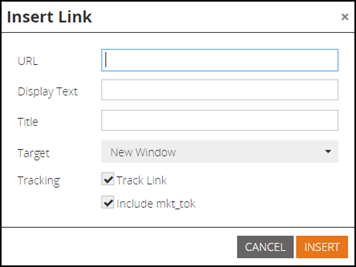

# 2015

## 2015年1月 {#january}

2015年1月發行版本包含下列功能。 請檢查您的Marketo版本是否有功能可用。 發行後，請務必返回尋找每個功能的詳細文章連結！

## 行銷自動化更新 {#marketing-automation-updates}

**支援行動裝置的登陸頁面**

您現在可以從登入頁面編輯器中[建立登入頁面](/help/marketo/product-docs/demand-generation/landing-pages/free-form-landing-pages/add-a-mobile-view-for-your-free-form-landing-page.md)的行動檢視。 無論裝置為何，都能有效傳遞您的訊息，並藉由量身打造您的內容以提升參與度，讓您在行動中輕鬆使用。 此功能將在發行後的一週內逐步推出。

[&#x200B; — 登陸頁面逐步說明影片 — &#x200B;](https://youtu.be/aPQHlG2X6c0)

**新REST API呼叫**

潛在客戶與活動REST API的三次新呼叫：

* 刪除銷售機會
* 依計畫ID取得銷售機會
* 取得已刪除的銷售機會

此外，Sync Lead也有新選項，可非同步寫入潛在客戶變更，以加快API呼叫速度。 發行後，完整詳細資料將可在[https://experienceleague.adobe.com/zh-hant/docs/marketo-developer/marketo/home](https://experienceleague.adobe.com/zh-hant/docs/marketo-developer/marketo/home)取得

**電子郵件指令碼自訂物件支援**

現在，您可以從電子郵件指令碼中存取與帳戶物件相關聯的自訂物件！

## 即時Personalization {#real-time-personalization}

**Google和[!DNL Facebook]**&#x200B;的個人化再行銷

再行銷會向造訪過您網站的人顯示廣告。 您現在可以使用即時Personalization中的資料，在[Google](/help/marketo/product-docs/web-personalization/website-retargeting/personalized-remarketing-in-google.md)和[[!DNL Facebook]](/help/marketo/product-docs/web-personalization/website-retargeting/personalized-remarketing-in-facebook.md)上個人化您的再行銷活動。 向不同產業的受眾、指定的帳戶清單、公司規模或任何已知潛在客戶的資料進行再行銷。

[具名帳戶清單模組](/help/marketo/product-docs/web-personalization/account-based-web-marketing/create-a-new-account-list.md)

「指定帳戶」模組的增強功能將改善使用者的符合率和驗證。 新增專案包括：

* 使用潛在客戶的電子郵件地址比對「具名帳戶」清單中的組織（也適用於RTP客戶）
* 支援每個帳戶最多10萬筆記錄
* 要檢視和下載的CSV檔案範本


**已更新RTP標籤選項**

「帳戶設定」下的「RTP標籤」選項已更新為包含：

1. CDN和非同步（建議標籤）
1. CDN和同步（高速）
1. 不含CDN的非同步標籤
1. 不含CDN的同步標籤

為獲得最佳效能，建議在`<head>`之後將標籤放在網頁標題的頂端。 所有標籤都允許使用[RTP API](https://experienceleague.adobe.com/zh-hant/docs/marketo-developer/marketo/javascriptapi/rich-media-recommendation)。 如需如何部署RTP標籤的詳細資訊，請參閱[這裡](/help/marketo/product-docs/web-personalization/rtp-tag-implementation/deploy-the-rtp-javascript.md)。


## 2015年2月 {#february}

2015年2月發行版本包含下列功能。 請檢查您的Marketo版本是否有功能可用。 發行後，請務必返回尋找每個功能的詳細文章連結。 鼓卷……

## 行銷自動化增強功能 {#marketing-automation-enhancements}

**[移動Smart Campaign](/help/marketo/product-docs/core-marketo-concepts/smart-campaigns/using-smart-campaigns/move-a-smart-campaign.md)**

歡呼！ 現在，您可以使用拖放或樹狀結構中的移動功能，將智慧型行銷活動移入和移出方案。

**[[!DNL Dynamics] 2015 （線上）](https://docs.marketo.com/display/docs/microsoft+dynamics+2013+on-premises)** — 支援！

**HTTPS憑證變更**

為了保護客戶資料和SaaS服務的機密性和完整性，Marketo遵循SaaS業界最佳實務

和將會用以下網域的更安全版本(SHA-2 （亦即SHA-256）和TLS)取代目前使用的安全性通訊協定（SHA-1和SSL）：

* marketo.net （加密的[!DNL Munchkin]流量）

* [marketo.com](https://marketo.com) （主要SaaS應用程式）

此作業將於此版本發行後不久進行。 在2015年12月之前，[mktoapi.com](https://mktoapi.com)網域將暫時支援SHA-1通訊協定，以允許舊版系統和應用程式的擁有者更新其系統以與SHA-2相容。

**安全[!DNL Munchkin]**

我們正在移除對SSL3的支援。 我們維持了SSL3直到現在為止，以維持對舊版網頁瀏覽器的支援，但在2015年，我們不再看到來自這些瀏覽器的重大網頁流量。 這只會影響用於安全頁面的[!DNL Munchkin]，並且在2月發行後會緩慢推出。

## 即時Personalization增強功能 {#real-time-personalization-enhancements}

行銷活動的&#x200B;**[目標URL](/help/marketo/product-docs/web-personalization/working-with-web-campaigns/adding-a-target-url-to-a-web-campaign.md)**

使用「新增目標URL」選取您想要即時行銷活動顯示的頁面。 此功能適用於所有行銷活動型別（對話方塊、In Zone、Widget），但對於In Zone行銷活動尤其有用，因為該行銷活動只會在Zone ID中顯示所選的目標URL。 支援新增多個URL以鎖定不同的網頁。


**國家/地區和州已新增至帳戶型鎖定目標**

現在可將國家/地區和州新增到您的具名帳戶清單中。 從特定位置鎖定主要帳戶潛在客戶。

## 2015年3月 {#march}

2015年3月發行版本包含下列功能。 請檢查您的Marketo版本是否有功能可用。 發行後，請務必返回尋找每個功能的詳細文章連結。

## 行事曆 HD {#calendar-hd}

以行事曆的新簡報模式顯示團隊的行銷活動。 這些適合辦公室的電視或大型顯示器！ 根據智慧清單或自訂量度設定及顯示目標。

>[!NOTE]
>
>此功能不適用於Spark和[!DNL Standard]版本。


## [!DNL Google Adwords]整合 {#google-adwords-integration}

將您的[[!DNL Google AdWords] 帳戶連結至Marketo](/help/marketo/product-docs/administration/additional-integrations/add-google-adwords-as-a-launchpoint-service.md)，以自動將離線轉換資料從Marketo上傳至[!DNL Google AdWords]。 接著，您可以從[!DNL AdWords] UI輕鬆檢視哪些點按導致合格的銷售機會、商機和新客戶（或您要追蹤的任何收入階段）。


## [!UICONTROL Revenue Explorer]重新設計 {#revenue-explorer-redesign}

[!UICONTROL Revenue Explorer]具有全新的外觀，以及全新的散射環圖型別！ 我們將在4月的前兩週推出這項計畫。

## 新資產REST API {#new-asset-rest-apis}

[新資產REST API](https://experienceleague.adobe.com/zh-hant/docs/marketo-developer/marketo/rest/assets/assets)

我們現在支援透過API建立和編輯電子郵件、範本、我的Token、檔案和程式碼片段[&#128279;](https://developer.adobe.com/marketo-apis/api/asset/)！

## [!DNL Microsoft Dynamics] 2015年內部部署 {#microsoft-dynamics-on-premise}

最新的安裝程式支援，現在[可透過應用程式](/help/marketo/product-docs/crm-sync/microsoft-dynamics-sync/sync-setup/update-the-marketo-solution-for-microsoft-dynamics.md)存取。


## RTP — 使用潛在客戶資料的個人化Web參與 {#rtp-personalized-web-engagement-with-lead-data}

利用您在Marketo銷售機會資料庫中擁有的[銷售機會資料欄位](/help/marketo/product-docs/web-personalization/using-web-segments/manage-person-data.md)，建立即時細分和個人化內容行銷活動。 管理RTP中的潛在客戶資料欄位，以及新增/刪除相關的潛在客戶欄位。

## RTP — 透過電子郵件或方案行銷活動名稱個人化網頁內容 {#rtp-personalize-web-content-by-email-or-program-campaign-name}

繼續透過電子郵件與網路等不同管道與潛在客戶進行對話。 [根據Marketo行銷活動中使用的電子郵件行銷活動或方案](/help/marketo/product-docs/web-personalization/using-web-segments/web-segments.md)名稱，個人化傳入內容。

## 2015年4月 {#april}

2015年4月發行版本包含下列功能。 請檢查您的Marketo版本是否有功能可用。 發行後，請務必返回尋找每個功能的詳細文章連結！

## Analytics首頁重新設計

[Analytics首頁重新設計](/help/marketo/product-docs/reporting/basic-reporting/creating-reports/navigating-the-analytics-home-page.md)

>[!NOTE]
>
>此功能將於4月28日（星期二）發行。

新的[[!UICONTROL Analytics]首頁](/help/marketo/product-docs/reporting/basic-reporting/creating-reports/navigating-the-analytics-home-page.md)可讓您快速存取跨可用報表型別執行的臨時報表。


此外，現在還提供私人與共用報表組織。 建立報表或將報表拖曳至您的[!UICONTROL My Reports]資料夾，以鎖定報表不讓其他使用者檢視、編輯或刪除。 [!UICONTROL Group Reports]已供所有使用者共用。

## Marketo行動參與 {#marketo-mobile-engagement}

**Marketo Mobile Engagement**

有了Marketo Mobile Engagement，提供引人入勝的行動體驗變得輕而易舉。 建立高度個人化的行銷活動，提供引人入勝的內容，永遠不需要依賴應用程式開發團隊。 新的篩選器和觸發器可讓您透過推播通知在行動裝置頻道上接聽和回應。


## [!DNL LinkedIn]銷售機會加速器整合

[[!DNL LinkedIn]銷售機會加速器整合](/help/marketo/product-docs/demand-generation/social/social-functions/use-a-marketo-list-or-smart-list-as-a-linkedin-audience-segment.md)

將您的潛在客戶培養策略延伸至付費顯示廣告和社交廣告。 使用[!DNL LinkedIn]銷售機會加速器的[廣告網路整合](/help/marketo/product-docs/demand-generation/ad-network-integrations/add-linkedin-matched-audiences-as-a-launchpoint-service.md)可讓您根據任何智慧或靜態清單的成員，在[!DNL LinkedIn]內安全地建立對象區段。 接著，[!DNL LinkedIn]對象區段中的成員就可以利用一系列相關廣告來培養。


## [!DNL Salesforce1]的Marketo [!DNL Sales Insight] {#marketo-sales-insight-for-salesforce}

您最愛的[!DNL Sales Insight]功能 — 銷售機會摘要、首選、有趣的時刻，以及新增至Marketo行銷活動 — 全都可在[!DNL Salesforce1]應用程式上取得。

 

## RTP - Account-Based Marketing Analytics {#rtp-account-based-marketing-analytics}

**RTP - Account-Based Marketing Analytics**

根據購買週期的每個階段，即時檢視您重要具名帳戶清單的效能，並提供您具名帳戶清單的新效能圖表。 圖表會根據造訪次數和訪客狀態，顯示主要組織從認知一直到行動的造訪階段。

## 2015年5月 {#may}

2015年5月發行版本包含下列功能。 請檢查您的Marketo版本是否有功能可用。 發行後，請務必返回尋找每個功能的詳細文章連結！

## 完全回應式登陸頁面

[完全回應式登陸頁面](/help/marketo/product-docs/demand-generation/landing-pages/guided-landing-pages/create-a-guided-landing-page.md)

我們將推出新的登入頁面編輯模式與範本語法。 不同於我們的「自由格式」登陸頁面編輯器，全新的「引導式」登陸頁面編輯器將為完全回應的登陸頁面提供結構化編輯體驗。


## 中止電子郵件方案

[中止電子郵件方案](/help/marketo/product-docs/email-marketing/email-programs/email-program-actions/abort-email-program.md)

您在電子郵件程式準備就緒要傳送前是否點選傳送？ 使用新的中止電子郵件程式按鈕來剎車。 這將會直接停止飛行中的電子郵件計畫。

## 電子郵件傳遞能力  {#email-deliverability}

Marketo現在會在您新增的網域上每週執行自動化[!DNL SPF]和[!DNL DKIM]檢查。 請檢視您的通知，隨時掌握此資訊。

## 電子郵件範本行為變更 {#email-template-behavior-change}

自此版本起，建立新電子郵件時，現在允許且不會移除有效的HTML註解。

## RTP：拖放區段編輯器 {#rtp-drag-and-drop-segment-editor}

RTP： [拖放區段編輯器](/help/marketo/product-docs/web-personalization/using-web-segments/web-segments.md)

將您的條件拖放至區段產生器、定義值，您就能順利建立即時區段。

## RTP：預測性內容建議 {#rtp-predictive-content-recommendations}

[預測性內容建議](/help/marketo/product-docs/predictive-content/enabling-predictive-content/enable-predictive-content-for-web-rich-media.md)

使用RTP的機器學習和預測性分析演演算法，向正確的潛在客戶建議正確的內容。 使用影像和文字說明以視覺化方式增強您的內容資產，並建議多個內容資產。

## 2015年6月 {#june}

2015年6月發行版本包含下列功能。 請檢查您的Marketo版本是否有功能可用。 發行後，請務必返回尋找每個功能的詳細文章連結！

## [歸因電子郵件報告](/help/marketo/product-docs/web-personalization/reporting-for-web-personalization/email-reports.md) {#attribution-email-report}

檢視個人化提供的價值以及建議內容提供給行銷活動。 [歸因電子郵件報表](/help/marketo/product-docs/web-personalization/reporting-for-web-personalization/email-reports.md)會顯示歸因於RTP個人化和建議內容行銷活動的直接和輔助銷售機會。 在RTP的「使用者設定和電子郵件報表」中，新增「歸因電子郵件報表」以接收每月或每季的電子郵件。

## 2015年7月 {#july}

## [!DNL Marketo Moments] {#marketo-moments}

午餐時間外出，但需要重新排程電子郵件嗎？ [!DNL Marketo Moments]應用程式可從App Store或[!DNL Google Play]取得，可讓您即時檢視電子郵件和事件行銷活動的執行狀況，以及未來的iPhone、iPad或Android手機內容。


## RTF編輯器更新 {#rich-text-editor-update}

更新文字編輯器，提供現代外觀，包括簡化的文字格式、影像編輯、連結插入和HTML編輯。HTML編輯器現在提供最低限度的驗證，允許進行限制較少的程式碼編輯。
`<iframe width="420" height="315" src="https://www.youtube.com/embed/LmmBN6IQrII" frameborder="0" allowfullscreen></iframe>`此更新將在7月發行後的幾天內自動推出。之後，您將可以從&#x200B;**[!UICONTROL Admin]> [!UICONTROL Email] >[!UICONTROL Edit Editor Settings]**&#x200B;切換編輯器的新版本和舊版本。


更新連結和影像對話方塊。




切換文字編輯器版本。


## 電子郵件傳遞能力單一登入 {#email-deliverability-single-sign-on}

當您按一下電子郵件傳遞能力圖磚，您就不需要再提供登入認證。

## 行銷活動優先順序 {#campaign-prioritization}

您是否已設定數個個人化RTP行銷活動，並發現其中某些行銷活動可能與其他行銷活動重疊？ 繼續進行並設定優先順序，行銷活動的RTP應顯示於其他行銷活動。


## 公司API {#company-api}

**透過REST API存取Company物件**： REST API現在提供存取Marketo Company (a.k.a. Account)物件的許可權。 這表示您可以讀取、更新及刪除您在Marketo中建立的公司物件，並使用更新的[!DNL Lead] API將銷售機會與這類公司建立關聯。

在公司API的參考指南中進一步瞭解[更多]<https://developer.adobe.com/marketo-apis/api/mapi/#tag/Companies>)。

## 存取電子郵件傳遞機制 {#access-email-deliverability}

**存取電子郵件傳遞工具**：此新許可權可讓管理員授與使用者對電子郵件傳遞工具的存取權。

## 2015年秋季 {#fall}

以下功能包含在2015年秋季發行版本中。 請檢查您的Marketo版本是否有功能可用。

## 訂閱智慧清單 {#subscribe-to-a-smart-list}

[訂閱智慧清單](/help/marketo/product-docs/reporting/basic-reporting/report-subscriptions/subscribe-to-a-smart-list.md)

訂閱智慧列示可讓行銷人員匯出智慧列示，並以電子郵件傳送給未使用Marketo的利害關係人，例如銷售或電話行銷團隊。

匯出可排程為每日、每週或每月，可有結束傳送日期，並可自訂以共用有限數量的欄。


您可以在智慧清單上建立多個訂閱。 在各Marketo例項中，各工作區每個訂閱最多100個訂閱，每個訂閱最多10萬個銷售機會。


## Marketo 自訂物件 {#marketo-custom-objects}

[Marketo 自訂物件](/help/marketo/product-docs/administration/marketo-custom-objects/understanding-marketo-custom-objects.md)

從管理員UI輕鬆建立自訂物件。 我們目前支援在Marketo中建立1:N自訂物件的功能，並將其連線到潛在客戶或公司。

>[!NOTE]
>
>Marketo自訂物件不適用於Spark。


## [!DNL Google Chrome]的Marketo深入分析 {#marketo-insights-for-google-chrome}

[&#x200B; [!DNL Google Chrome]的Marketo深入分析](/help/marketo/product-docs/marketo-sales-insight/msi-chrome-plugin/using-marketo-insights-for-google-chrome.md)

我們很高興宣佈[!DNL Google Mail] [!DNL Sales Insight]擴充功能的更新發行！ 在[[!DNL Chrome Store]](https://chrome.google.com/webstore/detail/marketo-insights-for-goog/jjkfbhajlmoeegbjgjipliamplidmbjb)中檢視它。

此更新包含許多新功能：

* 參與之前，銷售人員可以直接在[!DNL Google Mail]中檢視其潛在客戶的相關資訊，包括職稱、Twitter設定檔、公司資訊、像片等。
* 銷售人員可以即時檢視跨頻道潛在客戶正在互動的內容內容，例如已開啟或點按的電子郵件、已出席的線上或面對面活動、已瀏覽的網頁、已下載的eBook等等。
* 透過[!DNL Google Mail]傳送的電子郵件會登入Marketo並即時追蹤。 這麼做可讓銷售人員檢視潛在客戶何時檢視其電子郵件，方便他們在適當的時間進行追蹤。 適用於[!DNL Google Mail]的Marketo [!DNL Sales Insight]也可讓銷售人員輕鬆運用行銷所建立的範本，以傳送精美的邀請、優惠方案和其他型別的內容。


## Marketo Mobile參與度 — Token、傳送範例及預覽 {#marketo-mobile-engagement-tokens-send-sample-preview}

* [權杖](/help/marketo/product-docs/mobile-marketing/push-notifications/configure-mobile-push-notification.md)
* [傳送範例](/help/marketo/product-docs/mobile-marketing/push-notifications/send-a-push-notification-sample.md)
* [預覽](/help/marketo/product-docs/mobile-marketing/push-notifications/preview-a-push-notification.md)

使用[權杖](/help/marketo/product-docs/mobile-marketing/push-notifications/configure-mobile-push-notification.md)輕鬆個人化推播通知。


您也可以[預覽](/help/marketo/product-docs/mobile-marketing/push-notifications/preview-a-push-notification.md)，或先傳送[範例](/help/marketo/product-docs/mobile-marketing/push-notifications/send-a-push-notification-sample.md)推播通知，再部署給客戶。


## 瞬間的Smart Campaign {#smart-campaigns-in-moments}

[瞬間的Smart Campaign](/help/marketo/product-docs/core-marketo-concepts/mobile-apps/marketo-moments/understanding-moments/understanding-smart-campaign-cards.md)

透過Smart Campaigns傳送的電子郵件統計資料現在可在「時刻」取得。 此升級中的其他功能包括：

* 撥動至完成。 您的資料流中有太多卡片？ 您現在可以滑動它們！
* 直接從預覽畫面傳送範例
* 智慧清單詳細資料已新增到電子郵件計畫卡片
* 已新增對電子郵件計畫的「已中止」狀態的支援


## RTP - Content Analytics和Recommendations {#rtp-content-analytics-and-recommendations}

[Content Analytics](/help/marketo/product-docs/web-personalization/understanding-web-personalization/understanding-content-analytics.md)與建議

RTP Content Analytics會顯示您從定期網站造訪以及從RTP內容推薦引擎產生的造訪中，所取得的網站內容資產效能。

* 檢視哪些內容成效最佳並帶來最多銷售機會
* 啟用RTP的預測性內容引擎中的內容，自動向適當的訪客建議最佳內容，大幅增加您的內容使用量
* 向下展開每個內容資產，檢視更深入的量度、圖表和效能

RTP的Assets頁面現在分為Content Analytics和內容建議。

* **Content Analytics：**&#x200B;顯示所有探索與定義之網頁內容的檢視與直接銷售機會，協助您分析最佳表現內容
* **內容建議：**&#x200B;顯示RTP建議內容的曝光次數與點按次數，以及相關的潛在客戶歸因。 您也可以編輯和啟用此頁面的[列](/help/marketo/product-docs/predictive-content/enabling-predictive-content/enable-the-content-recommendation-bar.md)和[多媒體](/help/marketo/product-docs/predictive-content/enabling-predictive-content/enable-predictive-content-for-web-rich-media.md)建議的內容建議。

* 這兩個頁面中的所有直接銷售機會資料，自今年年初（2015年1月1日）起已追溯更新。

## RTP — 複製RTP行銷活動 {#rtp-clone-an-rtp-campaign}

[RTP — 複製RTP行銷活動](/help/marketo/product-docs/web-personalization/working-with-web-campaigns/clone-a-web-campaign.md)

複製RTP行銷活動可讓您更快且更有效率地建立更個人化的網頁行銷活動。 使用RTP行銷活動頁面中的複製功能，可以複製行銷活動設定並變更內容以進行分割測試最佳化，或複製具有相同內容的行銷活動並將其定位到不同的區段。 數秒內建立行銷活動！


## RTF編輯器改良 {#rich-text-editor-improvements}

我們對RTF編輯器做了一些改進。 在7月發佈更新版編輯器後，我們收到了絕佳意見，並得以將這些變更用於此升級。 接下來的幾個月還有很多事情要做。 以下是第4季新增功能清單：

* 您的HTML程式碼現在支援VML：

```
<v:background xmlns:v="urn:schemas-microsoft-com:vml" fill="t">
<v:fill type="tile" src="<a href="https://i.imgur.com/YJOX1PC.png" rel="nofollow">https://i.imgur.com/YJOX1PC.png</a>" color="#7bceeb"/>
</v:background>
```

* 現在，任何內容都可以插入有效的HTML註解中（如下所示，某些語法先前已移除）：

`<!--[if gte mso 9]> <![endif]-->`

* 請勿將空白表格儲存格填入`&nbsp;`

* HTML原始碼編輯器新增了最大化/最小化按鈕
* 現在可在「表格屬性」對話方塊中識別並顯示預先存在的表格屬性
* 現在，預設會顯示這兩列按鈕。
* 編輯器現在將接受任何元素（甚至是已棄用或非標準元素）：

`<myCustomElement>Hello World!</myCustomElement>`

* 編輯器現在將接受任何屬性（甚至是已棄用或非標準屬性）：

```
<myCustomElement myCustomAttribute="foo">Hello World!</myCustomElement>
<td background="someImage.png">
```

## [!DNL Microsoft Dynamics] — 驗證同步 {#microsoft-dynamics-validate-sync}

[[!DNL Microsoft Dynamics] — 驗證同步](/help/marketo/product-docs/crm-sync/microsoft-dynamics-sync/sync-setup/validate-microsoft-dynamics-sync.md)

這個新的管理工具會執行一系列檢查，以檢視您的同步設定是否已正確設定。


## 新增欄位至CRM自訂物件同步 {#add-fields-to-crm-custom-object-sync}

輕鬆新增欄位至從[!DNL Salesforce]和[!DNL Dynamics]同步的自訂物件。 您現在可以將新欄位新增至自訂物件同步處理，而無需停用及啟用整個自訂物件。

## 安全性功能的變更 {#changes-to-security-features}

* 密碼嘗試次數上限為5。 在第五次嘗試後，將會鎖定使用者。
* 現在可以為訂閱設定非作用中工作階段逾時。


## IE 11支援（及不再支援IE 9） {#ie-support-and-deprecating-support-for-ie}

我們現在正式支援[!DNL Microsoft Internet Explorer] 11瀏覽器，並正在移除對[!DNL Microsoft Internet Explorer] 9瀏覽器的支援。

## MSI的Lightning UI支援 {#lightning-ui-support-for-msi}

應用程式交換上的最新MSI套件可搭配Lightning和舊版[!DNL Salesforce] UI使用。

## 新[!DNL Dynamics]外掛程式 {#new-dynamics-plug-in}

此外掛程式會以非同步模式執行各種動作，協助提高效能。

## 在Design Studio中依登陸頁面的URL搜尋 {#search-by-url-of-landing-page-in-design-studio}

在Design Studio登陸頁面格線中，您現在可以依頁面URL進行搜尋，以尋找您的登陸頁面。 此檔案也可匯出。

