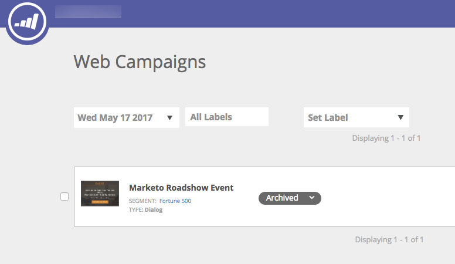
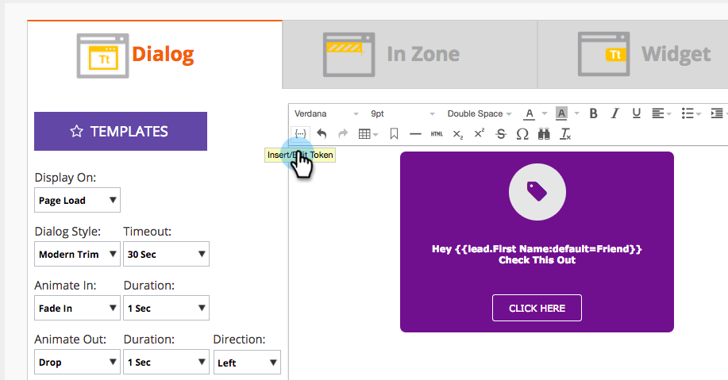
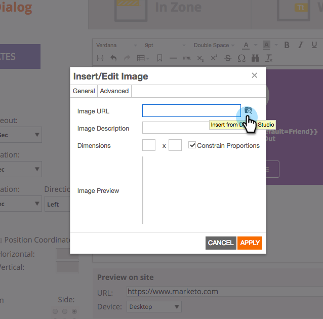

# 2017

## 2017年冬季 {#winter}

以下功能包含在2017年冬季發行版本中。 檢查您的Marketo版本是否有功能可用。

請按一下標題連結以檢視每個功能的詳細文章。

>[!NOTE]
>
>如果主題有多個副標題，連結就會放在那裡。

## [Facebook自訂對象的進階比對](/help/marketo/product-docs/demand-generation/ad-network-integrations/add-facebook-custom-audiences-as-a-launchpoint-service.md) {#advanced-matching-for-facebook-custom-audiences}

基本比對僅使用電子郵件地址，但新的進階比對使用額外的七個欄位，這會提高更多轉換的符合率。

## [自訂物件匯入API](https://developers.marketo.com/rest-api/lead-database/custom-objects/) {#custom-object-import-api}

此API提供更快速的介面，可將自訂物件同步到Marketo中。 您可以將CSV、TSV或SSV試算表檔案匯入Marketo做為自訂物件。

## [網站Personalization行銷活動匯出](/help/marketo/product-docs/web-personalization/working-with-web-campaigns/export-web-campaign-data.md) {#web-personalization-campaigns-export}

以CSV格式匯出所有網頁行銷活動的詳細資訊和分析。 然後，您就可以使用方便的版面配置檢視資料。

## 本地化 {#localization}

Web Personalization、[!UICONTROL Predictive Content]和電子郵件深入分析應用程式現在提供日文、德文和西班牙文版本。 您[選取您的語言和地區](/help/marketo/product-docs/administration/settings/change-time-zone.md)，以檢視這些語言的內容。

## 帳戶型行銷增強功能 {#account-based-marketing-enhancements}

**[匯入具名帳戶](/help/marketo/product-docs/target-account-management/target/named-accounts/import-named-accounts.md)**

透過[!UICONTROL Named Account]匯入選項，透過CSV上傳一次建立或更新多個記錄。

**[電子郵件深入分析支援](/help/marketo/product-docs/reporting/email-insights/filtering-in-email-insights.md)**

在電子郵件深入分析中使用[!UICONTROL Named Account]或[!UICONTROL Account List]作為維度。

## [!UICONTROL Predictive Content]個增強功能 {#predictive-content-enhancements}

**[依[!UICONTROL Enabled Source]](/help/marketo/product-docs/predictive-content/working-with-predictive-content/understanding-predictive-content.md)**&#x200B;篩選

篩選已為[!UICONTROL Email]、[!UICONTROL Rich Media]或[!UICONTROL Recommendation Bar]啟用的[!UICONTROL Predictive Content]個片段。

**[篩選器[!UICONTROL Analytics by Source]](/help/marketo/product-docs/predictive-content/working-with-predictive-content/understanding-predictive-content.md)**

篩選[!UICONTROL Predictive Content]特定來源的分析 — [!UICONTROL Email]、[!UICONTROL Rich Media]或[!UICONTROL Recommendation Bar]。

**[!UICONTROL Predictive Content]編輯器**

已改善編輯體驗和版面配置，可依來源 — [!UICONTROL Email]、[!UICONTROL Rich Media]或[!UICONTROL Recommendation Bar]分割內容準備。

預測性的&#x200B;**[自動探索內容](/help/marketo/product-docs/predictive-content/getting-started/enable-content-discovery.md)**

影像URL和中繼資料現在用於內容自動探索程式。

## [SDK增強功能](https://developers.marketo.com/mobile/) {#sdk-enhancements}

開發人員現在可以透過新增的SDK API呼叫，額外控制推送通知的傳送，該呼叫可讓開發人員移除推送代號。

## Vibes SMS LaunchPoint整合

使用新的篩選器選項「Member of Vibes List」改善您的目標定位。

## [舊版RTF編輯器和表單編輯器1.0已淘汰](https://nation.marketo.com/docs/DOC-4315)

自2017年8月1日起，仍在使用舊版RTF編輯器和表單編輯器1.0的客戶將自動轉換為新體驗。

## [Marketo活動API](https://developers.marketo.com/blog/important-change-activity-records-marketo-apis/) {#marketo-activity-apis}

Marketo的活動API即將發生重要變更。 您準備好了嗎？

## 2017年春季 {#spring}

以下功能包含在2017年春季發行版本中。 檢查您的Marketo版本是否有功能可用。

請按一下標題連結以檢視每個功能的詳細文章。 **注意**：如果主題有多個副標題，連結會放在那裡。

## [LinkedIn潛在客戶Gen Forms](/help/marketo/product-docs/demand-generation/social/social-functions/set-up-linkedin-lead-gen-forms.md) {#linkedin-lead-gen-forms}

[[!UICONTROL LinkedIn Lead Gen] Forms](https://business.linkedin.com/marketing-solutions/native-advertising/lead-gen-ads)是公司在[!DNL LinkedIn]上執行潛在客戶產生行銷活動的更直接方式。 人員可以填寫表格來表達對產品或服務的興趣，讓企業能夠擷取人員的詳細資訊，並將其同步至Marketo，以便進行自動化後續流程和潛在客戶路由活動。

Marketo與[!UICONTROL LinkedIn Lead Gen] Forms的整合會自動擷取銷售機會在Lead Gen表單中提供的資訊。 後續動作和通知可以使用新的&#x200B;**填寫[!DNL LinkedIn Lead Gen]表單**&#x200B;觸發器和篩選器自動執行。

## [使MSI範本過期](/help/marketo/product-docs/marketo-sales-insight/msi-for-salesforce/features/actions-in-the-msi-panel/send-marketo-email/publish-an-email-to-sales-insight.md) {#expire-msi-template}

在[!DNL Sales Insight]中清除過時範本的日子已經過去。 設定您發佈電子郵件的到期日，我們會在到期日臨近時為您負責取消發佈。

>[!NOTE]
>
>設定2017年5月31日的到期日表示範本將在2017年5月31日當天結束時從[!DNL Sales Insight]中移除。

## [大量擷取人員與活動的API](https://developers.marketo.com/rest-api/bulk-extract/) {#bulk-extract-apis-for-people-and-activities}

輕鬆將大量人員和活動資料從Marketo傳輸至您的外部系統。

## ABM增強功能

ABM具名帳戶上的&#x200B;**[自訂欄位](https://docs.marketo.com/x/1wnG)**

Marketo ABM現在可讓您在具名帳戶中建立最多10個自訂欄位。 您可以將這些自訂欄位對應到CRM帳戶物件中的欄位，Marketo ABM將同步資料，讓您擴充ABM具名帳戶，並協助推動行銷。

ABM具名帳戶上的&#x200B;**[百分位數評分](https://docs.marketo.com/display/docs/assets/abmpercentiles.png)**

具名帳戶的分數可能大不相同。 Marketo ABM現在會自動計算每個評分的百分位數，因此您可以一眼看出每個具名帳戶與其他具名帳戶之間的排名。

**[ABM帳戶清單API](https://developers.marketo.com/rest-api/lead-database/named-account-lists/)**

利用豐富且強大的ABM合作夥伴整合，以及針對具名帳戶清單提供的增強API支援。

## 網頁Personalization增強功能

捲動時&#x200B;**[網頁行銷活動](/help/marketo/product-docs/web-personalization/working-with-web-campaigns/set-how-your-web-campaign-displays.md)**

新的Web Campaign效果為網頁訪客提供更個人化的體驗。 將您的個人化[!UICONTROL Web Campaigns]設定為僅在網頁訪客向下捲動您的網頁時顯示。 您可以設定對話方塊[!UICONTROL Web Campaigns]在捲動時根據以下條件顯示：

* 已捲動頁面的百分比
* 已達到畫素
* 在頁面摺疊下方捲動

**[退出意圖時的網頁行銷活動](/help/marketo/product-docs/web-personalization/working-with-web-campaigns/set-how-your-web-campaign-displays.md)**

在訪客關閉您的頁面之前吸引訪客的注意。 設定您的個人化[!UICONTROL Web Campaigns]，使其僅在滑鼠手勢指出訪客正在離開頁面時顯示。

[!UICONTROL Web Campaigns][&#128279;](/help/marketo/product-docs/web-personalization/working-with-web-campaigns/create-a-new-dialog-web-campaign.md)**的**&#x200B;動畫效果

設定對話方塊網路促銷活動的動畫效果，以自訂進入或退出網頁時促銷活動的顯示方式。 您可以從6種不同的效果中選取，並控制對話方塊的時機和方向。

**[對話方塊關閉按鈕自訂](/help/marketo/product-docs/web-personalization/working-with-web-campaigns/create-a-new-dialog-web-campaign.md)**

自訂對話方塊的關閉按鈕。 從透明對話方塊樣式[!UICONTROL Web Campaigns]中使用的選項範圍中選取。 選取「關閉」按鈕的圖示、顏色和位置。 您也可以新增自己的按鈕影像。

**[封存網頁行銷活動](/help/marketo/product-docs/web-personalization/working-with-web-campaigns/archive-a-web-campaign.md)**

封存是新的網頁行銷活動狀態，可讓您封存[!UICONTROL Web Campaigns]並在預設的網頁行銷活動檢視中隱藏它們。 這讓您可以專注於最相關、最活躍的行銷活動，並隨選擷取較舊的已封存行銷活動。

**[本地化](/help/marketo/product-docs/administration/settings/change-time-zone.md)**

Web Personalization現在提供所有Marketo支援的語言（英文、日文、德文、西班牙文、法文和葡萄牙文）。

## 預測性增強功能 {#predictive-enhancements}

**[本地化](/help/marketo/product-docs/administration/settings/change-time-zone.md)**

預測內容現在提供所有Marketo支援的語言（英文、日文、德文、西班牙文、法文和葡萄牙文）。

## [舊版RTF編輯器和表單編輯器1.0已淘汰](https://nation.marketo.com/docs/DOC-4315)

自2017年8月1日起，仍在使用舊版RTF編輯器和表單編輯器1.0的客戶將自動轉換為新體驗。

## 2017年夏天 {#summer}

下列功能包含在2017年夏季版本中。 檢查您的Marketo版本是否有功能可用。

請按一下標題連結以檢視每個功能的詳細文章。 注意：此版本包含的部分功能沒有相關文章。 如果主題有多個副標題，連結就會放在那裡。

## [其他Facebook離線轉換階段](/help/marketo/product-docs/demand-generation/facebook/set-up-facebook-offline-conversions.md) {#additional-facebook-offline-conversion-stages}

選擇最多7個額外的離線轉換階段，以對應至您的Marketo生命週期階段（超過目前的3個）。 根據您客戶歷程中的轉換將您的[!DNL Facebook]廣告支出最佳化，以獲得更佳的投資報酬率。

## [鎖定銷售Insight範本](/help/marketo/product-docs/marketo-sales-insight/msi-for-salesforce/features/actions-in-the-msi-panel/send-marketo-email/lock-sales-template.md) {#lock-sales-insight-template}

防止對您的銷售範本進行編輯，以確保訊息與內容的一致性。 這有助於標準化範本及維護專業通訊。

## ABM增強功能

**日本公司查詢的Data Source**

以當地語言比對人員與日文公司名稱。

**[ABM與LeanData整合](https://docs.marketo.com/x/pKmt)**

[!DNL LeanData]整合現在允許在Marketo中進行銷售線索與帳戶的比對。 讓相同的銷售機會與記錄銷售與行銷系統內的帳戶相關聯，以保持行銷與銷售的一致性。 更彈性的選項可讓行銷與銷售作業部門對銷售線索與帳戶的比對規則擁有更多控制權，以便他們達到所需的精確度等級。

## 網頁Personalization增強功能

**[促銷活動預覽增強功能](/help/marketo/product-docs/web-personalization/working-with-web-campaigns/preview-and-test-a-web-campaign.md)**

行銷從業人員現在可確保&#x200B;*啟動前，其網頁行銷活動在任何裝置*&#x200B;上都看起來不錯。 透過這些增強功能，瞭解您的網頁行銷活動在桌上型電腦、行動裝置和平板電腦上的呈現方式。 [!DNL Chrome]的新外掛程式也提供更一致且精確的預覽。

**[Widget Campaign增強功能](/help/marketo/product-docs/web-personalization/working-with-web-campaigns/create-a-new-widget-web-campaign.md)**

Widget Campaign的新選項現已推出，包括：

* 觸發行銷活動（延遲、捲動）
* 顯示行銷活動（畫面周圍的任何位置）
* 將展開/最小化箭頭變更為任何CTA文字

## ContentAI {#contentai}

**[ContentAI分析和建議](/help/marketo/product-docs/predictive-content/predictive-content-analytics-overview.md)**

透過更深入的分析和AI支援的內容建議來增加內容行銷的回報，以提高參與度。 強大的分析功能可顯示建議內容的執行情形，包括熱門、趨勢和以對象為基礎的檢視。 您也會看到其他要包含內容的建議。

## 分析 {#analytics}

**[!UICONTROL Email Insights]增強功能**

透過準備和共用資料的新方式，從您的[!UICONTROL Email Insights]體驗中獲得更多好處。 您現在可以將您的[!UICONTROL Email Insights]結果下載至[!DNL Microsoft Excel]和[!DNL PowerPoint]，以便在Marketo外部處理資料。

## 同盟身分設定支援 {#federated-identity-configuration-support}

將驗證(Active Directory)保留在防火牆內部部署之後，同時繼續在雲端中使用[!DNL Microsoft Dynamics] CRM。

## 2017年秋季 {#fall}

以下功能包含在2017年秋季發行版本中。 檢查您的Marketo版本是否有功能可用。

請按一下標題連結以檢視每個功能的詳細文章。 注意：此版本包含的部分功能沒有相關文章。 如果主題有多個副標題，連結就會放在那裡。

## 系統可靠性 {#system-reliability}

我們已進一步改善核心Marketo基礎結構，包括更順暢的排序、更少的不相符，以及改善[!DNL Munchkin]穩定性。

## SFDC同步效能 {#sfdc-sync-performance}

利用Marketo和[!DNL Salesforce]之間更豐富且更快速的同步處理。 需要大量更新帳戶或銷售機會的資料變更，可分割為平行佇列以避免積壓。 事件和任務同步速度現在也加快了50%。

## Analytics效能改善 {#analytics-performance-improvements}

最近的基礎架構改善專案，可提高Marketo報告與分析工具的運作時間和穩定性，讓您更快建立隨選報告。

## [收件者時區](/help/marketo/product-docs/email-marketing/email-programs/email-program-actions/scheduling-with-recipient-time-zone/understanding-recipient-time-zone.md) {#recipient-time-zone}

透過這項新功能，您現在可以根據當地時區保留及傳送電子郵件。 電子郵件和參與計畫可設定為在收件者的時區傳送，因此無需建立多個計畫，只需傳送一次，Marketo會自動保留電子郵件，直到正確的當地時間為止。 提升電子郵件量度、觀察本機實務，並在全域使用單一程式來節省時間。

>[!NOTE]
>
>如果您還無法在電子郵件和參與計畫上啟用收件者時區，請勿驚慌！ 我們正在逐步為所有客戶啟用此功能。

## [依區段檢閱範例電子郵件](/help/marketo/product-docs/email-marketing/general/creating-an-email/send-a-sample-email.md) {#review-sample-emails-by-segment}

傳送範例電子郵件以供檢閱時，Marketo有新選項可挑選區段。 您不再需要手動判斷銷售機會屬於哪個區段，更輕鬆地傳送包含動態內容的電子郵件至不同區段。

## [LinkedIn潛在客戶一般自訂問題](/help/marketo/product-docs/demand-generation/social/social-functions/set-up-linkedin-lead-gen-forms.md) {#linkedin-lead-gen-custom-questions}

自訂您的[!UICONTROL LinkedIn Lead Gen]表單以收集自訂銷售機會屬性。 您現在可以在每個表單中詢問最多三個自訂問題、從單行文字輸入或多選問題中進行選擇，並對應回Marketo潛在客戶欄位。

## Slack整合 {#slack-integration}

我們發行了兩項功能，屬於新的Slack整合的一部分：

* 系統通知：取得Marketo例項中重要事件的Slack通知，例如目前行銷活動狀態的警示以及需要立即關注的任何問題。
* 有趣的時刻：當銷售帳戶中的已知個人觸發了Marketo Insight時，可以透過Slack通知潛在擁有者。 通知包括潛在客戶資訊以及銷售帳戶的相關細節。

## ABM增強功能

**[顯示沒有連絡人的帳戶](https://docs.marketo.com/x/fKCt)**

Marketo ABM現在會同步並顯示沒有連絡人的CRM帳戶。 納入沒有先前銷售或行銷歷史記錄的新帳戶，並將後續銷售線索與帳戶比對以追蹤進度。

## ContentAI分析 {#contentai-analytics}

**[新ABM帳戶清單篩選器](https://docs.marketo.com/x/1BPG)**

檢視及比較不同ABM帳戶清單的內容效能，將現有內容最佳化。 ContentAI會顯示：

* 最常檢視的內容
* 排名在前的轉換內容
* AI支援的行銷活動建議內容

## 網頁Personalization增強功能

網頁行銷活動的&#x200B;**[代號](/help/marketo/product-docs/web-personalization/working-with-web-campaigns/using-the-web-personalization-rich-text-editor.md)**

Token現在可用於網頁行銷活動。 運用代號來提供個人化訊息和內容，以提升網站行銷活動的參與度。

**[在Web行銷活動編輯器中設計工作室影像](/help/marketo/product-docs/web-personalization/working-with-web-campaigns/using-the-web-personalization-rich-text-editor.md)**

在Marketo中跨多個管道重複使用創意資產和影像，以節省時間。

## 整合  {#integration}

**[電子郵件預覽API](https://experienceleague.adobe.com/en/docs/marketo-developer/marketo/email-scripting)**

您現在可以在Marketo外部遠端預覽電子郵件，簡化電子郵件內容本地化的程式，並減少錯誤。

**[取代HTML API](https://experienceleague.adobe.com/en/docs/marketo-developer/marketo/email-scripting)**

開發人員可從遠端更新電子郵件資產的HTML內容，讓他們能在單一系統中工作，以維護資產。

## 4月ABM增強功能 {#april-abm}

以下功能包含在2017年4月發行的ABM增強功能中。 檢查您的Marketo版本是否有功能可用。

## 同步CRM對應的標準欄位 {#synching-of-crm-mapped-standard-fields}

Marketo ABM正在變更與CRM相關的行為。 今後，Marketo ABM會在CRM中的ABM帳戶與帳戶之間建立並維持1對1關係。 這可讓Marketo讓對應的帳戶欄位與CRM保持同步。

## CRM探索的自訂欄位 {#custom-fields-for-crm-discovery}

您現在可以新增自訂欄位至帳戶、將其對應至您的CRM，並用於Marketo中的CRM帳戶探索。

## 具名帳戶格線中的帳戶型篩選器 {#account-based-filters-in-the-named-account-grid}

您現在可以根據帳戶清單輕鬆篩選已命名的帳戶。

## 8月ABM增強功能 {#august-abm}

以下功能包含在2017年8月發行的ABM增強功能中。 檢查您的Marketo版本是否有功能可用。

請按一下標題連結以檢視每個功能的詳細文章。

## [!DNL Account Insight] {#account-insight}

**[[!DNL Account Insight]](/help/marketo/product-docs/target-account-management/setup-tam/account-insight-plug-in-overview.md)**&#x200B;是[!DNL Google Chrome]外掛程式，可向您的銷售團隊呈現可操作的ABM和帳戶分析，讓他們能與行銷密切合作，以有效與帳戶互動。 銷售團隊將能看見針對他們擁有的每個具名帳戶所產生的資料和深入分析。 這將包括帳戶分數百分比、其具名帳戶的優先順序清單、這些帳戶中的參與人員，以及帳戶中最近活動的即時活動資料流。

 

## [動態帳戶清單](/help/marketo/product-docs/target-account-management/target/account-lists.md) {#dynamic-account-lists}

我們正在新增在ABM中建立帳戶清單的新方法。 除了現有的帳戶清單之外，您現在可以建立從公開CRM帳戶檢視產生的動態帳戶清單。 CRM帳戶檢視是一組規則，可在顯示帳戶時作為篩選條件。 例如，您可以使用它來尋找產業為醫療保健&#x200B;_且_&#x200B;收入超過1億美元的帳戶。

